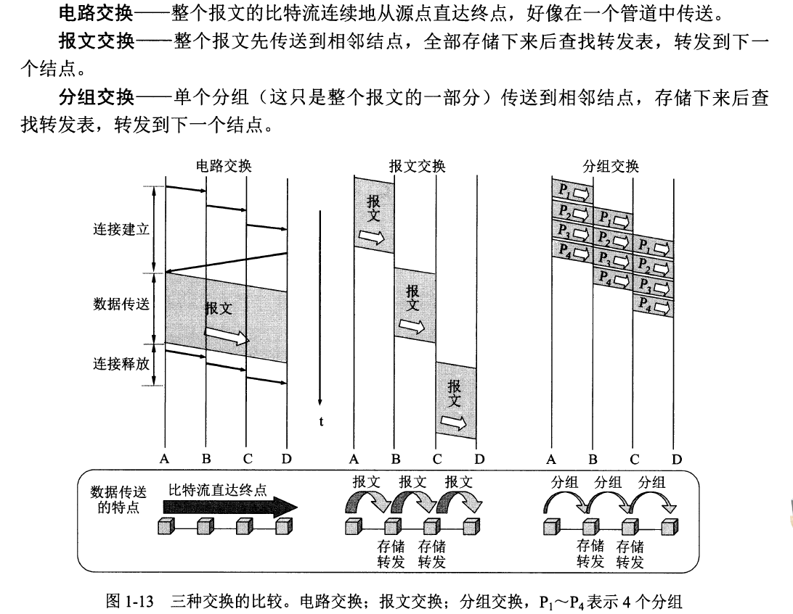
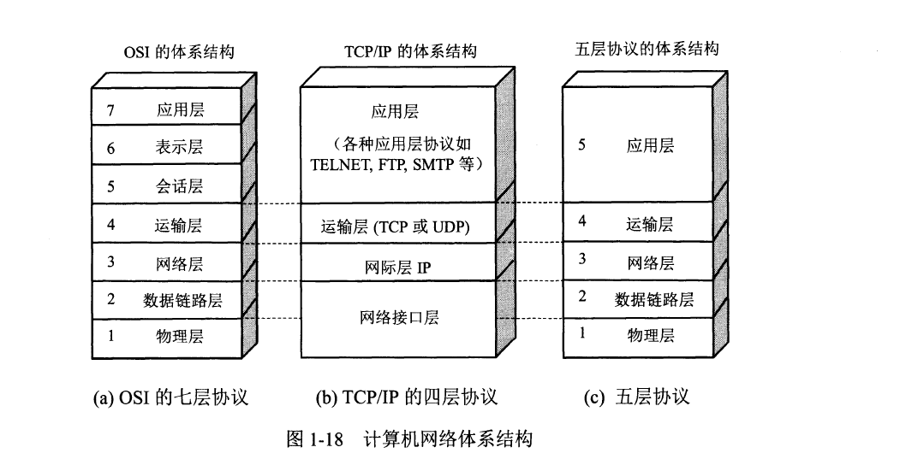
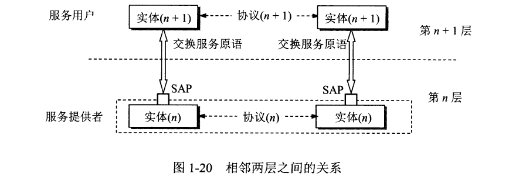
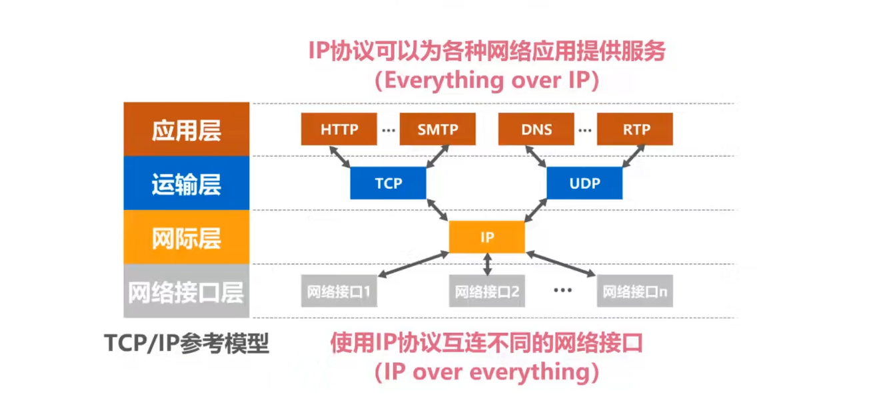

# 第一章 概述

## 1.1 计算机网络在信息时代中的作用

21 世纪的一些重要特征

> 数字化，网络化和信息化
>
> 以网络为核心的信息时代

互联网的两个重要基本特点

- 连通性
- 共享（资源共享）

## 1.2 互联网概述

计算机网络由若干个结点货连接这些结点的链路组成

网络把许多计算机连接在一起，而互联网则把许多网络通过路由器连接在一起。与网络相连的计算机常称为主机

Internet 和 internet 的区别

- internet（互连网）是一个通用名词，它泛指由多个计算机网络互连而成的计算机网络
- Internet（互联网，或因特网）则是一个专用名词，它指当前全球最大的，开放的，由众多网络相互连接而成的特定互联网，它采用 TCP/IP 协议族作为通信的规则，且其前身是美国的 ARPANET

## 1.3 互联网的组成

计算机之间通信：主机 A 的某个进程和主机 B 上的另一个进程进行通信

在网络边缘的端系统之间的通信方式通常课划分为两大类

- 客户-服务器方式（C/S 方式）

  客户是服务请求方，服务器是服务提供方
- 对等方式（P2P 方式）

路由器是实现分组交换的关键构件，其任务是转发收到的分组

- 电路交换（Circuit Switching）

  - 电话交换机接通电话线的方式成为电路交换
  - 从通信资源的分配角度来看，交换（Switching）就是按照某种方式动态地分配传输线路的资源
  - 电路交换的三个步骤

    - 建立连接（分配通信资源）
    - 通话（一直占用通信资源）
    - 释放连接（归还通信资源）
  - 特点

    - 在通话的全部时间内，通话的两个用户始终占用端到端的通信资源
    - 当使用电路交换来传送计算机数据时，其线路的传输效率往往很低
- 分组交换（Packet Switching）

  - 优点

    - 高效

      - 在分组传输的过程中动态哦分配传输带宽，对通信链路是逐段占用
    - 灵活

      - 为每一个分组独立地选择最合适的转发路由
    - 迅速

      - 以分组作为传送单位，可以不先建立连接就能向其他主机发送分组
    - 可靠

      - 保证可靠性网络协议，分布式多路由的分组交换网，使网络有很好的生存性

​​

## 1.6 计算机网络的性能

> 比特
>
> 计算机中数据量的单位，也是信息论中信息量的单位。一个比特就是二进制数字中的一个 1 或 0
>
> 常用数据单位
>
> ​​

- 速率

  > 速率：数据的传送速率，即数据率/比特率
  >

  - 常用数据单位

    
- 带宽

  - 在模拟信号系统中的意义

    - 信号所包含的各种不同频率成分所占据的频率范围
    - 单位：HZ （KHz，MHz，GHz）

      - 带宽 3.1KHz（300Hz ~ 3.4kHz）话音的主要成分的频率范围
  - 在计算机网络中的意义

    - 用来表示网络的通信线路所能传送数据的能力，因此网络带宽表示在单位时间内从网络中的某一点到另一点所能通过的“最高数据率”
    - 单位： b/s (kb/s,Mb/s,Gb/s,Tb/s)
- 吞吐量

  - 表示在单位时间内通过某个网络（或信道，接口）实际的数据量
  - 受网络的带宽或网络的额定速率的限制
- 时延

  - 是指数据（一个报文或分组，甚至比特）从网络（或链路）的一端传送到另一端所需的时间
  - 发送时延

    - 是主机或路由器发送数据帧所需要的时间，即从发送数据帧的第一个比特算起，到该帧的最后一个比特发送完毕所需的时间
    - $$
      发送时延 = \frac{数据帧长度(bit)}{发送速率(bit/s)}
      $$
  - 传播时延

    - 是电磁波在信道中传播一定的距离需要花费的时间
    - $$
      {\color{Green}传播时延 = \frac{信道长度(m)}{电磁波在信道上的传播速率(m/s)}}
      $$
    - > 电磁波在自由空间的传播速率是光速(3.0*10^3km/s)
      >
      > 在网络传输媒体中的传播速率比在自由空间要略低一些
      >
      > 在铜线电缆中的传播速率约为 2.3*10^5 km/s
      >
      > 在光纤中的传播速率约为 2.0*10^5 km/s
      >
  - 处理时延

    - 主机或路由器在收到分组时要花费一定的时间进行处理
    - 几种情况

      - 分析分组的首部
      - 从分组中提取数据部分
      - 进行差错检验
      - 查找适当的路由
  - 排队时延

    - 分组在经过网络传输时。要经过许多路由器。但分组在进入路由器要先在输入队列中排队等待处理
    - 排队时延的长短往往取决于网络当时的通信量
  - $$
    总时延 = 发送时延 + 传播时延 + 处理时延 + 排队时延}
    $$
  - 
  - 发送时延发生在机器内部的发送器中（一般是网络适配器中），与传输信道的长度（或信号传送的距离）没有任何关系。但传播时延则发生在机器外部的传输信道媒体上，而与信号的发送速率无关。信号传送的距离越远，传播时延就越大
- 时延带宽积

  - $$
    时延带宽积 = 传播时延 * 带宽
    $$

  
- 往返时间 RTT

  - ‍

    $$
    {\color{Green}
    发送时间 = \frac{数据长度}{发送速率}
    \parallel 
    有效数据率 = \frac{数据长度}{发送时间+RTT}
    }
    $$
  - RTT 还包括各中间结点的处理时延，排队时延，一级转发数据时的发送时延
- 利用率

  - 信道利用率

    - 某信道有百分之几的时间是被利用的（有数据通过）
  - 网络利用率

    - 全网络的信道利用率的加权平均值
  - $$
    {\color{Green}令D_0表示网络空闲时的时延，D表示网络当前的时延，U表示利用率，那么在适当的假定条件下} \\
      {\color{Green}D = \frac{D_0}{1-U}}
    $$
  - 
  - 信道或网络的利用率过高会产生非常大的时延
- 丢包率

## 1.7 计算机网络体系结构

## 1.7.1 计算机网络体系结构的形成

- OSI 标准失败的原因

  - OSI 的专家们缺乏实际经验，他们在完成 OSI 标椎时缺乏商业驱动
  - OSI 的协议实现起来过分复杂，而且运行效率很低
  - OSI 标准的制定周期太长，因而使得按 OSI 标准生产的设备无法及时进入市场
  - OSI 的层次划分不太合理。有些功能在多个层次中重复出现

## 1.7.2 协议与划分层次

网络协议：为进行网络中的数据交换而建立的规则，标椎或约定

- 网络协议主要由以下三要素组成

  - 语法，即数据与控制信息的结构或格式
  - 语义，即需要发出何种控制信息，完成何种动作以及做出何种响应
  - 同步，即事件实现顺序的详细说明
- 分层的好处

  - 灵活性好
  - 结构上可分割
  - 易于实现和维护
  - 能促进标椎化工作

## 1.7.3 具有五层协议的体系结构

- 应用层（application layer）

  - 最高层
  - 任务

    - 通过应用进程间的交互来完成特定网络应用
  - 定义

    - 应用进程间的通信和交互的规则

      [^ 进程]: 主机中正在运行的程序
  - 把应用层交互的数据单元称为报文
- 运输层（transport layer）

  - 任务

    - 负责向两台主机中进程之间的通信提供通用的数据传输服务
  - 功能

    - 复用

      - 多个应用层进程课同时使用下面运输层的服务
    - 分用

      - 运输层把收到的信息分班交付上面应用层中的相应进程
  - 主要使用协议

    - 传输控制协议 TCP

      - 提供面向连接的，可靠的数据传输服务，其数据传输的单位是报文段
    - 用户数据报协议 UDP

      - 提供无连接的，尽最大努力的数据传输服务（不保证数据传输的可靠性），其数据传输的单位是用户数据报
- 网络层（network layer）

  - 任务

    - 负责为分组交换网上的不同主机提供通信服务
    - 选择合适的路由
  - 协议

    - IP 协议
- 数据链路层（data link layer）
- 物理层（physical layer）

## 1.7.4 实体，协议，服务和服务访问点

- 实体

  - 表示任何发送或接收信息的硬件或软件进程
- 协议

  - 是控制两个对等实体（或多个实体）进行通信的规则的集合

- 协议数据单元 PDU

  - 对等层次之间传送的数据包称为该层的协议数据单元
- 服务数据单元 SDU

  - 同一系统内，层与层之间交换的数据包称为服务数据单元
- 多个 SDU 可以合成一个 PDU，一个 SDU 也可以划分为几个 PDU

## 第一章习题

‍

‍
