# 第三章 数据链路层

数据链路层使用的信道

- 点对点信道
- 广播信道
  - 使用专用的共享信道来协调这些主机的数据发送

## 3.1 数据链路和帧

每一种链路层协议都规定了所能传送的帧的数据部分长度上限——最大的传送单元MTU

### 3.1.1 数据链路和帧

链路

> 从一个结点到相邻结点的一端物理线路（有线或无线），中切没有任何”其它的交换点。是一条路径的组成部分

- 链路也可以分为
  - 物理链路
  - 逻辑链路
    - ${物理链路+必要的通信协议}$

数据链路

> 由实现通信协议的硬件，软件和链路组成

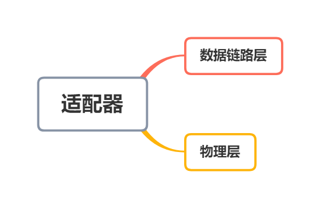

点对点信道的数据链路层在进行通信时的主要步骤如下：

1. 结点A的数据链路层把网络层交下来的IP数据报添加首部和尾部封装成帧
2. 结点A把封装好的帧发送给结点B的数据链路层
3. 若结点B的数据链路层收到的帧无差错，则从收到的帧中提取出IP数据报交给上面的网络层；否则丢弃这个帧

### 3.1.2 三个基本问题

#### 封装成帧

> 在一段数据的前后分别添加首部和尾部，从而构成了一个帧

- 帧头和帧尾中包含有重要的控制信息
- 帧头和帧尾的作用之一就是帧定界

​	

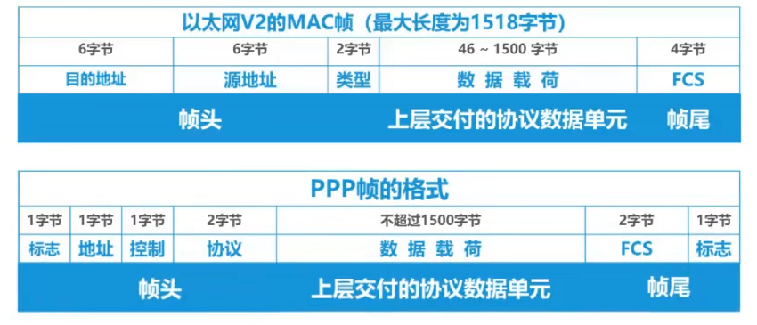

---

#### 透明传输

> 指数据链路层对上层交付的传输数据没有任何限制，就好像数据链路层不存在一样

- 面向字节的物理链路使用字节填充（或称字符填充）的方法实现透明传输
  - 在EOT和ESC前面插入一个ESC
- 面向比特的物理链路使用比特填充的方法实现透明传输
  - 每五个连续的1后面添加一个0

---

#### 差错检测

> 实际的通信链路都不是理想的，比特在传输过程中可能会产生差错：1可能变成0,0也可能变成1，这称为比特差错
>
> FCS字段的值（检测码）

- 在一段时间内，传输错误的比特占所传输比特总数的比率称为误码率BER
- 检错码只能检错出帧在传输过程中出现了茶卒，但并不能定位错误，因此无法纠正错误
- 目前广泛采用循环冗余检验CRC的检错技术

  - 收发方约定好一个**生成多项式**​****
  - 发送方基于待发送的数据和生成多项式计算出差错检测吗（冗余码），将其添加到待传输数据的后面一起传输
  - 接收方通过生成多项式来计算收到的数据是否产生了误码

  

  

  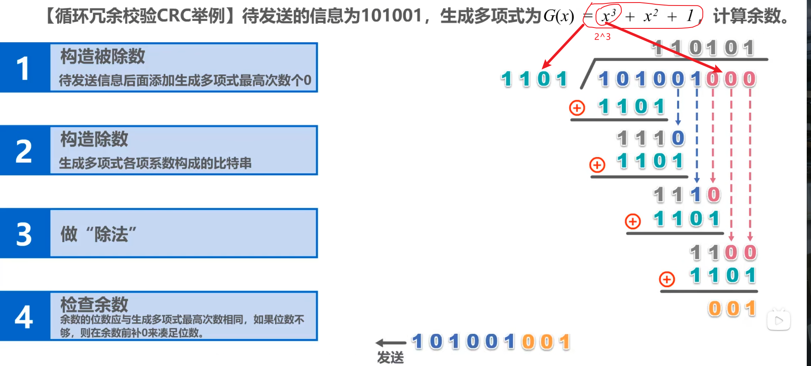

  
- 奇偶校验

  - 在待发送的数据后面**添加1位奇偶校验位**，使整个数据（包括添加的校验位在内）中**“1”的个数**位奇数（奇校验）或偶数（偶校验）
  - 奇校验
    - 添加比特1
    - 1的数量为奇数时，无法检验出错误
    - 1的数量为偶数时，可以检验出错误
  - 偶校验
    - 添加比特0
    - 0的数量为偶数时，无法检验出错误
    - 0的数量为奇数时，可以检验出错误

#### 可靠传输

当检测出帧中出现了比特差错后所采取的措施取决于数据链路层向上层提供的服务类型

- 不可靠传输服务
  - 仅仅丢弃有误码的帧，其它什么也不做
- 可靠传输服务
  - 想办法实现发送端发送什么，接收端就收到什么

---

- 一般情况下，**有限链路**的误码率比较低，为了减小开销，并**不要求数据链路层**向上提供**可靠**传输服务。即使出现了误码，可靠传输的问题也由其上层处理
- **无线链路**易受干扰，误码率比较高，因此**要求数据链路层**必须向上层提供**可靠**传输服务
- **比特差错**只是传输差错的一种
- 从整个体系网络结构来看，传输差错还包括**分组丢失，分组失序以及分组重复**，这三个一般不会出现在数据链路层，而会出现在其上层，因此各层均可选择实现可靠传输

---

##### 停止-等待协议SW

- 接收端检测到数据分组有误时，将其丢弃并等待发送方的超时重传。但对于误码率较高的点对点链路，为使发送发**尽早重传**，也可**个发送方发送NAK（否认）分组**
- 为了让接收方能够判断所收到的数据是否重复的，需要给**数据分组编号**。由于停止=等待协议的停等特性，**只需1个比特编号**就够了，即编号0和1
- 为了让发送方能够判断所收到的ACK（确认）分组是否是重复的，需要给**ACK分组编号**,所以比特数量**与数据分组编号所用比特数量一样**。数据链路层一般不会出现ACK分组迟到的情况，因此在**数据链路层实现停止-等待协议可以不用给ACK分组编号**
- 超时计时器设置的**重传时间**应仔细选择。一般将重传时间选为**略大于&quot;从发方放到接收方的平均往返时间&quot;**
  - 在数据链路层点对点的往返时间比较确定，重传时间比较好设定
  - 然而在运输层，由于端到端往返时间非常不确定，设置合适的重传时间有时并不容易

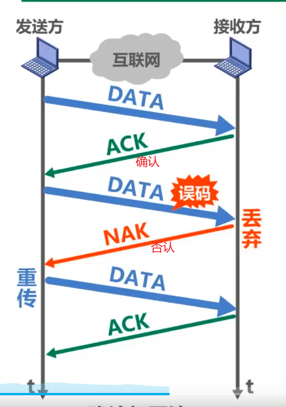

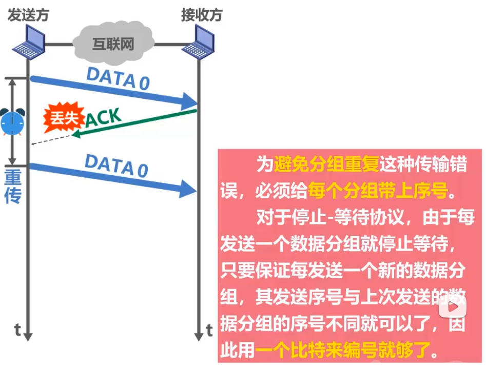

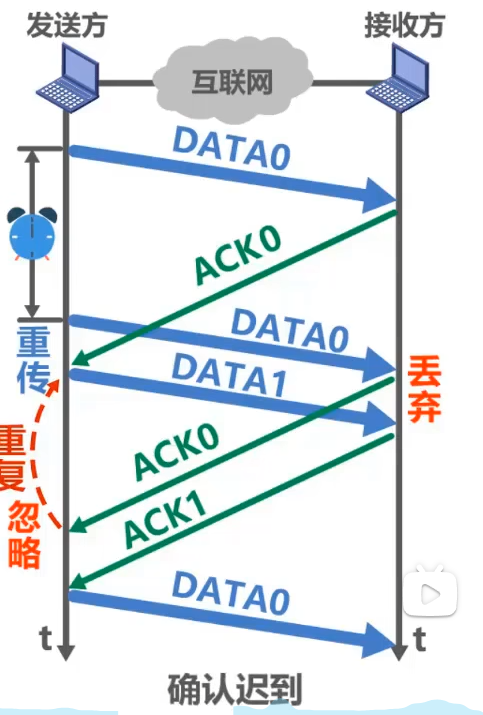

---

信道利用率

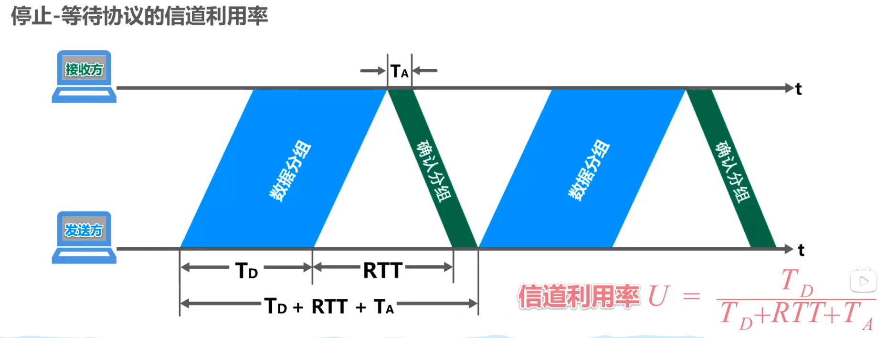

- 当往返时延RTT远大于数据帧发送时延${T_D}$时（例如使用卫星链路），信道利用率非常低
- 若出现重传，则对于传送有用的数据信息来说，信道利用率还要降低
- 为了克服SW，就产生了GBN和SR

##### 回退N帧协议GBN

> GBN协议在流水线传输的基础上利用发送窗口来限制发送发连续发送的数据分组的数量，是一种连续ARQ协议

- 采用3个比特给分组编序号，即序号0~7
- 发送窗口的尺寸${W_T}$的取值：${1&lt;W_T\le2^{3-1}}$
  - 当${W_T}$的值为1，则与SW协议相同
- 接收窗口的尺寸${W_R}$的取值：$W_R=1$
- 累计确认
  - 接收方**不一定**要对收到的数据分组**逐个发送确认**，而是可以在收到几个数据分组后（由具体实现决定），**对按序到达的最后一个数据分组发送确认**。ACKn表示序号为n及以前的所有数据分组都已正确接收
  - 即使确认分组丢失，发送方也可能不必重传
  - 发送方收到重复的确认，就知道之前所发送的数据分组出现了差错，于是可以不等超时计时器超时就立刻重传（至于收到几个重复确认就立刻重传，由具体实现决定）

##### 选择重传协议SR

> 回退N帧协议的接收窗口尺寸$W_R$只能等于1，因此接收方只能按序接收正确到达的数据分组
>
> 一个数据分组的误码就会导致其后续多个数据分组不能被接收方按序接收而丢弃，必然会造成发送方对这些数据分组的超时重传，对通信资源造成了极大的浪费
>
> 因此${W_R\ge1}$,以便**接收方先收下失序到达但无误码并且序号落在接收窗口内的那些数据分组**，等到所缺分组收齐后在一并送气上层，这就是选择重传协议

- 采用3个比特给分组编序号，即序号0~7
- 发送窗口的尺寸${W_T}$的取值：${1&lt;W_T\le2^{3-1}}$
  - 当${W_T}$的值为1，则与GBN协议相同
- 接收窗口的尺寸${W_R}$的取值：$W_R=W_T$

---

- 发送方的发送窗口尺寸$W_T$必须满足：${1&lt;W_T\le2^{n-1}}$,其中n是构成分组序号的比特数量
  - 当${W_T}$的值为1，则与SW协议相同
  - 若${W_T&gt;2^{n-1}}$：造成接收方无法分辨新，旧数据分组的问题
- 接收方的接收窗口尺寸$W_R$必须满足：${1&lt;W_R\le W_T}$,其中n是构成分组序号的比特数量
  - 当${W_T}$的值为1，则与GBN协议相同
  - 若${W_R&gt;W_T}$：无意义

## 3.2 点对点协议PPP

目前使用最广泛的点对点数据链路协议

> 高级数据链路控制HDLC

### 3.2.1 PPP协议的特点

PPP协议应满足的要求

- 简单

  - 对数据链路层的帧，不需要纠错，不需要序号，也不需要流量控制
  - 接收方每收到一个帧，就进行CRC 检验。如CRC 检验正确，就收下这个帧；反之，就丢弃这个帧，其他什么也不做。
- 封装成帧

  - PPP 协议必须规定特殊的字符作为帧定界符（即标志一个帧的开始和结束的字符），以便使接收端从收到的比特流中能准确地找出帧的开始和结束位置。
- 透明性

  - PPP 协议必须保证数据传输的透明性。
- 多种网络层协议

  - PPP 协议必须能够在在同一条物理链路上同时支持多种网络层协议（如IP 和IPX 等）的运行。
  - 当点对点链路所连接的是局域网或路由器时， PPP 协议必须同时支持在链路所连接的局域网或路由器上运行的各种网络层协议。、
- 多种类型链路

  - PPP 还必须能够在多种类型的链路上运行。
- 差错检测

  - PPP 协议必须能够对接收端收到的帧进行检测，并立即丢弃有差错的帧。
- 检测连接状态

  - PPP 协议必须具有一种机制能够及时（不超过几分钟）自动检测出链路是否处千正常工作状态。
- 最大传送单元

  - PPP协议必须对每一种类型的点对点链路设置最大传送单元的标准默认值气

    > MTU是数据链路层的帧可以载荷的数据部分的最大长度，而不是帧的总长度。
    >
- 网络层地址协商

  - PPP 协议必须提供一种机制使通信的两个网络层（例如，两个IP 层）的实体能够通过协商知道或能够配置彼此的网络层地址。
- 数据压缩状态

  - PPP 协议必须提供一种方法来协商使用数据压缩算法。

PPP协议的组成

- 一个将IP 数据报封装到串行链路的方法。
  - PPP 既支待异步链路（无奇偶检验的8 比特数据）
  - 也支持面向比特的同步链路。
  - IP 数据报在PPP 帧中就是其信息部分。这个信息部分的长度受最大传送单元MTU 的限制。
- 一个用来建立、配置和测试数据链路连接的链路控制协议LCP (Link Control Protocol)
- 一套网络控制协议NCP(Network Control Protocol)
  - 其中的每一个协议支持不同的网络层协议，

### 3.2.2 PPP协议的帧格式

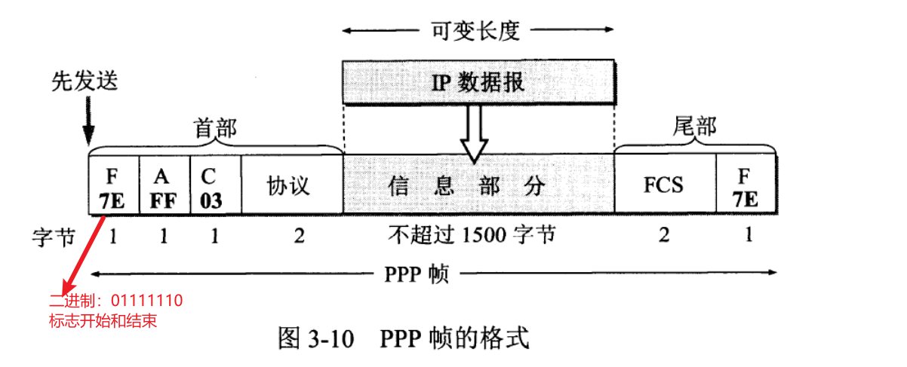

> 标志字段表示一个帧的开始或结束。因此标志字段就是PPP 帧的定界符。连续两帧之间只需要用一个标志字段。如果出现连续两个标志字段，就表示这是一个空帧，应当丢弃。

> PPP 首部的第四个字段是2 字节的协议字段。
>
> - 当协议字段为Ox0021 时， PPP 帧的信息字段就是IP 数据报。
> - 若为OxC021, 则信息字段是PPP 链路控制协议LCP 的数据，
> - 而Ox8021 表示这是网络层的控制数据气

---

字节填充

当PPP 使用异步传输时，它把转义符定义为Ox7D （即01111101) ，并使用字节填充，

- 把信息字段中出现的每一个Ox7E 字节转变成为2 字节序列(Ox7D, Ox5E) 。
  - $0X7E \rightarrow 0X7D,0X5E$
  - 7E前面插入7D，并且把7E-0x20,由此得到7D，5E
- 若信息字段中出现一个Ox7D 的字节（即出现了和转义字符一样的比特组合），则
  把Ox7D 转变成为2 字节序列(Ox7D, Ox5D) 。
  - $0X7D \rightarrow 0X7D,0X5D$
  - 7D前面插入7D，并且把7D-0x20,由此得到7D，5D
- 若信息字段中出现ASCII 码的控制字符（即数值小千Ox20 的字符），则在该字符前
  面要加入一个Ox7D 字节，同时将该字符的编码加以改变。例如，出现Ox03 （在控制字符中是“传输结束“ETX) 就要把它转变为2 字节序列(Ox7D, Ox23) 。
  - 控制字符（小于0X20)前面加0X7D，同时将该控制字符**加上0x20**

零比特填充

### 3.2.3 PPP协议的工作状态

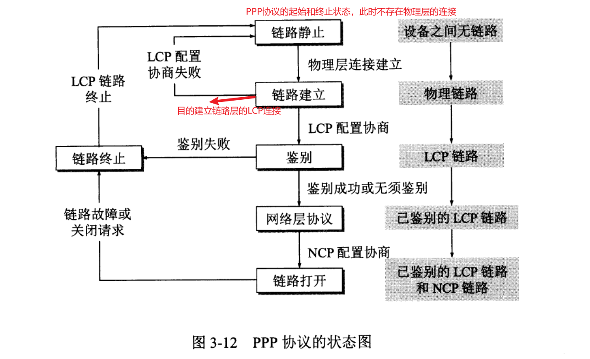

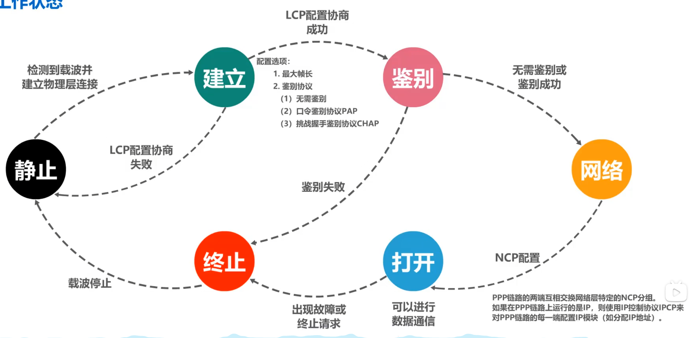

## 3.3 使用广播信道的数据链路层

### 3.3.1 局域网的数据链路层

局域网

- 主要特点
  - 网络为一个单位所拥有，且地理范围和站点数目均有限
- 优点
  - 具有广播功能，从一个站点可很方便地访问全网。
  - 便千系统的扩展和逐渐演变，各设备的位置可灵活调整和改变。
  - 提高了系统的可靠性(reliability) 、可用性(availability)和生存性(survivability) 。

---

### 媒体接入控制

#### 2.4 信道复用技术

复用

> 就是在一条传输媒体上同时传输多路用户的信号

原理

> 当一条传输媒体的传输容量大于多条信道传输的总容量时，就可以通过复用技术，在这条传输媒体上建立多条通信信道，以便充分利用传输媒体的带宽

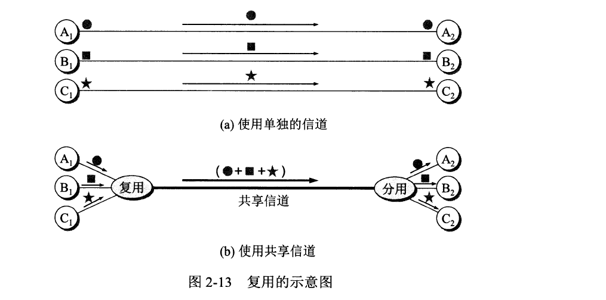

#### 频分复用FDM

- 用户在分配到一定的频带后，在通信过程中自始至终都占用这个频带
- 所有用户在同样的时间占用不同的带宽资源
- 不够灵活
- 

#### 时分复用TDM

- 将时间划分为一段段等长的时分复用帧（TDM帧）。每一个时分复用的用户在每一个TDM帧中占用固定序号的时隙
- TDM信号也被称为等时信号
- 所有用户是在不同的时间占用同样的频带宽度
- 不够灵活
- 更有利于数字信号的传输

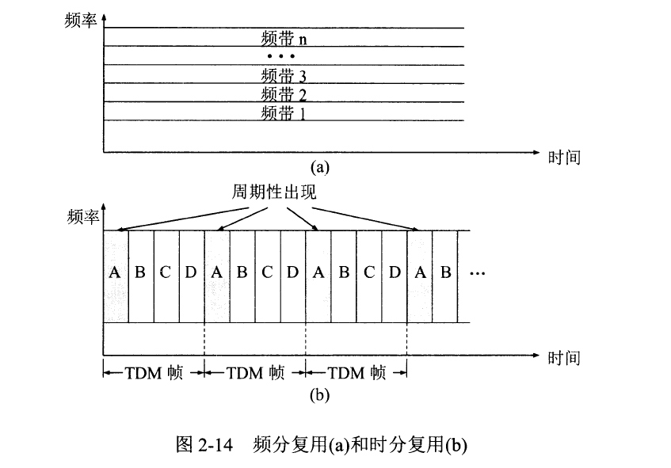

#### 波分复用WDM

> 就是光的频分复用

原理

> 根据频分复用的设计思想，可在一根光纤上同时传输多个频率（波长）相近的光载波信号，实现基于光纤的频分复用技术

密集波分复用DWDM

> 在一根光纤上复用几十路或更多路数的光载波信号

#### 码分复用CDM

> 常被称为码分多址CDMA，他是在扩频通信技术的基础上发展起来的一种无线通信技术

- 每个用户可以在相同的时间使用相同的频带进行通信
- 最初用千军事通信，因为这种系统发送的信号有很强的抗干扰能力，其频谱类似千白噪声，不易被敌人发现。
- 现在已广泛使用在民用的移动通信中，特别是在无线局域网中。

---

工作原理

- CDMA将每个比特时间划分为m个更短的时间片，称为码片。m的取值通常为64或128
- CDMA中的每个站点都被指派一个唯一的m比特码片序列

  - 某个站要发送比特1，则发送它自己的m比特码片序列
  - 某个站要发送比特0，则发送它自己的m比特码片序列的反码
- 如果有两个或多个站同时发送数据，则信道中的信号就是这些站各自所发送一系列码片序列或码片序列反码的叠加。为了从信道中分离出各个站的信号，给每个站指派码片序列时，必须遵循以下规则：

  - 分配给每个站的码片序列必须各不相同，实际常采用伪随机码序列
  - 分配给每个站的码片序列必须相互正交，即各码片序列相应的码片向量之间的规格化内积为0

  $$
  bold{S} \cdot \bold{T} = \frac{1}{m}\sum_{i=1}^mS_iT_i = 0 \\
  \bold{S}：站S的码片向量 \\
  \bold{T}：其他任何站的码片向量 \\
  $$

  

  规律
- 各码片序列相应的码片向量之间的规格化内积为0
- 任何一个码片向量和该码片向量自己的规格化内积都是1
- 一个码片向量和该码片向量的规格化内积值是${-1}$

---

#### 区别

- 码分复用CDM是另一种共享信道的方法。实际上，由于该技术主要用于多址接入，人们更常用的名词是码分多址CDMA(Code Division Multiple Access)。
- 同理，频分复用FDM和时分复用TDM同样可用于多址接入，相应的名词是频分多址FDMA(Frequency Division Multiple Access)和时分多址TDMA(Time Division Multiple Access)。
- 复用和多址
  - 复用是将单一媒体的频带资源划分成很多子信道，这些子信道之间相互独立，互不干扰。从媒体的整体频带资源上看，每个子信道只占用该媒体频带资源的一部分。
  - 多址（更确切地应该称为多点接入）处理的是动态分配信道给用户。这在用户仅仅暂时性地占用信道的应用中是必须的，而所有的移动通信系统基本上都属于这种情况。相反，在信道永久性地分配给用户的应用中，多址是不需要的（对于无线广播或电视广播站就是这样）。
- 与FDM和TDM不同，CDM的每一个用户可以**在同样的时间使用同样的频带进行通信。**
- 由于**各用户使用经过特殊挑选的不同码型**，因此各用户之间**不会造成干扰**。
- CDM最初是用于军事通信的，因为这种系统所发送的信号有很强的抗干扰能力，其频谱类似于白噪声，不易被敌人发现。

### 3.3.2 CSMA/CD协议

##### 随机接入

> 载波监听多址接入/碰撞检测CSMA/CD(Carrier Sense Multiple Access/Collision Detection)

- 多址接入MA
  - 多个站连接在一条总线上，竞争使用总线
- 载波监听CS
  - 每一个站在发送帧之前先要检测一下总线上是否有其它站点在发送帧（“先听后说”）
    - 若检测到总线空闲96比特时间，则发送这个帧
    - 若检测到总线忙，则继续检测并等待总线转为空闲96比特时间，然后发送这个帧
- 碰撞检测CD
  - 每一个正在发送帧的站边发送变检测碰撞（“边说边听”）
    - 一旦发现总线上出现碰撞，则立即停止发送，退避一段随机时间后再次发送（“一旦冲突，立即停说，等待时机，重新再说”）。

#### 争用期（碰撞窗口）

- 主机最多经过${2\tau(即\delta\to0)}$的时长就可检测到本次发送是否遭受了碰撞
- 因此，以太网的端到端往返传播时延$2\tau$称为**争用期**或**碰撞窗口**
- 经过争用期这段时间还没有检测到碰撞，才能肯定这次发送不会发生碰撞。
- 每一个主机在自己发送帧之后的一小段时间内，存在着遭遇碰撞的可能性。这一小段时间是不确定的。它取决于另一个发送帧的主机到本主机的距离，但不会超过总线的端到端往返传播时延，即一个争用期时间。
- 显然，在以太网中发送帧的主机越多，端到端往返传播时延越大，发生碰撞的概率就越大。因此，**共享式以太网不能连接太多的主机，使用的总线也不能太长。**
  - 10Mb/s以太网把争用期定为512比特发送时间，即51.2us，因此其总线长度不能超过5120m，但考虑到其他一些因素，如信号衰减等，以太网规定总线长度不能超过2500m。

---

#### 最小帧长

- **以太网规定最小帧长为64字节**，即512比特（512比特时间即为争用期）
  - 如果发送的数据非常少，那么必须加入一些字节填充，使帧长不小于64字节
- 以太网的**最小帧长确保了主机可在帧发送完成之前就检测到该帧的发送过程中是否遭遇了碰撞**
  - 如果在争用期（共发送64字节）没有检测到碰撞，那么后续发送的数据就一定不会发生碰撞；
  - 如果在争用期内检测到碰撞，就立即中止发送，这时已经发送出去的数据一定小于64字节，因此**凡长度小于64字节的帧都是由于碰撞而异常中止的无效帧。**

#### 截断二进制指数退避算法

$$
电磁波在1km电缆的传播时约为5{\mu}s \\
总线上的单程端到端传播时延记为\tau \\
争用期时间是51.2{\mu}s \\
基本退避时间：争用期2\tau \\
随机数r：r从离散的整数集合\{0,1,...,(2^k-1)\}中随机选出一个数 \\
k=Min[重传次数，10] \\
退避时间 = 基本退避时间 \times 随机数r
$$

- 若连续多次发生碰撞，就表明可能有较多的主机参与竞争信道。但使用上述退避算法可**使重传需要推迟的平均时间随重传次数而增大**（这也称为**动态退避**），因而**减小发生碰撞的概率**，有利于整个系统的稳定。
- **当重传达16次仍不能成功时**，表明同时打算发送帧的主机太多，以至于连续发生碰撞，则**丢弃该帧**，并向高层报告。

#### 强化碰撞

> 是当发送数据的站一旦发现发生了碰撞时，除了立即停止发送数据外，还要再继续发送32 比特或48 比特的**人为干扰信号Gamming signal)**  ，以便让所有用户都知道现在已经发生了碰撞

以太网还规定了帧间最小间隔为9.6 μs, 相当于96 比特时间。这样做是为了使刚刚收
到数据帧的站的接收缓存来得及清理，做好接收下一帧的准备。

CSMA/CD 协议的要点归纳如下：

1. 准备发送：适配器从网络层获得一个分组，加上以太网的首部和尾部，组成以太网帧，放入适配器的缓存中。但在发送之前，必须**先检测信道**。
2. 检测信道：若检测到信道忙，则应不停地检测，一直等待信道转为空闲。若检测到
   信道空闲，并在96 比特时间内信道保持空闲（保证了帧间最小间隔），就发送这个帧。
3. 在发送过程中仍不停地检测信道，即网络适配器要**边发送边监听**。这里只有两种可
   能性：
   1. 发送成功：在争用期内一直未检测到碰撞。这个帧肯定能够发送成功。发送完毕后，其他什么也不做。然后回到(1) 。
   2. 发送失败：在争用期内检测到碰撞。这时立即停止发送数据，并按规定发送人为干扰信号。适配器接着就执行指数退避算法，等待r 倍512 比特时间后，返回到步骤(2) ，继续检测信道。但若重传达16 次仍不能成功，则停止重传而向上报错。

### CSMA/CA协议

> 载波监昕多址接入/碰撞避免CSMA/CA(Carrier Sense Multiple Access/Collision Avoidance)

- **在无线局域网中，仍然可以使用载波监听多址接入CSMA**，即在发送帧之前先对传输媒体进行载波监听。若发现有其他站在发送帧，就推迟发送以免发生碰撞。
- **在无线局域网中，不能使用碰撞检测CD**，原因如下：

  - 由于无线信道的传输条件特殊，其信号强度的动态范围非常大，无线网卡上接收到的信号强度往往会远远小于发送信号的强度（可能相差百万倍）。**如果要在无线网卡上实现碰撞检测CD，对硬件的要求非常高。**
  - 即使能够在硬件上实现无线局域网的碰撞检测功能，但由于无线电波传播的特殊性**（存在隐蔽站问题），进行碰撞检测的意义也不大。**
- **802.11无线局域网**使用CSMA/CA协议，在CSMA的基础上增加了一个**碰撞避免CA功能**，而不再实现碰撞检测功能。
- 由于**不可能避免所有的碰撞**，并且**无线信道误码率较高**，802.11标准还使用了**数据链路层确认机制（停止-等待协议）**来保证数据被正确接收。
- 802.11的MAC层标准定义了两种不同的媒体接入控制方式：

  - **分布式协调功能DCF**(Distributed Coordination Function)。在DCF方式下，没有中心控制站点，每个站点使用CSMA/CA协议通过争用信道来获取发送权，这是802.11定义的默认方式。
  - **点协调功能PCF**(Point Coordination Function)。PCF方式使用集中控制的接入算法（一般在接入点AP实现集中控制），是802.11定义的可选方式，在实际中较少使用。

#### 帧间间隔IFS(InterFrame Space)

- 802.11标准规定，所有的**站点必须在持续检测到信道空闲一段指定时间后才能发送帧**，这段时间称为帧间间隔IFS
- 帧间间隔的长短取决于该站点要发送的帧的类型：
  - 高优先级帧需要等待的时间较短，因此可优先获得发送权
  - 低优先级帧需要等待的时间较长。若某个站的低优先级帧还没来得及发送，而其他站的高优先级帧已发送到信道上，则信道变为忙态，因而低优先级帧就只能再推迟发送了。这样就减少了发生碰撞的机会。
- 常用的两种帧间间隔如下：
  - **短帧间间隔SIFS**($28{\mu}s$)，是最短的帧间间隔，用来分隔开属于一次对话的各帧。一个站点应当能够在这段时间内从发送方式切换到接收方式。使用SIFS的帧类型有ACK帧、CTS帧、由过长的MAC帧分片后的数据帧、以及所有回答AP探询的帧和在PCF方式中接入点AP发送出的任何帧。
  - **DCF帧间间隔DIFS**（$128{\mu}s$)，它比短帧间间隔SIFS要长得多，在DCF方式中用来发送数据帧和管理帧。

#### CSMA/CA协议的工作原理

- 当检测到信道是空闲的，并且所发送的数据帧不是成功发送完上一个数据帧之后立即连续发送的数据帧，则不适用退避算法
- 以下情况必须使用退避算发
  - 在发送数据帧之前坚持测到信道处于忙状态时
  - 在每一次重传一个数据帧时
  - 在每一次成功发送后要连续发送下一个数据帧时（这是为了避免一个站点长时间占用信道）

#### CSMA/CA协议的退避算法

- 在执行退避算法时，站点为退避计时器设置一个随机的退避时间：
  - 当退避计时器的时间减小到零时，就开始发送数据
  - 当退避计时器的时间还未减小到零时而信道又转变为忙状态，这时就冻结退避计时器的数值，重新等待信道变为空闲，在经过时间DIFS后，继续启动退避计时器
- 2+i在进行第i次退避时，退避时间在时隙编号{0，1，…，$2^{i+1}-1$}中随机选择一个，然后乘以基本退避时间（也就是一个时隙的长度）就可以得到随机的退避时间。这样做是为了使不同站点选择相同退避时间的概率减少。当时隙编号达到255时（对应于第6次退避）就不再增加了。

#### CSMA/CA协议的信道预约和虚拟载波监听

- 为了**尽可能减少碰撞的概率**和降低碰撞的影响，802.11标准允许要发送数据的站点**对信道进行预约**。

  1. 源站在发送数据帧之前先发送一个短的控制帧，称为**请求发送RTS**（Request To Send），它包括源地址、目的地址以及这次通信（包括相应的确认帖） 所需的持续时间.
  2. 若目的站正确收到源站发来的RTS帧，且媒体空闲，就发送一个响应控制帧，称为**允许发送CTS(**Clear To Send)，它也包括这次通信所需的持续时间（从RTS帧中将此持续时间复制到CTS帧中）
  3. 源站收到CTS帧后，再等待一段时间SIFS后，就可发送其数据帧。
  4. 若目的站正确收到了源站发来的数据帧，在等待时间SIFS后，就向源站发送确认帧ACK。
- 除源站和目的站以外的**其他各站**，在**收到CTS帧（或数据帧）后就推迟接入到无线局域网中**。这样就保证了源站和目的站之间的通信不会受到其他站的干扰。
- 如果RTS帧发生碰撞，源站就收不到CTS帧，需执行退避算法重传RTS帧。
- 由于**RTS帧和CTS帧很短，发送碰撞的概率、碰撞产生的开销及本身的开销都很小**。而对于一般的数据帧，其发送时延往往大于传播时延（因为是局域网），碰撞的概率很大，且一旦发生碰撞而导致数据帧重发，则浪费的时间就很多，因此**用很小的代价对信道进行预约往往是值得的**。802.11标准规定了3种情况供用户选择：

  - 使用RTS帧和CTS帧
  - 不使用RTS帧和CTS帧
  - 只有当数据帧的长度超过某一数值时才使用RTS帧和CTS帧

  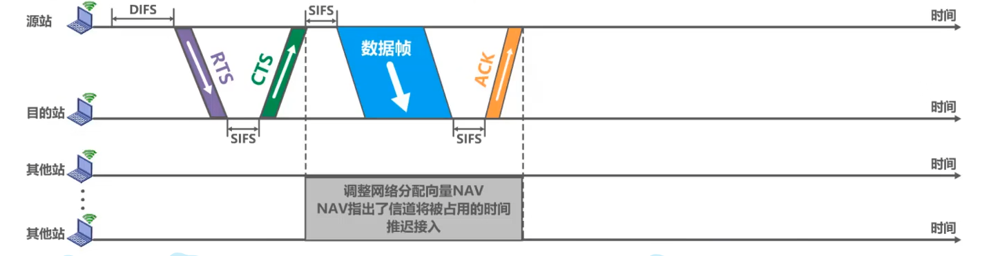

### 3.3.3 使用集线器的星形拓扑

集线器的特点

1. 使用集线器的以太网在逻辑上仍是一个总线网，各站共享逻辑上的总线，使用的还是CSMA/CD 协议（更具体些说，是各站中的适配器执行CSMNCD 协议）。网络中的各站必须竞争对传输媒体的控制，并且在同一时刻至多只允许一个站发送数据。
2. 一个集线器很像一个多接口的转发器。
3. 集线器工作在物理层，它的每个接口仅仅简单地转发比特——收到1 就转发1, 收到0 就转发o, 不进行碰撞检测。若两个接口同时有信号输入（即发生碰撞），那么所有的接口都将收不到正确的帧。

### 3.3.4 以太网的信道利用率

$$
发送帧需要的时间是T_0 \\
T_0 = \frac{帧长(bit)}{发送速率(10 Mbit/s)} \\
a：以太网单程端到端时延\tau与帧的发送时间T_0之比:  a=\frac{\tau}{T_0} \\
发送一帧占用总线的时间为T_0+\tau \\
极限信道利用率：S_{max}=\frac{T_0}{T_0+\tau}=\frac{1}{1+a}
$$

帧发送流程;

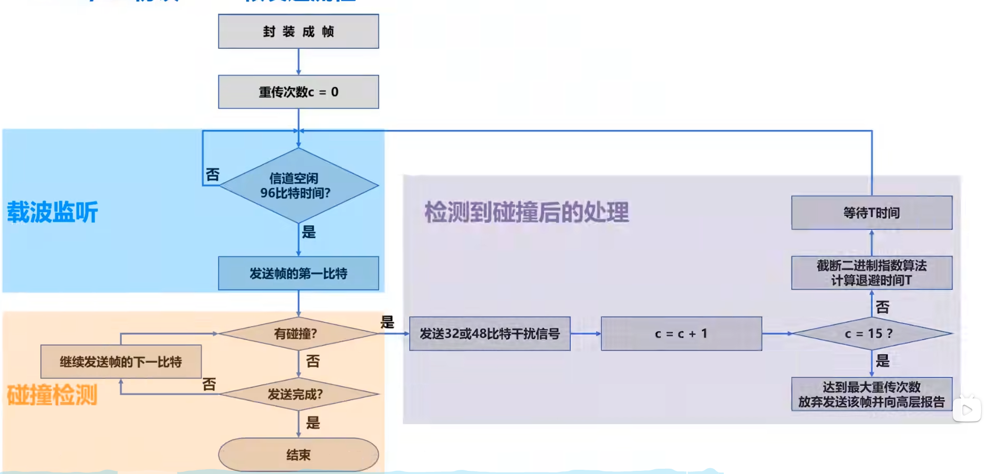

### 3.3.5 以太网的MAC层

#### MAC地址

MAC地址是以太网的MAC子层所使用的地址

- 当多个主机连接在同一个广播信道上，要想实现两个主机之间的通信，则每个主机都必须有一个唯一的标识，即一个数据链路层地址
- 在每个主机发送的**帧中必须携带标识发送主机和接收主机的地址**。由于这类地址是用于媒体接入控制MAC(Media Access Control),因此这类地址被称为**MAC地址**;
  - MAC地址一般被固化在网卡（网络适配器）的电可擦可编程只读存储器EEPROM中，因此MAC地址也被称为**硬件地址**
  - MAC地址有时也被称为**物理地址**。这并不意味着MAC地址属于网络体系结构中的物理层！
- 一般情况下，用户主机会包含两个网络适配器：有线局域网适配器（有线网卡）和无线局域网适配器（无线网卡）。每个网络适配器都有一个全球唯一的MAC地址。而交换机和路由器往往拥有更多的网络接口，所以会拥有更多的MAC地址。综上所述，**严格来说，MAC地址是对网络上各接口的唯一标识，而不是对网络上各设备的唯一标识。**

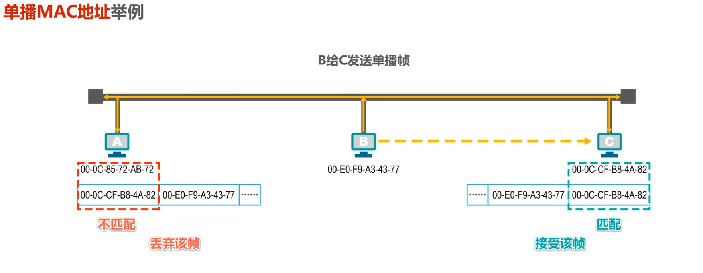

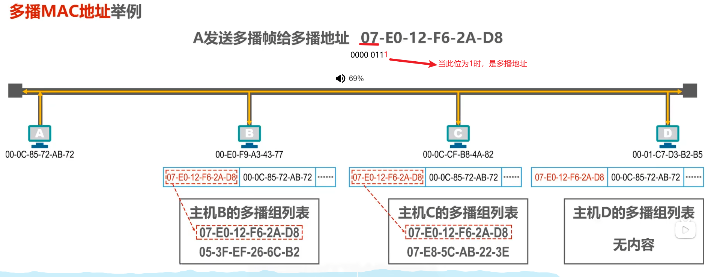

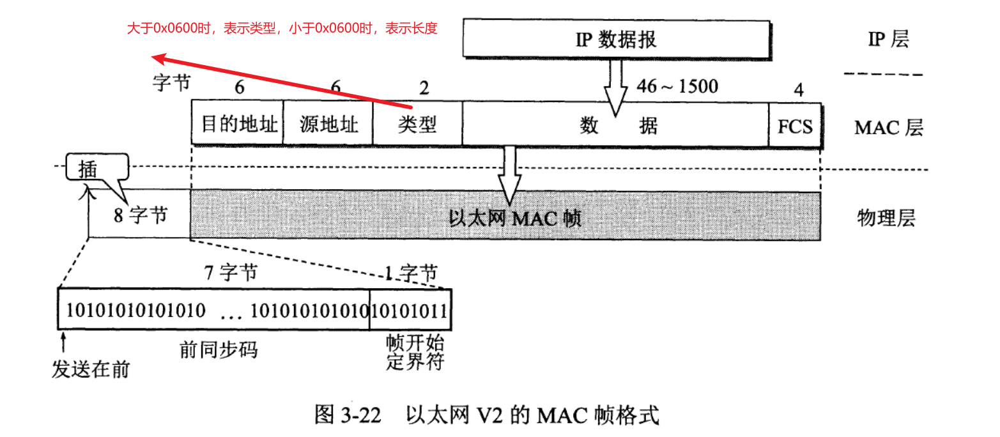

#### IP地址

IP地址是TCP/IP体系结构网际层所使用的地址

- IP地址是因特网（Internet)上的主机和路由器所使用的地址，用于标识两部分信息：
  - **网络编号**：标识因特网上数以百万计的网络
  - **主机编号**：标识同一网络上不同主机（或路由器各接口）
- 在数据包的转发过程中，**源IP地址和目的IP地址始终保持不变**；而**源MAC地址和目的MAC地址逐段链路（或逐个网络）改变**。
  - 

#### ARP协议

ARP协议属于TCP/IP体系结构的网际层，其作用是已知设备所分配到的IP地址，使用ARP协议可以通过该IP地址获取到设备的MAC地址；

## 3.4 扩展的以太网

- 光纤调制解调器
  - 进作用是进行电信号和光信号的转换

- 在每一个碰撞域中只能有一个站在发送数据
- 网桥

  - 对收到的帧根据其MAC帧的目的进行转发和过滤
- 使用双绞线和集线器HUB的星型以太网

  - **使用集线器的以太网在逻辑上仍是一个总线网，**各专共享总线资源，**使用的还是CSMA/CD协议**
  - **集线器只工作在物理层，**它的每个接口仅简单地转发比特，不进行碰撞检测（由各站的网卡检测）
  - **集线器一般都有少量的容错能力和网络管理功能**。例如，若网络中某个网卡出了故障，不停地发送帧。此时，集线器可以检测到这个问题，在内部断开与出故障网卡的连线，使整个以太网仍然能正常工作。
- 以太网交换机

  - 以太网交换机通常都有**多个接口**。每个接口都可以直接与一台主机或另一个以太网交换机相连。一般都工作在**全双工方式**。
  - 以太网交换机具有并行性，能**同时连通多对接口**，使多对主机能同时通信，**无碰撞（不使用CSMA/CD协议）** 。
  - 以太网交换机一般都具有多种速率的接口，例如：10Mb/s、100Mb/s、1Gb/s、10Gb/s接口的多种组合。
  - 以太网交换机**工作在数据链路层**（也包括物理层），它收到帧后，在帧交换表中查找**帧的目的MAC地址所对应的接口号**，然后通过该接口转发帧。
  - 以太网交换机是一种即插即用设备，其内部的**帧交换表**是通过**自学习算法**自动地逐渐建立起来的。
  - 帧的两种转发方式：
    - 1.存储转发
    - 2.直通交换：
      - 采用基于硬件的交叉矩阵(交换时延非常小，但不检查帧是否右差错）

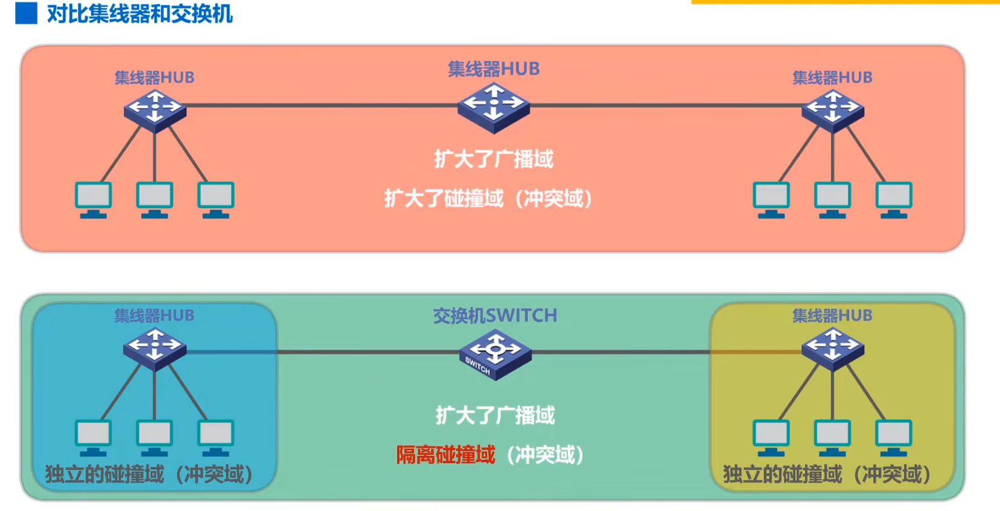

---

> 以太网交换机自学习和转发帧的流程

- 以太网交换机工作在**数据链路层**（也包括物理层）
- 以太网交换机收到帧后，在帧交换表中查找**帧的目的MAC地址所对应的接口号**，然后通过该接口转发帧。
- 以太网交换机是一种即插即用设备，刚上电启动时其内部的帧交换表是空的。随着网络中各主机间的通信，以太网交换机通过**自学习算法**自动逐渐**建立起帧交换表**。

---

> 以太网交换机的生成树协议STP

- 如何提高以太网的可靠性？
  - 添加**冗余链路**可以提高以太网的可靠性
  - 但是，冗余链路也会带来负面效应——**形成网络环路**
  - 网络环路会带来以下问题：
    - 广播风暴
      - 大量消耗网络资源，使得网络无法正常转发其他数据帧；
    - 主机收到重复的广播帧大
      - 量消耗主机资源
    - 交换机的帧交换表震荡（漂移）
- 以太网交换机使用**生成树协议STP**(Spanning Tree Protocol),可以在增加冗余链路来提高网络可靠性的同时又**避免网络环路带来的各种问题**。
  - 不论交换机之间采用怎样的物理连接，交换机都能够**自动计算并构建一个逻辑上没有环路的网络**，其逻辑拓扑结构必须是树型的（无逻辑环路）；
  - 最终生成的树型逻辑拓扑要**确保连通整个网络**；
  - 当首次连接交换机或网络**物理拓扑发生变化**时（有可能是人为改变或故障），交换机都将进行**生成树的重新计算。**

## 3.5 虚拟局域网VLAN

### 概述

- 以太网交换机工作在**数据链路层**（也包括物理层）
- 使用一个或多个以太网交换机互连起来的交换式以太网，其所有站点都属于**同一个广播域**。
- 随着交换式以太网规模的扩大，广播域相应扩大。
- 巨大的广播域会带来很多**弊端**：
  - 广播风暴
  - 难以管理和维护
  - 潜在的安全问题
- **网络中会频繁出现广播信息**
  - TCP/IP协议栈中的很多协议都会使用广播：
    - 地址解析协议ARP（已知IP地址，找出其相应的MAC地址）
    - 路由信息协议RIP(一种小型的内部路由协议)
    - 动态主机配置协议DHCP（用于自动配置IP地址）
  - NetBEUI：Widnows下使用的广播型协议
  - IPX/SPX：Novell网络的协议栈
  - Apple Talk：Apple公司的网络协议栈
- 分割广播域的方法
  - 使用路由器
    - 成本较高
  - 虚拟局域网VLAN

> 虚拟局域网VLAN（Virtual Local Area Network)是一种将局域网内的**设备划分成与物理位置无关的逻辑组的技术，这些逻辑组具有某些共同的需求。**

### 实现机制

> 需要实现**IEEE 802.1Q帧**和**交换机的端口类型**

- IEEE 802.1Q帧（也称Dot One Q帧）对以太网的MAC帧格式进行了扩展，插入了**4字节的VLAN标记**。
  - 
- VLAN标记的**最后12比特**称为**VLAN标识符VID**，它唯一地标志了以太网帧属于哪一个VLAN。
  - VID的取值范围是$(0\sim 2^{12}-1)$
  - 0和4095都不用来表示VLAN，因此用于表示VLAN的**VID的有效取值范围是1~4094**。
- **802.1Q帧是由交换机来处理的，而不是用户主机来处理的。**
  - 当交换机**收到普通的以太网帧**时，会将其插入4字节的VLAN标记转变为802.1Q帧，简称“**打标签**“
  - 当交换机**转发802.1Q帧**时，**可能**会删除其4字节VLAN标记转变为普通以太网帧，简称“**去标签**”

---

> 端口类型

- 交换机的端口类型有以下三种
  - Access
  - Trunk
  - Hybrid
- 交换机各端口的缺省VLAN ID
  - 在思科交换机上称为Native VLAN，即本征VLAN。
  - 在华为交换机上称为Port VLAN ID，即端口VLAN ID，简记为PVID。
- **Access端口**
  - Access端口一般用于连接用户计算机
  - Access端口只能属于一个VLAN
  - Access端口的PVID值与端口所属VLAN的ID相同（默认为1）
  - Access端口接收处理方法：
    - 一般只接受“未打标签”的普通以太网MAC帧。根据接收帧的端口的PVID给帧“**打标签**”，即插入4字节VLAN标记字段，字段中的VID取值与端口的PVID取值相等。
  - Access端口发送处理方法：
    - 若帧中的VID与端口的PVID相等，则“**去标签**”并**转发**该帧；否则不转发。
- **Trunk端口**
  - Trunk端口一般用于交换机之间或交换机与路由器之间的互连
  - Trunk端口可以属于多个VLAN
  - 用户可以设置Trunk端口的PVID值。默认情况下，Trunk端口的PVID值为1。
  - Trunk端口接收处理方法：
    - 对VID等于PVID的帧， **“去标签’“再转发**：
    - 对VID不等于PVID的帧，**直接转发**；
  - Trunk端口发送处理方法：
    - 接收“未打标签”的帧，根据接收帧的端口的PVID给帧“**打标签**”，即插入4字节VLAN标记字段，字段中的VID取值与端口的PVID取值相等。
    - 接收“已打标签的帧”
- **Trunk端口**
  - Hybrid端口既可用于交换机之间或交换机与路由器之间的互连（同Trunk端口），也可用于交换机与用户计算机之间的互连（同Access端口）
  - Hybrid端口可以属于多个VLAN（同Trun端口）用户可以设置Hybrid端口的PVID值。默认情况下，Hybrid端口的PVID值为1（同Trun端口）
  - Hybrid端口发送处理方法（**与Trunk端口不同**）查看帧的VID是否在端口的“去标签”列表中：
    - 若存在，则“去标签”后再转发；
    - 若不存在，则直接转发；
  - Hybrid端口接收处理方法（同Trunk端口）
    - 接收“未打标签”的帧，根据接收帧的端口的PVID给帧“打标签”，即插入4字节VLAN标记字段，字段中的VID取值与端口的PVID取值相等。
    - 接收“已打标签的帧”；
