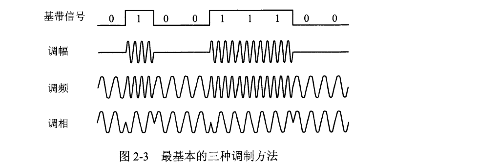
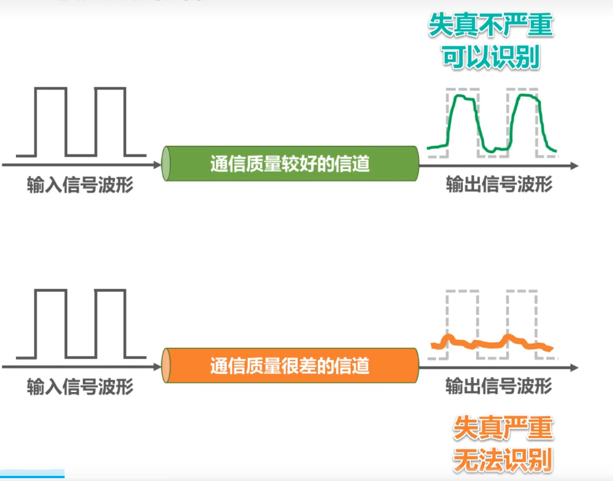
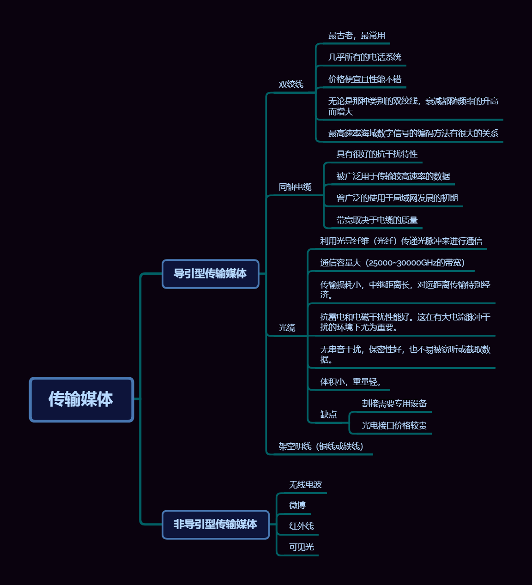

# 第二章 物理层

# 第二章 物理层

## 2.1 物理层的基本概念

> 物理层考虑的是**怎样才能在连接各种计算机的传输媒体上传输数据比特流，而不是指具体的传输媒体**

物理层的主要任务描述为确定与传输媒体的接口有关的一些特性

- 机械特性
  - 指明接口所用接线器的形状和尺寸，引脚数目和排列，固定和锁定装置
- 电气特性
  - 指明在接口电缆的各条线上出现的电压范围
- 功能特性
  - 指明某条线上出现的某一电平的电压的意义
- 过程特性
  - 指明对于不同功能的各种可能事件的出现顺序

> 数据在计算机内部多采用并行传输方式，在通信线路上一般是串行传输（即逐个比特按照时间顺序传输），因此物理层还要完成传输方式的转换

## 2.2 数据通信的基础知识

### 2.2.1 数据通信系统的模型

> 通信的目的是消息，数据是运送消息的实体，信号则是数据的电气或电磁的表现
>
> 数据是使用特定方式表示的信息，通常是有意义的符号序列

根据信号中代表信息的参数的取值方式不同，信号可以分为两大类

- 模拟信号，或连续信号
  - 代表消息的参数的取值是连续的
- 数字信号，或离散信号
  - 代表消息的参数的取值是离散的
  - 在使用时间域的波形表示数字信号时，代表不同离散数字的基本波形就称为**码元**

> 一个码元所携带的信息量是不固定的，而是由调制方式和编码方式决定的

### 2.2.2 有关信道的几个基本概念

- 信道
  - 一般都是用来表示向某一个方向传送的媒体
  - 一条通信电路往往包含一条发送信道和一条接收信道

从通信的双方交互方式来看，可以有以下三种基本方式

- 单向通信（单工通信）
  - 只能有一个方向的通信而没有反方向的交互
  - 无线广播，有线广播，电视广播
- 双向交替通信 （半双工通信）
  - 通信的双方都可以发送消息，但不能双方同时接受/发送
- 双向同时通信 （全双工通信）
  - 通信的双方可以同时发送和接受信息

基带信号（基本频带信号）

- 来自信源的信号
- 例如计算机输出的代表各种文字或图像文件的数据信号
- 因为往往包含较多的低频成分，甚至有直流成分，而许多信道不能传输这些，因此需要对其进行调制

---

- 调制
  - 基带调制（编码）
    - 仅仅对基带信号的波形进行变换，使它能够与信道特性相适应
      - 变换后仍然是基带信号
  - 带通调制
    - 使用载波进行调制，把基带信号的频率范围搬移到较高的频段，并转换为模拟信号

---

常用编码方式

- 不归零制
  - 正电平代表1，负电平代表0
  - 需要额外一条传输线来传输时钟信号，使发送方和接收方同步
  - 存在同步问题
- 归零制
  - 正脉冲代表1，负脉冲代表0
  - 每个码元传输结束后都要“归零”，所以接收方只要在信号归零后采样即可，不需要单独的时钟信号
  - 实际上，归零编码相当于把时钟信号用“归零”方式编码在了解数据之内，这称为“自同步”信号
  - 但是归零编码中大部分的数据带宽，都用来传输“归零”而浪费掉了
  - 自同步，编码效率低
- 曼彻斯特编码
  - 位周期中心的向上跳代表0，位周期中心的向下跳代表1，但也可以反过来定义
- 差分曼彻斯特编码
  - 在每一位的中心处始终都有跳代表变。位开始边界有跳变代表0，而位开始边界没有跳代表1

> 从信号波形中可以看出，曼彻斯特(Manchester)编码产生的信号频率比不归零制高。从自同步能力来看，不归零制不能从信号波形本身中提取信号时钟频率（这叫做没有自同步能力），而曼彻斯特编码具有自同步能力。

基本的带通调制方法

- 调幅（AM）
  - 载波的振幅随基带数字信号而变化
  - 0或1分别对应于无载波或有载波输出
- 调频（FM）
  - 载波的频率随基带数字信号而变化
  - 0或1分别对应于频率${f_1}$或${f_2}$
- 调相（PM）
  - 载波的初始相位随基带数字信号而变化
  - 0或1分别对应于相位0度或180度

### 2.2.3 信道的极限容量

信号波形失真因素

- 码元传输速率
- 信号传输距离
- 噪声干扰
- 传输媒体质量

---

奈氏准则

> 在假定的理想条件下，为了避免码间串扰，码元传输速率是有上限的

- 理想低通信道的最高码元传输速率 = 2W Baud = 2W 码元/秒
- 理想带通信道的最高码元传输速率 =   W Baud =   W 码元/秒
  - W;	信道带宽（单位为Hz）
  - Baud：波特，即码元/秒
- 码元传输速率又称为波特率，调制速率，波形速率或符号速率。它与比特率有一定的关系
  - 当1个码元只携带1比特的信息量时，则波特率（码元/秒）与比特率（比特/秒）在数值上是想等的
  - 当1个码元携带n比特的信息量时，则波特率（码元/秒）换成比特率（比特/秒）时，数值要乘以n
- 要提高信息传输速率（比特率），就必须设法使每一个码元能携带更多个比特的信息量。这需要采用多元制
- 实际的信道所能传输的最高码元速率，要明显地域奈氏准则给出的这个上限数值
- 在任何信道中，码元传输的速率是有上限的，传输速率超过此上限，就会出现严重的码间串扰的问题，使接收端对码元的判决（即识别）成为不可能。

---

信噪比

> 是信号的平均功率和噪声的平均功率之比，常记为${S/N}$,并用分贝（dB）作为度量单位，即
>
> $$
> 信噪比(dB) = 10 \log_{10}(S/N) (dB)
> $$

香农公式

> 带宽受限且有高斯白噪声干扰的信道的极限信息传输速率
>
> $$
> {\color{Green}c = W \times log_{2}(1+\frac{S}{N}) } \\
> \begin{align}
> &c：信道的极限信息传输速率 （单位：b/s）\\
> &W：信道带宽（单位：Hz）\\
> &S：信道内所传信号的平均功率 \\
> &N：信道内的高斯噪声功率 \\
> &S/N：信噪比，使用分贝(dB)作为度量单位 \\
>  &信噪比(dB) = 10 \log_{10}(S/N) (dB)
> \end{align}
> $$

- 信道带宽或信道中的信噪比越大，信息的极限传输速率越高
- 在实际信道上信道能够达到信息传输速率要比该公式的极限传输速率低不少。这是因为在实际信道中，信号还要受到其他一些损伤，入各种脉冲干扰，信号在传输中的衰减和失真等，这些因素在香农公式中并未考虑

## 2.3 物理层下面的传输媒体

传输媒体

- 导引型传输媒体
  - **电磁波被导引沿着固体媒体传播**
  - 双绞线
    - 
    - 屏蔽层主要为了提高双绞线抗电磁干扰的能力（STP，没有屏蔽层的是UTP）
    - 绞合的作用
      - 低于部分来自外界的电磁波干扰
      - 减少相邻导线的电磁干扰
    - 
    - 
  - 同轴电缆
    - 
    - 基带同轴电缆（50${\Omega}$）
      - 数字传输，过去用于局域网
    - 带宽同轴电缆（75${\Omega}$）
      - 模拟传输，目前主要用于有线电视
  - 光缆
    - 
    - 
    - 
    - 光在纤芯中传输的方式是不断地全反射
    - 
  - 架空明线（铜线或铁线）
- 非导引型传输媒体
  - **传输媒体是指自由空间**
  - 
  - 

## 2.4 信道复用技术

复用

> 就是在一条传输媒体上同时传输多路用户的信号

原理

> 当一条传输媒体的传输容量大于多条信道传输的总容量时，就可以通过复用技术，在这条传输媒体上建立多条通信信道，以便充分利用传输媒体的带宽

### 频分复用FDM

- 用户在分配到一定的频带后，在通信过程中自始至终都占用这个频带
- 所有用户在同样的时间占用不同的带宽资源
- 不够灵活

### 时分复用TDM

- 将时间划分为一段段等长的时分复用帧（TDM帧）。每一个时分复用的用户在每一个TDM帧中占用固定序号的时隙
- TDM信号也被称为等时信号
- 所有用户是在不同的时间占用同样的频带宽度
- 不够灵活
- 更有利于数字信号的传输

### 波分复用WDM

> 就是光的频分复用

原理

> 根据频分复用的设计思想，可在一根光纤上同时传输多个频率（波长）相近的光载波信号，实现基于光纤的频分复用技术

密集波分复用DWDM

> 在一根光纤上复用几十路或更多路数的光载波信号

### 码分复用CDM

> 常被称为码分多址CDMA，他是在扩频通信技术的基础上发展起来的一种无线通信技术

- 每个用户可以在相同的时间使用相同的频带进行通信
- 最初用千军事通信，因为这种系统发送的信号有很强的抗干扰能力，其频谱类似千白噪声，不易被敌人发现。
- 现在已广泛使用在民用的移动通信中，特别是在无线局域网中。

---

工作原理

- CDMA将每个比特时间划分为m个更短的时间片，称为码片。m的取值通常为64或128
- CDMA中的每个站点都被指派一个唯一的m比特码片序列

  - 某个站要发送比特1，则发送它自己的m比特码片序列
  - 某个站要发送比特0，则发送它自己的m比特码片序列的反码
- 如果有两个或多个站同时发送数据，则信道中的信号就是这些站各自所发送一系列码片序列或码片序列反码的叠加。为了从信道中分离出各个站的信号，给每个站指派码片序列时，必须遵循以下规则：

  - 分配给每个站的码片序列必须各不相同，实际常采用伪随机码序列
  - 分配给每个站的码片序列必须相互正交，即各码片序列相应的码片向量之间的规格化内积为0

  $$
  bold{S} \cdot \bold{T} = \frac{1}{m}\sum_{i=1}^mS_iT_i = 0 \\
  \bold{S}：站S的码片向量 \\
  \bold{T}：其他任何站的码片向量 \\
  $$

  

  规律
- 各码片序列相应的码片向量之间的规格化内积为0
- 任何一个码片向量和该码片向量自己的规格化内积都是1
- 一个码片向量和该码片向量的规格化内积值是${-1}$

## 2.5 数字传输系统

## 2.6 宽带接入技术

### 2.6.1 ADSL技术

> 非对称数字用户线ADSL技术是用数字技术对现有的模拟电话用户线进行改造

标椎模拟电话信号的频带被限制在300~3400Hz的范围内，但用户线本身实际可通过的信号频率仍然超过1 MHz

ADSL技术就把0~4kHz低端频谱留给传统电话使用，而把原来没有被利用的高端频谱留给用户上网使用

ADSL的下行（从ISP到用户）带宽都远远大于上行（从用户到ISP）带宽

- ADSL的传输距离取决于数据率和用户线的线径，与其成正比
- ADSL所能得到的最高数据传输速率还与实际的用户线上的信噪比密切相关

---

ADSL的特点

- ADSL在用户线两端各安装一个ADSL调制解调器
- 我国目前采用的ADSL方案是离散多音调DMT调制技术
- 不能保证固定的数据率

> 数字用户线接入复用器DSLAM
>
> ADSL调制解调器又被称为接入端单元ATU

### 2.6.2 光纤同轴混合网（HFC网）

> HFC网是在目前覆盖面很广的有线电视网CATV的基础上开发的一种居民宽带接入网，
>
> 除可传送电视节目外，还能提供电话、数据和其他宽带交互型务。
>
> 最早的有线电视网是树形拓扑结构的同轴电缆网络，它采用模拟技术的频分复用对电视节目进行单向广播传输。但以后有线电视网进行了改造，成
> 了现在的光纤同轴混合网(HFC 网）

### 2.6.3 FTTx技术

- 光纤到户FTTH
- 无源光网络PON

  - > 光线路终端OLT
    >
  - 

## 传输方式

- 串行传输
  - 数据是一个比特一个比特依次发送的，因此在发送端与接收端之间，只需要一条数据传输线路即可
- 并行传输
  - 一次发送n个比特，因此，在发送端和接收端之间需要有n条传输线路
  - 并行传输的优点是比串行传输的速度n倍，但成本高
- 同步传输
  - 数据块以稳定的比特流的形式传输。字节之间没有间隔
  - 接收端在每个比特信号的中间时刻进行检测，以判别接收到的是比特0还是比特1
  - 由于不同设备的时钟频率存在一定差异，不可能做到完全相同，在传输大量数据的过程中，所产生的判别时刻的累计误差，会导致接收端对比特信号的判别错位
  - 要使收发双方保持同步的方法
    - 外同步
      - 在收发双方之间添加一条单独的时钟信号线
    - 内同步
      - 发送端将时钟同步信号编码到发送数据中一起传输
- 异步传输
  - 以字节为独立的传输单位，字节之间的时间间隔不是固定
  - 接收端仅在每个字节的起始处对字节内的比特实现同步
  - 通常在每个字节前后分别加上起始位和结束位
