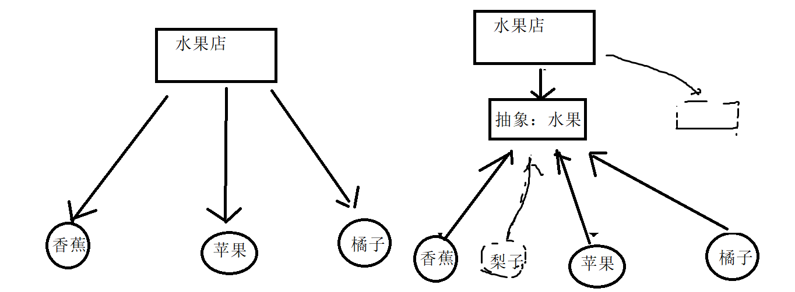
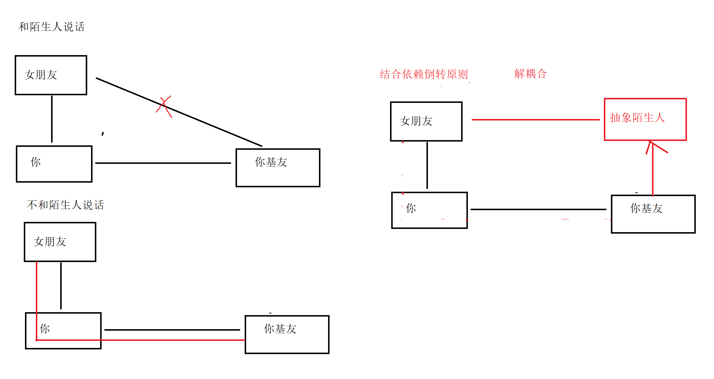
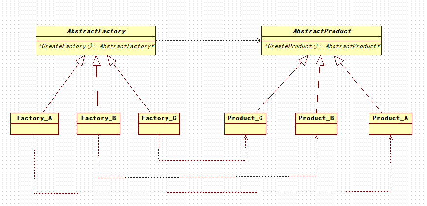

#        设计模式初识

## 什么是设计模式

### 模式

模式：在一定环境中解决一些问题的方案(通俗点就是: 特定环境用固定的套路解决问题)

### 设计模式

设计模式是一套反复被人使用，多数人知晓的，经过分类编目的代码设计经验的总结

设计模式最终的目的为了应对变化，提高代码的复用和重用性

1. 客户需求的变化

2. 技术平台变化

3. 开发团队的变化

4. 市场环境的变化

   ......

## 设计模式分类

+ 创建型模式

  通常和对象创建有关，设计到对象实例化的方式(5种)

  + 工厂模式
  + 抽象工厂模式
  + 建造者模式
  + 原型模式
  + 单例模式

+ 结构型模式

  描述的是如何组合类和对象获得更大的结构(7种)

  + 代理模式
  + 装饰者模式
  + 适配器模式
  + 桥接模式
  + 组合模式
  + 外观模式
  + 享元模式

+ 行为型模式

  描述的类和对象的交互以及分配职责(11种 )

  + 模板方法模式
  + 命令模式
  + 责任链模式
  + 策略模式
  + 中介者模式
  + 观察者模式
  + 备忘录模式
  + 访问者模式
  + 状态模式
  + 解释器模式
  + 迭代器模式

//23种

# 面向对象的设计原则

## 依赖倒置原则(DIP)

DIP：Dependence Inversion Principle

- 高层(稳定)不依赖低层(变化)，两者依赖抽象(稳定)。
- 抽象(稳定)不依赖细节(变化)，细节依赖抽象(稳定)。



## 开放封闭原则(OCP)

OCP:Open For Extension, Closed For Modification Principle

- 对扩展开放，对更改封闭

- 类模块可扩展， 但不可修改

  

## 单一职责原则(SRP)

SRP:Single Responsibility Principle

- 一个类应该仅有一个引起它变化的原因
- 变化的方向隐含类的责任

> 如果一个类承担的职责过多，就等于把这就职责耦合在一起，一个职责的变化可能会削弱或者抑制这个类完成其他职责的能力。这种耦合会导致脆弱的设计，当变化发生时，设计会遭受到意想不到的破坏【ASD】

**单一职责原则的好处：**

- 类的复杂性降低，实现什么职责都有清晰明确的定义
- 可读性提高，复杂性降低
- 可维护性提高，可读性提高
- 变更引起的风险降低

## 里氏替换原则(LSP)

LSP:Liskov Substitution Principle

- 子类必须能够替换它们的基类
- 继承表达类型抽象

## 接口隔离原则(ISP)

- 不应该强迫客户程序依赖他们不用的方法
- 接口应该小而完备
- 一个接口应该只提供一种对外功能

## 优先组合不是继承原则(CARP)

CARP：Composite/Aggregate Reuse Principle

- 类的继承通常是"白箱复用"，对象组合通常是"黑箱复用"
- 继承在一定程序破坏封装性，子类和父类耦合度高

## 迪米特法则(LOD)

LOD：Law of Demeter

- 对象应当对其他对象尽可能少的了解
- 各个模块之间相互调用时，通常会提供一个统一的接口来实现



# C++类图

## 什么是类图

类图(Class diagram)是显示了模型的静态结构，特别是模型中存在的类、类的内部结构以及它们与其他类的关系等。类图不显示暂时性的信息。类图是面向对象建模的主要组成部分。它既用于应用程序的系统分类的一般概念建模，也用于详细建模，将模型转换成编程代码。

## 类图作用

类图(Class diagram)是显示了模型的静态结构，特别是模型中存在的类、类的内部结构以及它们与其他类的关系等。类图不显示暂时性的信息。类图是面向对象建模的主要组成部分。它既用于应用程序的系统分类的一般概念建模，也用于详细建模，将模型转换成编程代码。

## 类图的元素

在类图中一共包含了以下几种模型元素，分别是：类（Class）、接口（Interface）、依赖（Dependency）关系、泛化（Generalization）关系、关联（Association）关系、聚合关系（Aggregation）、组合关系（Composition）和实现（Realization）关系。

## 类图中类的组成

C++中一个类的类图组成如下图:


```c
+: 公有属性
-: 私有属性
#: 保护属性
name:string  成员名:类型
eat():void   成员函数:返回值类型
斜体:抽象类或者纯虚函数
```

## 类中图类的关系

+ 依赖（Dependency）关系

  依赖关系是指两个或多个类之间的依存关系，如植物类依赖于土壤类。 依赖关系还可以再细分为5种类型，分别是绑定（Binding）依赖、实现（Realization）依赖、使用（Usage）依赖、抽象（Abstraction）依赖和授权（Permission）依赖。

  (**依赖关系用虚线箭头来表示，箭头指向为依赖的方向**)

+ 泛化（Generalization）关系

  简单的讲就是类之间的继承关系。

    (**用空心三角形+实线来表示，箭头指向为父类**)

+ 关联（Association）关系

  关联关系是类之间一种相互影响的关系，影响的方向就是关联的方向。

  （**关联关系用实线箭头来表示**）

+ 聚合（Aggregation)关系

  聚合关系是类之间的一种较弱的耦合关系，如一个字符串数组和一个字符串就是一种聚合关系。

  （**空心的菱形+实线箭头来表示，箭头指向为被聚合的类**）

+ 组合（Composition）关系

  组合关系是类之间一种整体与部分之间的关系，如一只青蛙有四条腿，青蛙类与青蛙腿类之间的关系就是组合关系。

  (**组合关系用实心的菱形+实线箭头来表示，箭头指向为被组合的类**)

+ 实现（Realization）关系

  一般来讲实现关系是针对类与接口之间的关系而言的。

  (**实现关系用空心三角形+虚线来表示**)

# 单例设计模式

## 什么是单例模式

单例模式是一种对象创建型模式，使用单例模式，可以保证为一个类只生成唯一的实例对象。也就是说，在整个程序空间中，该类只存在一个实例对象。

## 为什么使用单例模式

在应用系统开发中，我们常常有以下需求： 

**1.需要生成唯一序列的环境**

**2.需要频繁实例化然后销毁的对象。**

**3.创建对象时耗时过多或者耗资源过多，但又经常用到的对象。** 

**4.方便资源相互通信的环境** 

实际案例:

+ 多线程中网络资源初始化
+ 回收站机制
+ 任务管理器
+ 应用程序日志管理
+ .......

## 单例模式实现步骤

1. 构造函数私有化
2. 提供一个全局的静态方法，访问唯一对象
3. 类中定义一个静态指针，指向唯一对象


## 单例模式实现代码

### 懒汉式

```c
#include <iostream>
using namespace std;
//懒汉式
class SingleTon 
{
private:
	SingleTon();
public:
	static SingleTon* m_singleTon;
	static SingleTon* GetInstance();
	void TestPrint();
};
//懒汉式并没有创建单例对象
SingleTon* SingleTon::m_singleTon = NULL;		
int main()
{
	SingleTon* p1 = SingleTon::GetInstance();
	SingleTon* p2 = SingleTon::GetInstance();
	cout << "p1:"<<  hex << p1 << endl;
	cout << "p2:" << hex << p2 << endl;
	p1->TestPrint();
	p2->TestPrint();
	return 0;
}
SingleTon::SingleTon()
{
	m_singleTon = NULL;
	cout << "构造了对象....." << endl;
}
SingleTon* SingleTon::GetInstance()
{
	if (m_singleTon == NULL) 
	{
		m_singleTon = new SingleTon;
	}
	return m_singleTon;
}
void SingleTon::TestPrint()
{
	cout << "测试调用....." << endl;
}

```

### 饿汉式

```c
#include <iostream>
using namespace std;
//懒汉式
class SingleTon 
{
private:
	SingleTon();
public:
	static SingleTon* m_singleTon;
	static SingleTon* GetInstance();
	void TestPrint();
};
//饿汉式创建单例对象
SingleTon* SingleTon::m_singleTon = new SingleTon;		
int main()
{
	SingleTon* p1 = SingleTon::GetInstance();
	SingleTon* p2 = SingleTon::GetInstance();
	cout << "p1:"<<  hex << p1 << endl;
	cout << "p2:" << hex << p2 << endl;
	p1->TestPrint();
	p2->TestPrint();
	return 0;
}
SingleTon::SingleTon()
{
	m_singleTon = NULL;
	cout << "构造了对象....." << endl;
}
SingleTon* SingleTon::GetInstance()
{
	return m_singleTon;
}
void SingleTon::TestPrint()
{
	cout << "测试调用....." << endl;
}
```

## 单例模式优缺点

**优点**：

- 在内存中只有一个对象，节省内存空间；
- 避免频繁的创建销毁对象，可以提高性能；
- 避免对共享资源的多重占用，简化访问；
- 为整个系统提供一个全局访问点。

**缺点**：

-  不适用于变化频繁的对象；
- 如果实例化的对象长时间用，系统会认为该对象是垃圾而被回收，这可能会导致对象状态的丢失；

# 简单工厂模式

## 什么是简单工厂

简单工厂模式属于类的创建型模式,又叫做静态工厂方法模式。

通过专门定义一个类来负责创建其他类的实例，被创建的实例通常都具有共同的父类。

## 为什么使用简单工厂

减少客户程序对类创建过程的依赖

## 简单工厂实现步骤

1.提供一个工厂类

简单工厂模式的核心，它负责实现创建所有实例的内部逻辑。工厂类可以被外界直接调用，创建所需的产品对象。

2.提供一个抽象产品类

简单工厂模式所创建的所有对象的父类，它负责描述所有实例所共有的公共接口。

3.提供一个具体产品类

简单工厂模式所创建的具体实例对象


## 简单工厂实现代码

```c
#include <iostream>
#include <string>
using namespace std;
//产品抽象父类
class Operation 
{	

public:
	double m_leftVlaue;
	double m_rightValue;
	virtual double GetResult() = 0;
};
//具体产品实现类
class AddOperation:public Operation
{
	double GetResult()
	{
		return m_leftVlaue + m_rightValue;
	}
};
class SubOperation :public Operation 
{
	double GetResult()
	{
		return m_leftVlaue - m_rightValue;
	}
};

class MulOperation :public Operation
{
	double GetResult()
	{
		return m_leftVlaue * m_rightValue;
	}
};

class DivOperation :public Operation
{
	double GetResult()
	{
		return m_leftVlaue / m_rightValue;
	}
};
//工厂类
class  OperatorFactory 
{
public:
	static  Operation* createOperation(char c) 
	{
		switch (c) 
		{
		case '+':
			return new AddOperation;
			break;
		case '-':
			return new SubOperation;
			break;
		case '*':
			return new MulOperation;
			break;
		case '/':
			return new DivOperation;
			break;
		}
	}
};
int main() 
{
	Operation* operation = OperatorFactory::createOperation('+');
	operation->m_leftVlaue = 1;
	operation->m_rightValue = 2;
	cout << operation->GetResult() << endl;
	return 0;
}
```

## 简单工厂优缺点

**优点**：

- 帮助封装

  实现组件封装，面向接口编程

- 解耦合

  客户端和具体实现类的解耦合

**缺点**：

-  可能增加客户端的复杂度
-  不方便扩展子工厂

# 工厂模式

## 什么是简单工厂模式

工厂方法模式同样属于类的创建型模式又被称为多态工厂模式 。工厂方法模式的意义是 定义一个创建产品对象的工厂接口，将实际创建工作推迟到子类当中。 核心工厂类不再负责产品的创建，这样核心类成为一个抽象工厂角色，仅负责具体工厂子类 必须实现的接口，这样进一步抽象化的好处是使得工厂方法模式可以使系统在不修改具体工 厂角色的情况下引进新的产品

## 为什么使用工厂模式

工厂方法模式与简单工厂模式在结构上的不同不是很明显。工厂方法类的核心是一个抽 象工厂类，而简单工厂模式把核心放在一个具体类上。 工厂方法模式之所以有一个别名叫多态性工厂模式是因为具体工厂类都有共同的接口， 或者有共同的抽象父类。 当系统扩展需要添加新的产品对象时，仅仅需要添加一个具体对象以及一个具体工厂对 象，原有工厂对象不需要进行任何修改，也不需要修改客户端，很好的符合了“开放－封闭” 原则。而简单工厂模式在添加新产品对象后不得不修改工厂方法，扩展性不好。工厂方法模式退化后可以演变成简单工厂模式。 

## 工厂模式实现步骤

1.提供一个抽象工厂类 :所有具体工厂类的父类

2.提供与产品对应的工厂类:负责实例化产品对象

3.提供一个抽象产品类： 所有产品的父类

4.提供一个或多个产品类:工厂方法模式所创建的具体实例对象



## 工厂模式实现代码

```c++
#include <iostream>
using namespace std;
class AbstractProduct
{
public:
	virtual void makeProduct() = 0;
};

class AbstractFactory 
{
public:
	virtual AbstractProduct* createProduct() = 0;
};

class PlaneProduct :public AbstractProduct
{
public:
	void makeProduct() 
	{
		cout << "造飞机....." << endl;
	}
};
class PlaneFactory :public AbstractFactory 
{
public:
	AbstractProduct* createProduct()
	{
		AbstractProduct* product = new PlaneProduct;
		return product;
	}
};
class RocketProduct :public AbstractProduct
{
public:
	void makeProduct()
	{
		cout << "造火箭...." << endl;
	}
};
class RocketFactory :public AbstractFactory 
{
public :
	AbstractProduct* createProduct()
	{
		AbstractProduct* product = new RocketProduct;
		return product;
	}
};

int main() 
{
	//造飞机
	AbstractFactory* factory = new PlaneFactory;
	AbstractProduct* product = factory->createProduct();
	product->makeProduct();
	//造火箭
	factory = new RocketFactory;
	product = factory->createProduct();
	product->makeProduct();

	return 0;
}
```

## 工厂模式优缺点

**优点**：

+ 需求改变时改动最小

+ 具体的创建实例过程与客户端分离

**缺点：**

+ 新增功能时，工程量稍大

# 抽象工厂模式

## 什么是抽象工厂模式

抽象工厂模式是所有形态的工厂模式中最为抽象和最其一般性的。抽象工厂模式可以向 客户端提供一个接口，使得客户端在不必指定产品的具体类型的情况下，能够创建多个产品族的产品对象。 

## 为什么使用抽象工厂模式

抽象工厂方法是针对与一个产品族，使得易于交换产品系列，只需改变具体的工厂就可以使用不同的产品配置。当一个族中的产品对象被设计成一起工作且一个应用只是用同一族的对象，例如设计系统生成不同风格的UI界面，按钮，边框等UI元素在一起使用，并且只能同属于一种风格，这很容易使用抽象工厂实现。

## 抽象工厂模式实现步骤

**1.提供一个抽象工厂类：**声明一组创建一族产品的工厂方法

**2.提供一个具体工厂类：**实现了在抽象工厂创建产品的工厂方法

**3.提供一个抽象产品类：**抽象产品中声明了产品具有的业务方法

**4.提供一个具体产品类：**实现抽象产品接口中声明的业务方法


## 抽象工厂模式实现代码

```c++
#include <iostream>
using namespace std;
//抽象产品
class Product 
{
public:
	virtual void show() = 0;
};
//抽象产品族1
class KeyBoard :public Product{};
//罗技键盘
class LogiKeyBoard :public KeyBoard
{
	void show()
	{
		cout << "罗技键盘......" << endl;
	}
};
//雷蛇键盘
class RazerKeyBoard :public KeyBoard
{
	void show() 
	{
		cout << "雷蛇键盘......" << endl;
	}
};
//抽象产品族2
class Mouse :public Product {};
//罗技鼠标
class LogiMouse :public Mouse
{
	void show() 
	{
		cout << "罗技鼠标......" << endl;
	}
};
class RazerMouse :public Mouse 
{
	void show() 
	{
		cout << "雷蛇鼠标......" << endl;
	}
};
//抽象工厂
class Factory
{
public:
	virtual KeyBoard* createKeyBoard() = 0;
	virtual Mouse* createMouse() = 0;
};
class LogiFactory :public Factory
{
	KeyBoard* createKeyBoard()
	{
		return new LogiKeyBoard;
	}
	Mouse* createMouse() 
	{
		return new LogiMouse;
	}
};
class RazerFactory :public Factory 
{
	KeyBoard* createKeyBoard() 
	{
		return new RazerKeyBoard;
	}
	Mouse* createMouse() 
	{
		return new RazerMouse;
	}
};

int main() 
{
	Factory* factory = new LogiFactory;
	KeyBoard* keyBoard = factory->createKeyBoard();
	Mouse* mouse = factory->createMouse();
	keyBoard->show();
	mouse->show();
	delete factory;
	delete keyBoard;
	delete mouse;
	factory = new RazerFactory;
	keyBoard = factory->createKeyBoard();
	mouse = factory->createMouse();
	keyBoard->show();
	mouse->show();
	delete factory;
	delete keyBoard;
	delete mouse;
	factory = NULL;
	keyBoard = NULL;
	mouse = NULL;
	return 0;
}
```

## 抽象工厂模式优缺点

**优点**：

+ 抽象工厂封装了变化，封装了对象创建的具体细节
+ 增加新的产品族很方便，无须修改已有系统
+ 针对接口进行编程而不是针对具体进行编程

**缺点：**

+  增加新的产品等级结构需对原系统做较大修改(违背开放封闭)

# 建造者模式

## 什么是建造者模式

建造者模式是一种对象创建型模式之一，用来隐藏复合对象的创建过程，它把复合对象的创建过程加以抽象，通过子类继承和重载的方式，动态地创建具有复合属性的对象。官方说法就是将一个复杂对象的构造与它的表示分离，使同样的构建过程可以创建不同的表示。

## 为什么使用建造者模式

主要解决在软件系统中，有时候面临着"一个复杂对象"的创建工作，其通常由各个部分的子对象用一定的算法构成；由于需求的变化，这个复杂对象的各个部分经常面临着剧烈的变化，但是将它们组合在一起的算法却相对稳定。

## 建造者模式实现步骤

1.提供抽象建造者类: 为创建产品各个部分，统一抽象接口

2.提供具体建造者类：具体实现抽象建造者各个部件的接口

3.提供多个具体产品类:具体的创建产品的各个部分

4.提供一个指挥类：负责安排和调度复杂对象的各个建造过程


## 建造者模式实现代码

```c++
//电脑组装:显示器、鼠标、键盘、主机（主机又包括cpu、显卡、主板等）
//1.找到店铺老板告诉需求
//2.客服安排技术员工组装
//3.产品组装完成

#include <iostream>
#include <vector>
#include <string>
using namespace std;

class AbstractProduct 
{
public:
	virtual void SetDisplayer(string displayer) = 0;
	virtual void SetMouse(string  mouse) = 0;
	virtual void SetKeyBoard(string  keyBoard) = 0;
	virtual void SetHost(string host) = 0;
	virtual void Show() = 0;
	//vector<string> m_list;	//电脑清单
};

class Computer:public AbstractProduct
{
	void SetDisplayer(string displayer) 
	{
		m_list.push_back(displayer);
	}
	void SetMouse(string  mouse)
	{
		m_list.push_back(mouse);
	}
	void SetKeyBoard(string  keyBoard)
	{
		m_list.push_back(keyBoard);
	}
	void SetHost(string host) 
	{
		m_list.push_back(host);
	}
	void Show() 
	{
		cout << "组装电脑配置:" << endl;
		for (auto v : m_list) 
		{
			cout << v << endl;
		}
	}
	vector<string> m_list;	//电脑清单
};
//抽象建造者
class AbstarctBuilder 
{
public:
	AbstarctBuilder() :product(new Computer) {}
	virtual void BuildDisplayer(string displayer) = 0;
	virtual void BuildMouse(string mouse) = 0;
	virtual void BuildKeyBoard(string keyBoard) = 0;
	virtual void BuildHost(string host) = 0;
	AbstractProduct* GetProduct()
	{
		return product;
	}
protected:
	AbstractProduct* product;
};
//具体建造者:技术人员
class ConcreteBuilder :public AbstarctBuilder
{
public:
	virtual void BuildDisplayer(string displayer) 
	{
		product->SetDisplayer(displayer);
	}
	void BuildMouse(string mouse) 
	{
		product->SetMouse(mouse);
	}
	void BuildKeyBoard(string keyBoard) 
	{
		product->SetKeyBoard(keyBoard);
	}
	void BuildHost(string host) 
	{
		product->SetHost(host);
	}
};
//指挥者
class Director 
{
public:
	Director(AbstarctBuilder* pBuilder) :pBuilder(pBuilder) {}
	AbstractProduct* Construct(string displayer,string mouse, string keyBoard, string host)
	{
		pBuilder->BuildDisplayer(displayer);
		pBuilder->BuildMouse(mouse);
		pBuilder->BuildKeyBoard(keyBoard);
		pBuilder->BuildHost(host);
		return pBuilder->GetProduct();
	}
private:
	AbstarctBuilder* pBuilder;
};

int main() 
{
	AbstarctBuilder* pB = new ConcreteBuilder;
	Director* pD = new Director(pB);
	AbstractProduct* pC = pD->Construct("华为显示器", "牧马人鼠标", "雷蛇键盘", "外星人");
	pC->Show();
	return 0;
}
```

## 建造者模式优缺点

**优点**

+ 封装性好，构建和表示分离

+ 扩展性好，各个具体的建造者相互独立，有利于系统的解耦

+ 控制细节风险，客户端无需详知细节，建造者细化创建过程

**缺点**

+ 产品的组成部分必须相同，这限制了其使用范围

+ 产品内部发生变化，建造者需同步修改，后期维护成本较大

# 原型模式

## 什么是原型模式

用原型实例指定创建对象的种类，并通过拷贝这些原型创建新的对象，简单理解就是“**克隆指定对象**”

## 为什么使用原型模式

某些结构复杂的对象的创建工作中由于需求的变化，这些对象经常面临着剧烈的变化，但是他们却拥有比较稳定一致的接口。此时便可以使用原型模式。

## 原型模式实现步骤

1. 提供一个抽象原型类：规定了具体原型对象必须实现的接口。
2. 提供多个具体原型类：实现抽象原型类的 `clone()` 方法，它是可被复制的对象。
3. 提供访问类：使用具体原型类中的 `clone()` 方法来复制新的对象。


## 原型模式实现代码

```c++
#include<iostream>
#include <string>
using namespace std;
// 猴子
class Monkey
{
public:
    Monkey() {}
    virtual ~Monkey() {}
    virtual Monkey* Clone() = 0;  // 克隆
    virtual void Play() = 0;      // 玩耍
};
// 孙悟空
class SunWuKong : public Monkey
{
public:
    SunWuKong(string name) { m_strName = name; }
    ~SunWuKong() {}

    // 拷贝构造函数
    SunWuKong(const SunWuKong& other) {
        m_strName = other.m_strName;
    }
    Monkey* Clone() 
    {
        // 调用拷贝构造函数
        return new SunWuKong(*this);
    }
    void Play() {
        cout << m_strName << ":金箍棒" << endl;
    }

private:
    string m_strName;
};

int main()
{
    // 孙悟空
    Monkey* monkey = new SunWuKong("齐天大圣孙悟空");

    // 克隆猴子猴孙
    Monkey* m1= monkey->Clone();
    Monkey* m2 = m1->Clone();

    m1->Play();
    m2->Play();

    delete monkey;
    delete m1;
    delete m2;

	return 0;
}
```

## 原型模式优缺点

**优点**

+ 如果创建新的对象比较复杂，可以利用原型模式简化对象的创建过程，同时也能够提高效率。
+ 简化对象的创建，无需理会创建过程。
+ 可以在程序运行时（对象属性发生了变化）获得一份内容相同的实例，他们之间不会相互干扰

**缺点**

+ 每一个类都必须配备一个克隆方法,对于已有的没有克隆方法的类来说是致命的。

# 创建型模式总结

工厂模式模式：单个类的对象创建工作

抽象工厂模式：多个类的对象创建工作

单例模式:类的全局对象创建工作

建造者模式:复杂类的对象创建工作

原型模式：自身类的克隆工作

到目前为止，五个创建模式都汇总了，各有各的用途，在实际运用中，要多对比，哪种创建模式才适合，设计模式虽好，但要学会正确的运用，将会像把利刃，非常有利于项目的扩展易用等。

# 代理模式

## 什么是代码模式

代理模式是构造型的设计模式之一，它可以为其他对象提供一 种代理以控制对这个对象的访问。 所谓代理，是指具有与代理元（被代理的对象）具有相同的接口的类，客户端必须 通过代理与被代理的目标类交互，而代理一般在交互的过程中（交互前后），进行某些 特别的处理。 

## 为什么使用代理模式

在目标对象实现的基础上,增强额外的功能操作,即扩展目标对象的功能. 

代理模式的作用：AOP实现，拦截器，中介，黄牛，解耦，专人做专事。

AOP:面向切面编程，通过预编译方式和运行期间动态代理实现程序功能的统一维护的一种技术。

## 代理模式实现步骤

1.提供一个抽象主题角色：真实主题与代理主题的共同接口

2.提供一个真实主题角色：定义了代理角色所代表的真实对象

3.提供一个代理主题角色：含有对真实主题角色的引用


## 代理模式实现代码

```c
//携程买票
#include <iostream>
using namespace std;
//抽象主题类
class Subject 
{
public:
	virtual void BuyTicket() = 0;
};
//代理类
class User :public Subject 
{
public:
	void BuyTicket() 
	{
		cout << "用户买票" << endl;
	}
};
class Ctrip :public Subject 
{
public:
	Ctrip(Subject* sub) :m_sub(sub) {}
	void BuyTicket() 
	{
		cout << "携程买票" << endl;
	}
private:
	Subject* m_sub;
};

int main() 
{
	Subject* sub = new User;
	Ctrip* proxy = new Ctrip(sub);
	proxy->BuyTicket();
	return 0;
}
```

## 代理模式优缺点

**优点**

+ 职责清晰：**真实角色就是实现实际业务逻辑，**不关心其他非本职责事务，**通过后期代理完成一件事务，附带结果就是编程简介清晰。**

+ 高扩展性：具体**主题角色可变**。

**缺点**

+ 代理模式可能会造成**请求的处理速度变慢**

# 装饰模式

## 什么是装饰模式

装饰（ Decorator ）模式又叫做包装模式。通过一种对客户端透明的方式来扩展对象的功能，是继承关系的一个替换方案。 装饰模式就是把要添加的附加功能分别放在单独的类中，并让这个类包含它要装饰的对 象，当需要执行时，客户端就可以有选择地、按顺序地使用装饰功能包装对象。

## 为什么使用装饰模式

装饰模式可以动态的给一个对象添加一些额外的职责。就增加功能来说，此模式比生成子类更为灵活,通过子类继承的方式，但是如果后续继续增加功能的话，便要继续继承现有的类，如此就会使继承的层次越来越深，不利与代码的维护和可读性。故最好的方式便是通过装饰者模式来完成。

## 装饰模式实现步骤

1.提供一个抽象组件类:抽象被装饰者的行为

2.提供一个或多个具体组件类:被装饰者的行为具体实现

3.提供一个抽象装饰器类：抽象组件指针与抽象组件一致接口

4.提供一个具体的装饰器类：为具体组件附加责任


## 装饰模式代实现代码

```C++
//美女穿衣
#include <iostream>
#include <string>
using namespace std;
class AbstractCompent 
{
public :
	virtual void Show() = 0;
	string pStr;
};
class Girl :public AbstractCompent 
{
public :
	Girl( ) 
	{
		this->pStr = "啥也没穿的女孩";
	}
	void Show() 
	{
		cout << pStr << endl;
	}
};

class AbstractDecrate :public AbstractCompent 
{
public:
	virtual void Show() = 0;
protected:
	AbstractCompent* pBase;
};

//超短裙装饰
class MiniSkirt :public AbstractDecrate 
{
public:
	MiniSkirt(AbstractCompent* pBase)
	{
		this->pBase = pBase;
	}
	void Show() 
	{
		this->pStr = pBase->pStr + " 穿超短裙";
		cout << this->pStr << endl;
	}
};

class BlackSilk :public AbstractDecrate 
{
public:
	BlackSilk(AbstractCompent* pBase) 
	{
		this->pBase = pBase;
	}
	void Show() 
	{
		this->pStr = pBase->pStr + " 穿黑丝";
		cout << this->pStr << endl;
	}
};

int main() 
{
	//1.原始呗装饰者
	Girl* pG = new Girl;
	pG->Show();

	MiniSkirt* pM = new MiniSkirt(pG);
	pM->Show();

	BlackSilk* pB = new BlackSilk(pM);
	pB->Show();

	return 0;
}
```

## 装饰模式优缺点

**优点**

+ 易于扩展对象功能
+ 通过装饰类的排列组合，可创造出很多不同行为的组合

**缺点**

+ 会出现更多的代码，更多的类，增加程序复杂性
+ 动态装饰时，多层装饰时会更复杂

# 适配器模式

## 什么是适配器模式

适配器模式是将一个类的接口转换成客户希望的另外一个接口。适配器模式使得原本由于接口不兼容而不能一起工作的那些类可以一起工作。好比日本现在就只提供110V的电压，而我的电脑就需要220V的电压，那怎么办啦?适配器就是干这活的，在不兼容的东西之间搭建一座桥梁，让二者能很好的兼容在一起工作。

## 为什么使用适配器模式

在软件开发中，有的时候系统的数据和行为都正确，但接口不符合，我们应该考虑使用适配器模式，目的是使控制范围之外的一个原有对象与某个接口匹配。举个例子:在开发一个模块的时候，有一个功能点实现起来比较费劲，但是，之前有一个项目的模块实现了一样的功能点;但是现在这个模块的接口和之前的那个模块的接口是不一致的。此时，作为项目经理的你，该怎么办啦?使用适配器模式，将之前实现的功能点适配进新的项目了。

## 适配器模式实现步骤

1. 适配器实现与其中一个现有对象兼容的接口
2. 现有对象可以使用该接口安全地调用适配器方法
3. 适配器方法被调用后将以另一个对象兼容的格式和顺序将请求传递给该对象

一般适配器模式分为以下两类:

+ #### 对象适配器:适配器实现了其中一个对象的接口， 并对另一个对象进行封装


+ #### 类适配器:适配器同时继承两个对象的接口


## 适配器模式实现代码

### 对象适配器实现代码

```c
//电源插座  三插头到两插头转换
#include <iostream>
using namespace std;
class ThreeOutlet 
{
public:
	void ThreeOutletCharge()
	{
		cout << "开始三插座充电......" << endl;
	}
};

class AbstractTwoOutlet 
{
public:
	virtual void TwoOutletCharge() = 0;
};
class TwoOutlet:public TwoOutlet
{
public:
	void TwoOutletCharge() 
	{
		cout << "开始二插座充电......" << endl;
	}
};

//对象适配器
class OutletAdapterObject :public AbstractTwoOutlet
{
public:
	OutletAdapterObject(ThreeOutlet* out)
	{
		pOut = out;
	}
	void TwoOutletCharge()
	{
		Convertor();
		pOut->ThreeOutletCharge();
	}
	void Convertor() 
	{
		cout << "三插头转换为两插头后:";
	}
	ThreeOutlet* pOut;
};

int main()
{
	ThreeOutlet* pThree = new ThreeOutlet;
	AbstractTwoOutlet* pTwo = new OutletAdapterObject(pThree);
	pTwo->TwoOutletCharge();
	return 0;
}
```

### 类适配器实现代码

```c++
#include <iostream>
using namespace std;
class ThreeOutlet 
{
public:
	void ThreeOutletCharge()
	{
		cout << "开始三插座充电......" << endl;
	}
};

class AbstractTwoOutlet 
{
public:
	virtual void TwoOutletCharge() = 0;
};
class TwoOutlet:public TwoOutlet
{
public:
	void TwoOutletCharge() 
	{
		cout << "开始二插座充电......" << endl;
	}
};

//类适配器模式
class OutletAdapterClass :public AbstractTwoOutlet, public ThreeOutlet
{
public:
	void TwoOutletCharge()
	{
		Convertor();
		ThreeOutletCharge();
	}
	void Convertor() 
	{
		cout << "三插头转换为两插头后:";
	}
};


int main()
{
	ThreeOutlet* pThree = new ThreeOutlet;
	AbstractTwoOutlet* pTwo = new OutletAdapterClass;
	pTwo->TwoOutletCharge();

	return 0;
}
```

## 适配器模式优缺点

**优点**

+ 降低了去实现一个功能点的难度，可以对现有的类进行包装，就可以进行使用了
+ 提高了项目质量，现有的类一般都是经过测试的，使用了适配器模式之后，不需要对旧的类进行全面的覆盖测试;
+ 总的来说,提高了效率,降低了成本。


**缺点**

+ 类适配器模式，由于多继承，可能会出现二义性
+ 对象适配器模式，如果过多使用适配器模式，会导致代码阅读难度增大

# 桥接模式

## 什么是桥接模式

桥接模式是一种结构型设计模式， 可将业务逻辑或一个大类拆分为不同的层次结构， 从而能独立地进行开发。桥接模式通过将继承改为组合的方式来解决这个问题。 具体来说， 就是抽取其中一个维度并使之成为独立的类层次， 这样就可以在初始类中引用这个新层次的对象， 从而使得一个类不必拥有所有的状态和行为。层次结构中的第一层 （通常称为抽象部分） 将包含对第二层 （实现部分） 对象的引用。 抽象部分将能将一些 （有时是绝大部分） 对自己的调用委派给实现部分的对象。 所有的实现部分都有一个通用接口， 因此它们能在抽象部分内部相互替换。

## 为什么使用桥接模式

桥接模式在处理跨平台应用、 支持多种类型的数据库服务器或与多个特定种类 （例如云平台和社交网络等） 的 API 供应商协作时会特别有用。

## 桥接模式实现步骤

1.提供一个抽象类:提供高层控制逻辑,依赖实际底层对象

2.提供一个精准抽象类:拓展抽象类,更精确的抽象

3.提供具体实现抽象类:具体实现类的抽象通用接口

4.提供具体实现类：针对不同底层的通用接口实现


## 桥接模式实现代码

```c++
#include <iostream>
#include <string>
using  namespace std;
class Color 
{
public:
	virtual void FillColor() = 0;

};
class Red :public Color 
{
public:
	Red() :colorType("Red") {}
	void FillColor() 
	{
		cout << "填充颜色:" << colorType << endl;
	}
private:
	string colorType;
};
class Blue :public Color 
{
public:
	Blue() :colorType("Blue") {}
	void FillColor()
	{
		cout << "填充颜色:" << colorType << endl;
	}
private:
	string colorType;
};

class Shape
{
public:
	virtual void ShowShape() = 0;
	virtual void SetColor(Color* color) = 0;
protected:
	virtual void DrawShape() = 0;
	virtual void DrawColor() = 0;
	Color* color;
};

class Circle :public Shape 
{
public:
	Circle():shapeType("Circle") {}
	void ShowShape() 
	{
		DrawShape();
		DrawColor();
	}
	void SetColor(Color* color) 
	{
		this->color = color;
	}
private:
	void DrawShape() 
	{
		cout << "绘制:" << shapeType << endl;
	}
	void DrawColor() 
	{
		this->color->FillColor();
	}
	string shapeType;
};

class Rectangle :public Shape
{
public:
	Rectangle() :shapeType("Rectangle") {}
	void ShowShape()
	{
		DrawShape();
		DrawColor();
	}
	void SetColor(Color* color)
	{
		this->color = color;
	}
private:
	void DrawShape()
	{
		cout << "绘制:" << shapeType << endl;
	}
	void DrawColor()
	{
		this->color->FillColor();
	}
	string shapeType;
};

int main()
{
	cout << "绘制不同圆:" << endl;
	Shape* shape = new Circle;
	shape->SetColor(new Red);
	shape->ShowShape();
	
	shape->SetColor(new Blue);
	shape->ShowShape();
	delete shape;
	cout << "绘制不同矩形:" << endl;
	shape = new Rectangle;
	shape->SetColor(new Red);
	shape->ShowShape();

	shape->SetColor(new Blue);
	shape->ShowShape();
	return 0;
}
```

## 桥接模式优缺点

**优点**

+ 你可以创建与平台无关的类和程序
+ 客户端代码仅与高层抽象部分互动， 不接触到平台详细信息

+ 开闭原则，可以新增抽象和实现， 且它们之间互不影响
+ 单一职责原则，抽象专注高层逻辑， 实现部分处理平台细节

**缺点**

+ 对高内聚的类使用该模式可能会让代码更加复杂

# 外观模式

## 什么是外观模式

**外观模式**是一种结构型设计模式， 能为程序库、 框架或其他复杂类提供一个简单的接口

## 为什么使用外观模式

外观类为包含许多活动部件的复杂子系统提供一个简单的接口。 与直接调用子系统相比， 外观提供的功能可能比较有限， 但它却包含了客户端真正关心的功能。如果你的程序需要与包含几十种功能的复杂库整合， 但只需使用其中非常少的功能， 那么使用外观模式会非常方便。

## 外观模式实现步骤

1.提供一个外观类:为调用方, 定义简单的调用接口

2.提供一个调用者类:通过外观类接口调用提供某功能的内部类群

3.多个功能提供者类:提供功能的类群（模块或子系统）


## 外观模式实现代码

```c++
//IDE 编译过程
//编译器在后台会进行语法分析，生成中间代码，生成汇编代码，链接成可执行程序或库等等动作
#include <iostream>
using namespace std;
class CSyntaxParser 
{
public:
	void SyntaxParser() 
	{
		cout << "语法分析中......" << endl;
	}
};
class CMidCode 
{
public:
	void MidCode() 
	{
		cout << "生成中间代码中......" << endl;
	}
};
class CAssemblyCode 
{
public:
	void AssemblyCode()
	{
		cout << "生成汇编代码中......" << endl;
	}
};

class CLink 
{
public:
	void LinkSystem() 
	{
		cout << "连接成程序......" << endl;
	}
};
class Facade 
{
public:
	void Build() 
	{
		CSyntaxParser parser;
		CMidCode midcode;
		CAssemblyCode  acode;
		CLink link;
		parser.SyntaxParser();
		midcode.MidCode();
		acode.AssemblyCode();
		link.LinkSystem();
	}
};

int main() 
{
	Facade facade;
	facade.Build();
	return 0;
}
```

## 外观模式优缺点

**优点**

+ 你可以让自己的代码独立于复杂子系统

**缺点**

+ 外观可能成为与程序中所有类都耦合的上帝对象(了解过多或者负责过多的对象)

# 享元模式

## 什么是享元模式

**享元模式**是一种结构型设计模式， 它摒弃了在每个对象中保存所有数据的方式， 通过共享多个对象所共有的相同状态， 让你能在有限的内存容量中载入更多对象。

## 为什么使用享元模式

通过复用相同的对象来减少对象的创建数量，创建更小的对象组，并通过共享实现重用。通过归类，将对象的属性分为内蕴状态和外蕴状态。

外蕴状态是对象的外部描述，是每个对象的可变部分，比如对工具的使用地点、使用时间、使用人、工作内容的描述，这些属性不属于对象本身，而是根据每回使用情况进行变化的，这就需要制作成接口进行外部调用，而外蕴状态的维护是由调用者维护的，对象内不进行维护。

## 享元模式实现步骤

1.提供一个抽象享元角色类:具体享元类的父类，规定一些需要实现的公共接口

2.提供一个或者多个具体享元角色:实现了抽象享元角色规定的方法

3.提供一个享元工厂角色类:负责创建和管理享元角色


## 享元模式实现代码

```c
//车库信息
#include <iostream>
#include <string>
#include <sstream>
#include <map>
#include <initializer_list>
using namespace std;
class SharedState 
{
public:
	SharedState(const string brand, const string model, const string color) :brand(brand),
		model(model), color(color) 
	{

	}
	friend ostream& operator<<(ostream& out, const SharedState ss)
	{
		out << "[" << ss.brand << "," << ss.model << "," << ss.color << "]";
		return out;
	}
	const string& GetBrand()const { return brand;}
	const string& GetModel()const { return model; }
	const string& GetColor()const { return color; }
private:
	string brand;   //品牌
	string model;   //型号
	string color;	//颜色
};
class UniqueState
{
public:
	UniqueState(const string owner, const string plates) :owner(owner), plates(plates)
	{}
	friend ostream& operator<<(ostream& out, const UniqueState ss) 
	{
		return out << "[" << ss.owner << "," << ss.plates << "]";
	}
	const string& GetOwer() const{ return owner; }
	const string& GetPlates()const { return plates;}
private:

	string owner;	//车主
	string plates;	//车牌
};
class Flyweight 
{
private:
	SharedState* shared_state;
public:
	Flyweight(const SharedState* shared_state) :shared_state(new SharedState(*shared_state)) {}
	Flyweight(const Flyweight& other) :shared_state(new SharedState(*other.shared_state)) {}
	SharedState* Get_shared_state() const 
	{
		return shared_state;
	}
	void Operation(const UniqueState& unique_state) const 
	{
		cout << "shared:" << *shared_state << endl << "unique:" << unique_state << endl;
	}
};
class FlayweightFactory
{
private:
	map<string, Flyweight> flyweight;
	string GetKey(const SharedState& ss) const
	{
		return ss.GetBrand() + "_" + ss.GetModel() + "_" + ss.GetColor();
	}
public:
	FlayweightFactory(initializer_list<SharedState> shared_state) 
	{
		for (const SharedState& ss : shared_state) 
		{
			this->flyweight.insert(make_pair<string, Flyweight>(this->GetKey(ss), Flyweight(&ss)));
		}
	}
	Flyweight GetFlweight(const SharedState& shared_state) 
	{
		string key = this->GetKey(shared_state);
		if (this->flyweight.find(key) == this->flyweight.end()) 
		{
			cout << "车库未找到....." << endl;
			this->flyweight.insert(make_pair(key, Flyweight(&shared_state)));
			cout << "第一次入库成功" << endl;
		}
		else 
		{
			cout << "车库找到!......" << endl;
		}
		return this->flyweight.at(key);
	}
	void ListFlyweights() const 
	{
		int count = this->flyweight.size();
		cout << "车库总信息:" << endl;
		for (auto pair : this->flyweight) 
		{
			cout << pair.first << "\n";
		}
	}
};
void AddCarToPoliceDataBase(FlayweightFactory& ff, const string& plates, const string& ower,
	const string& brand, const string& model, const string& color) 
{
	cout << "车型匹配结果:" << endl;
	const Flyweight& flyweight = ff.GetFlweight({ brand,model,color });
	flyweight.Operation({ ower,plates});
}
int main() 
{
	FlayweightFactory* factory = new FlayweightFactory(
		{{"雪佛兰", "Camaro2020", "pink"}, 
		{"奔驰", "C43", "black"}, 
		{"奔驰", "C63", "red"}, 
		{"宝马", "M6", "red"}, 
		{"宝马", "X7", "white"} });
	AddCarToPoliceDataBase(*factory,
		"DK88888",
		"顽石",
		"宝马",
		"M6",
		"red");
	AddCarToPoliceDataBase(*factory,
		"DK66666",
		"里奇",
		"宝马",
		"X7",
		"red");
	factory->ListFlyweights();
	delete factory;
	return 0;
}
```

## 享元模式优缺点

**优点**

+ 如果程序中有很多相似对象， 那么你将可以节省大量内存。

**缺点**

+ 你可能需要牺牲执行速度来换取内存， 因为他人每次调用享元方法时都需要重新计算部分情景数据。
+ 代码会变得更加复杂。 

# 组合模式

## 什么是组合模式

**组合模式**是一种结构型设计模式， 你可以使用它将对象组合成树状结构， 并且能像使用独立对象一样使用它们。

## 为什么使用组合模式

组合模式为你提供了两种共享公共接口的基本元素类型： 简单叶节点和复杂容器。 容器中可以包含叶节点和其他容器。 这使得你可以构建树状嵌套递归对象结构。果你希望客户端代码以相同方式处理简单和复杂元素， 可以使用该模式。 组合模式中定义的所有元素共用同一个接口。 在这一接口的帮助下， 客户端不必在意其所使用的对象的具体类。

## 组合模式实现步骤

1.提供一个组件类：描述复杂元素的通用接口和方法

2.创建一个叶子节点类：描述简单元素

3.提供一个容器类：表示复杂元素 

4.容器类中定义添加和删除子元素的方法


## 组合模式实现代码

```c++
#include <iostream>
#include <list>
#include <string>
using namespace std;
class Root 
{
public:
	virtual void Display() = 0;
	virtual void Add(Root* file) = 0;
	virtual void Remove(Root* file) = 0;
	virtual list<Root*> GetChild() = 0;
};
class File :public Root 
{
public:
	File(string name) :m_name(name) {}
	virtual void Display() 
	{
		cout << m_name << endl;
	}
	virtual void Add(Root* file)
	{
		return ;
	}
	virtual void Remove(Root* file) 
	{
		return;
	}
	list<Root*> GetChild() 
	{
		return m_list;
	}
protected:
	list<Root*> m_list;
	string m_name;
};
class Folder :public Root 
{
public:
	Folder(string name) :m_name(name) {}
	virtual void Display() 
	{
		cout << m_name << endl;
	}
	virtual void Add(Root* file)
	{
		m_list.push_back(file);
	}
	virtual void Remove(Root* file)
	{
		m_list.remove(file);
	}
	list<Root*> GetChild()
	{
		return m_list;
	}
private:
	list<Root*> m_list;
	string m_name;
};
void ShowTree(Root* file, int level) 
{
	list<Root*> root;
	int i = 0;
	for (int i = 0; i < level; i++) 
	{
		cout << "--";
	}
	file->Display();
	root = file->GetChild();
	if (!root.empty()) 
	{
		for (auto v : root) 
		{
			if (v->GetChild().empty()) 
			{
				for (int i = 0; i <= level; i++) 
				{
					cout << "--";
				}
				v->Display();
			}
			else 
			{
				ShowTree(v, level + 1);
			}
		}
	}
}

int main() 
{
	Folder* root = new Folder("C:");
	Folder* dir1 = new Folder("1_dir");
	File* t1 = new File("t1.txt");
	Folder* dir2 = new Folder("2_dir");
	File* t2= new File("t2.txt");

	//root->Display();
	root->Add(dir1);
	root->Add(t1);

	dir1->Add(dir2);
	dir1->Add(t2);

	ShowTree(root, 0);
	return 0;
}
```

## 组合模式优缺点

**优点**

+  你可以利用多态和递归机制更方便地使用复杂树结构。
+ 开闭原则。 无需更改现有代码， 你就可以在应用中添加新元素， 使其成为对象树的一部分。

**缺点**

+  对于功能差异较大的类， 提供公共接口或许会有困难。 
+ 在一些特定情况下，可以存在过度一般化组件接口， 使其变得令人难以理解。

# 模板模式

## 什么是模板模式

模板方法是一种行为设计模式， 它在基类中定义了一个算法的框架， 允许子类在不修改结构的情况下重写算法的特定步骤。

## 为什么使用模板模式

在抽象类中统一操作步骤，并规定好接口，让子类实现接口。这样可以把各个具体的子类和操作步骤解耦合。你只希望客户端扩展某个特定算法步骤，而不是整个算法或其结构时，可使用模板方法模式。当多个类的算法除一些细微不同之外几乎完全一样时， 你可使用该模式。但其后果就是，只要算法发生变化， 你就可能需要修改所有的类。

## 模板模式实现步骤

1.提供一个抽象类：负责规定好接口，让子类实现接口，定义一个模板方法

2.提供具体实现子类:实现抽象类的抽象接口即可


## 模板模式实现代码

```c++
//造对象
#include <iostream>
#include <string>
using namespace std;
class MakeObject 
{
public:
	virtual void MakeHead() = 0;
	virtual void MakeBody() = 0;
	virtual void Garb() = 0;
	void Make() 
	{
		MakeHead();
		MakeBody();
		Garb();
	}
};
class MakeGirlFriend :public MakeObject
{
public:
	void MakeHead() 
	{
		cout << "刘亦菲的头" << endl;
	}
	void MakeBody() 
	{
		cout << "杨幂的身材" << endl;
	}
	void Garb() 
	{
		cout << "穿古装" << endl;
	}
};

class MakeBoyFriend :public MakeObject 
{
public:
	void MakeHead()
	{
		cout << "胡歌的头" << endl;
	}
	void MakeBody() 
	{
		cout << "彭于晏的身材" << endl;
	}
	void Garb() 
	{
		cout << "穿西装" << endl;
	}
};

int main() 
{
	MakeObject* object = new MakeGirlFriend();
	object->Make();
	delete object;
	object = new MakeBoyFriend();
	object->Make();
	delete object;
	object = nullptr;
	return 0;
}
```

## 模板模式优缺点

**优点**

+  你可仅允许客户端重写一个大型算法中的特定部分， 使得算法其他部分修改对其所造成的影响减小
+  你可将重复代码提取到一个超类中

**缺点**

+  部分客户端可能会受到算法框架的限制
+  通过子类抑制默认步骤实现可能会导致违反里氏替换原则
+  模板方法中的步骤越多， 其维护工作就可能会越困难

# 命令模式

## 什么是命令模式

命令模式是一种行为设计模式， 它可将请求转换为一个包含与请求相关的所有信息的独立对象。 该转换让你能根据不同的请求将方法参数化、 延迟请求执行或将其放入队列中， 且能实现可撤销操作。

## 为什么使用命令模式

在面向对象的程序设计中，一个对象调用另一个对象，整个调用过程比较繁杂，或者存在多处这种调用。这时，使用命令模式对该调用加 以封装，便于功能的再利用。命令模式可将特定的方法调用转化为独立对象。 这一改变也带来了许多有趣的应用： 你可以将命令作为方法的参数进行传递、 将命令保存在其他对象中， 或者在运行时切换已连接的命令等。同其他对象一样， 命令也可以实现序列化 （序列化的意思是转化为字符串）， 从而能方便地写入文件或数据库中。 一段时间后， 该字符串可被恢复成为最初的命令对象。 因此， 你可以延迟或计划命令的执行。 但其功能远不止如此！ 使用同样的方式， 你还可以将命令放入队列、 记录命令或者通过网络发送命令。

## 命令模式实现步骤

1.声明仅有一个执行方法的命令抽象类

2.抽取请求并使之成为实现命令接口的具体命令类

3.找到担任发送者职责的类

4.修改发送者使其执行命令， 而非直接将请求发送给接收者

5.客户端必须按照以下顺序来初始化对象

+ 创建接收者。
+ 创建命令， 如有需要可将其关联至接收者。
+ 创建发送者并将其与特定命令关联。


## 命令模式实现代码

```c
//餐厅点餐
#include <iostream>
#include <string>
#include <vector>
using namespace std;

//厨房
class Cook 
{
public:
	void MakeVegetable() 
	{
		cout << "蔬菜沙拉一份" << endl;
	}
	void MakeSteak() 
	{
		cout << "牛排一份" << endl;
	}
	void UnVegetable()
	{
		cout << "蔬菜沙拉不要了" << endl;
	}
	void UnSteak() 
	{
		cout << "牛排不要了" << endl;
	}
};
//抽象命令类
class Command 
{
public:
	Command(Cook* pcook=nullptr) :pcook(pcook) {}
	virtual void ExecuteCommand() = 0;
	virtual void UnCommand() = 0;
protected:
	Cook* pcook;
};
class MakeVegetableCommand :public Command 
{
public:
	MakeVegetableCommand(Cook* pcook) :Command(pcook)
	{
	}
	void ExecuteCommand() 
	{
		pcook->MakeVegetable();
	}
	void UnCommand() 
	{
		pcook->UnVegetable();
	}
};
class MakeSteakCommand :public Command 
{
public:
	MakeSteakCommand(Cook* pcook) :Command(pcook)
	{
	}
	void ExecuteCommand()
	{
		pcook->MakeSteak();
	}
	void UnCommand()
	{
		pcook->UnSteak();
	}
};

//客户点菜
class Order 
{
public:
	void  SetOrder(Command* command) 
	{
		cQueue.push_back(command);
		cout << "点了一道菜" << endl;
	}
	void UnOrder()
	{
		cQueue.pop_back();
		cout << "不做一道菜：" << endl;
	}
	void Notify() 
	{
		for (auto v : cQueue) 
		{
			v->ExecuteCommand();
		}
	}
private:
	vector<Command*> cQueue;
};

int main() 
{
	//生成厨子、点菜、订单对象
	Cook* pcook = new Cook;
	Command* pv = new MakeVegetableCommand(pcook);
	Command* pm = new MakeSteakCommand(pcook);
	Order* po = new Order;

	//将订单对象推送到命令队列
	po->SetOrder(pv);
	po->SetOrder(pm);

	///点菜信息提交厨子
	po->Notify();

	//退菜
	po->UnOrder();
	po->Notify();

	return 0;
}
```

## 命令模式优缺点

**优点**

+  单一职责原则:你可以解耦触发和执行操作的类
+  开闭原则:你可以在不修改已有客户端代码的情况下在程序中创建新的命令
+  你可以实现撤销和恢复功能
+  你可以实现操作的延迟执行
+  你可以将一组简单命令组合成一个复杂命令

**缺点**

+  代码可能会变得更加复杂， 因为你在发送者和接收者之间增加了一个全新的层次

# 责任链模式

## 什么是责任链模式

责任链模式是一种行为设计模式， 允许你将请求沿着处理者链进行发送。 收到请求后， 每个处理者均可对请求进行处理， 或将其传递给链上的下个处理者。比如有三个项目经理，顺序是A->B->C，把所有的项目都先传递给A，A拿到所有的项目后，把属于自己负责的项目留下来，把剩下的传递给B，然后B把属于自己的留下来，把不属于自己的再传递给C。

## 为什么使用责任链模式

该模式能将多个处理者连接成一条链。 接收到请求后， 它会 “询问” 每个处理者是否能够对其进行处理。 这样所有处理者都有机会来处理请求。 无论你以何种顺序将处理者连接成一条链， 所有请求都会严格按照顺序通过链上的处理者。如果在处理者类中有对引用成员变量的设定方法， 你将能动态地插入和移除处理者， 或者改变其顺序。总的来说链条式处理事情。工作流程化、消息处理流程化、事物流程化。

## 责任链模式实现步骤

1.提供处理类的抽象父类:抽象客户端如何将请求数据传递给方法

2.依次创建具体处理者子类并实现其处理方法

+ 是否自行处理这个请求
+ 是否将该请求沿着链进行传递

3.客户端处理链(组装链+触发处理者)，客户端需要准备好处理以下情况：

- 链中可能只有单个链接

- 部分请求可能无法到达链尾

- 其他请求可能直到链尾都未被处理

  

## 责任链模式实现代码

```C
//莫影请假
#include <iostream>
using namespace std;
class Handler 
{
public:
	Handler() :pnext(nullptr) {}
	void SetNextHandler(Handler* pnext) { this->pnext = pnext; }
	virtual void HandleRequest(int days) = 0;
protected:
	Handler* pnext;
};
class Director :public Handler
{
public:
	virtual void HandleRequest(int days) 
	{
		cout << "主管:";
		if (days <= 1) 
		{
			cout << "有权批准一天假,同意" << endl;
		}
		else 
		{
			cout << "请假太长,转接经理" << endl;
			pnext->HandleRequest(days);
		}
	}
};
class Manager :public Handler
{
public:
	virtual void HandleRequest(int days)
	{
		cout << "经理:";
		if (days <= 3)
		{
			cout << "有权批准三天假,同意" << endl;
		}
		else
		{
			cout << "请假太长,转接老板!" << endl;
			pnext->HandleRequest(days);
		}
	}
};


class Boss :public Handler
{
public:
	virtual void HandleRequest(int days)
	{
		cout << "老板:";
		if (days <= 7)
		{
			cout << "7天之内,同意" << endl;
		}
		else
		{
			cout << "请假时间天长,不同意" << endl;
		}
	}
};

int main() 
{
	Handler* director = new Director;
	Handler* manager= new Manager;
	Handler* boss = new Boss;
	
	director->SetNextHandler(manager);
	manager->SetNextHandler(boss);
	cout << "请假7天:" << endl;
	director->HandleRequest(7);
	return 0;
}
```

## 责任链模式优缺点

**优点**

+  你可以控制请求处理的顺序
+  单一职责原则: 你可对发起操作和执行操作的类进行解耦
+  开闭原则:你可以在不更改现有代码的情况下在程序中新增处理者

**缺点**

+   部分请求可能未被处理

# 策略模式

## 什么是策略模式

策略模式是一种行为设计模式， 它能让你定义一系列算法， 并将每种算法分别放入独立的类中， 以使算法的对象能够相互替换

## 为什么使用策略模式

策略模式让你能够将对象关联至可以不同方式执行特定子任务的不同子对象， 从而以间接方式在运行时更改对象行为。策略模式让你能将不同行为抽取到一个独立类层次结构中， 并将原始类组合成同一个， 从而减少重复代码。策略模式让你能将各种算法的代码、 内部数据和依赖关系与其他代码隔离开来。 不同客户端可通过一个简单接口执行算法， 并能在运行时进行切换。策略模式将所有继承自同样接口的算法抽取到独立类中， 因此不再需要条件语句。 原始对象并不实现所有算法的变体， 而是将执行工作委派给其中的一个独立算法对象。从而解决在同一算法的不同变体中切换时避免使用多重条件判断。

## 策略模式实现步骤

1.提供一个抽象策略类：定义抽象的函数算法让继承的子类实现

2.提供具体策略类:封装了继续相关的算法和行为，即函数的具体功能的实现

3.提供一个策略的容器类：根据不同策略执行不同的行为，策略由外部 环境决定


## 策略模式实现代码

```c++
//简单计算器
#include <iostream>
using namespace std;
class Strategy 
{
public :
	virtual int Execute(int left, int right) = 0;
};

class Add :public Strategy 
{
public:
	int Execute(int left, int right)
	{
		return left + right;
	}
};

class Sub :public Strategy 
{
public:
	int Execute(int left, int right)
	{
		return left - right;
	}
};

class Mul :public Strategy
{
public:
	int Execute(int left, int right)
	{
		return left * right;
	}
};

class Div :public Strategy
{
public:
	int Execute(int left, int right)
	{
		return left / right;
	}
};

class Context
{
public:
	void SetStrategy(Strategy* ps) 
	{
		this->ps = ps;
	}
	int ExecuteStrategy(int left, int right) 
	{
		return ps->Execute(left, right);
	}
private:
	Strategy* ps;
};
int main() 
{
	Context* pcontext = new Context;
	int left, right;
	char key;
	while (1) 
	{
		cin >> left >> key >> right;
		switch (key)
		{
		case '+':
			pcontext->SetStrategy(new Add);
			break;
		case '-':
			pcontext->SetStrategy(new Sub);
			break;
		case '*':
			pcontext->SetStrategy(new Mul);
			break;
		case '/':
			pcontext->SetStrategy(new Div);
			break;
		}
		cout << pcontext->ExecuteStrategy(left, right) << endl;
	}
	return 0;
}
```

## 策略模式优缺点

**优点**

+  你可以在运行时切换对象内的算法
+  你可以将算法的实现和使用算法的代码隔离开来
+  你可以使用组合来代替继承
+  开闭原则：你无需对上下文进行修改就能够引入新的策略

**缺点**

+   如果你的算法极少发生改变， 那么没有任何理由引入新的类和接口。 使用该模式只会让程序过于复杂
+   客户端必须知晓策略间的不同——它需要选择合适的策略
+   借助额外的类和接口可能会让代码不够简洁

# 观察者模式

## 什么是观察者模式

观察者模式是行为模式之一，它的作用是当一个对象的状态发生变化时，能够自动通知其 他关联对象，自动刷新对象状态

## 为什么使用观察者模式

当一个对象状态的改变需要改变其他对象， 或实际对象是事先未知的或动态变化的时，观察者模式适合描述此类问题。当应用中的一些对象必须观察其他对象时，可使用该模式，但仅能在有限时间内或特定情况下使用。

## 观察者模式实现步骤

1.提供一个抽象目标类：被观察的对象，抽象基本的属性状态及其他操作

2.提供一个具体目标类：被观察的对象对象具体实现

3.提供一个抽象观察者类：抽象观察者的具体的业务逻辑处理

4.提供一个具体观察者类：观察者的具体实现，得到通知后将完成一些具体的业务逻辑处理


## 观察者模式实现代码

```c++
//莫影摸鱼
#include <iostream>
#include <string>
#include <vector>
using namespace std;
class Boss;
class Staff 
{
public:
	Staff(string name,Boss* pboss):name(name),pboss(pboss){}
	void Update(string action) 
	{
		cout <<name<< "收到讯息:" << action <<"-->";
		if (action == "老板大门走进来....") 
		{
			cout << "开启认真工作模式!!!" << endl;
		}
		if (action == "老板走出了大门....") 
		{
			cout << "开启摸鱼模式!!!" << endl;
		}
	}
private:
	string name;
	Boss* pboss;
};
class Boss 
{
public:
	void AddObserver(Staff* pstaff)
	{
		staff.push_back(pstaff);
	}
	void Notify(string action) 
	{
		for (auto v : staff) 
		{
			v->Update(action);
		}
	}
	void SetAction(string action) 
	{
		this->action = action;
		Notify(this->action);
	}
private:
	string action;
	vector<Staff*> staff;
};
int main() 
{
	Boss* pB = new Boss;
	Staff* p1 = new Staff("莫影", pB);
	Staff* p2 = new Staff("顽石", pB);
	
	pB->AddObserver(p1);
	pB->AddObserver(p2);

	pB->SetAction("老板大门走进来");
	pB->SetAction("老板走出了大门");

	return 0;
}
```

## 观察者模式优缺点

**优点**

+  开闭原则： 你无需修改发布者代码就能引入新的订阅者类 （如果是发布者接口则可轻松引入发布者类）
+  你可以在运行时建立对象之间的联系
+  依赖倒置：让耦合的双方都依赖于抽象,而不是依赖于具体

**缺点**

+   被观察者对象有很多的直接和间接的观察者的话，将所有的观察者都通知到会花费很多时间
+   ⼀个被观察者对象有很多的直接和间接的观察者的话，将所有的观察者都通知到会花费很多时间

# 访问者模式

## 什么是访问者模式

访问者模式是行为模式之一，它分离对象的数据和行为，使用访问者模式模式，可以不修改已有类的情况下，增加新的操作角色和职责

## 为什么使用访问者模式

访问者模式通过在访问者对象中为多个目标类提供相同操作的变体， 让你能在属于不同类的一组对象上执行同一操作；访问者模式将所有非主要的行为抽取到一组访问者类中， 使得程序的主要类能更专注于主要的工作；当某个行为仅在类层次结构中的一些类中有意义，而在其他类中没有意义时，你可将该行为抽取到单独的访问者类中， 只需实现接收相关类的对象作为参数的访问者方法并将其他方法留空即可。

## 访问者模式实现步骤

1.提供一个抽象访问者类：声明了一个或者多个访问操作，形成所有的具体元素角色必须实现的抽象方法

2.提供一个具体访问者类:实现抽象访问者角色所声明的抽象方法，也就是抽象访问者所声明的各个访问操作

3.提供一个抽象被访问者类:声明一个接受操作，接受一个访问者对象作为一个变量的抽象方法

4.提供一个或多个被访问者类:被访问者的抽象方法的具体实现

5.提供一个结构对象类:可以遍历结构中的所有元素；如果有需要，可提供访问元素接口，元素可设计存储到容器中


## 访问者模式实现代码

```c++
//不同人逛公园
//莫影：  看美女
//美女:   看风景
//情侣:   约会
#include <iostream>
#include <string>
#include <list>
using namespace std;
class ParkElement;
class Visitor 
{
public:
	virtual void Visit(ParkElement* park) = 0;
};
class ParkElement 
{
public:
	virtual void Accept(Visitor* visitor) = 0;
	string GetAddr() { return addr;};
protected:
	string addr;
};

//小树林
class Grove :public ParkElement
{
public:
	Grove() { this->addr = "小树林";}
	void Accept(Visitor* visitor)
	{
		visitor->Visit(this);
	}
};
class  Lake:public ParkElement
{
public:
	Lake() { this->addr = "湖边";}
	void Accept(Visitor* visitor)
	{
		visitor->Visit(this);
	}

};

//集中管理
class Park :public ParkElement 
{
public:
	Park()
	{
		parkList.clear();
	}
	void SetPart(ParkElement* parkElement) 
	{
		parkList.push_back(parkElement);
	}
	void Accept(Visitor* visitor) 
	{
		for (auto v : parkList) 
		{
			v->Accept(visitor);
		}
	}
private:
	list<ParkElement*> parkList;
};

class Moying:public Visitor
{
public:
	Moying() :name("莫影") {}
	void Visit(ParkElement* park)
	{
		cout <<name<<" 在 "<<park->GetAddr() << " 看美女" << endl;
	}
private:
	string name;
};
class MM :public Visitor 
{
public:
	MM() :name("美女") {}
	void Visit(ParkElement* park) 
	{
		cout << name << " 在 " << park->GetAddr() << " 欣赏风景" << endl;
	}
private:
	string name;
};
class Lovers :public Visitor 
{
public:
	Lovers() :name("情侣") {}
	void Visit(ParkElement* park) 
	{
		cout << name << " 在 " << park->GetAddr() << " 约会" << endl;
	}
private:
	string name;
};

int main() 
{
	//创建访问者
	Moying* pMy = new Moying;
	MM* pMM = new MM;
	Lovers* pLove = new Lovers;
	//创建被访问者
	Grove* pGrove = new Grove;
	Lake* pLake = new Lake;
	pLake->Accept(pMy);
	pGrove->Accept(pMM);
	pGrove->Accept(pLove);
    
	cout << "----------------------------" << endl;
	Park* p = new Park;
	p->SetPart(pLake);
	p->SetPart(pGrove);
	p->Accept(pMy);
	p->Accept(pMM);
	p->Accept(pLove);
    
	return 0;
}
```

## 访问者模式优缺点

**优点**

+  开闭原则: 你可以引入在不同类对象上执行的新行为， 且无需对这些类做出修改
+  单一职责原则: 可将同一行为的不同版本移到同一个类中
+  访问者对象可以在与各种对象交互时收集一些有用的信息

**缺点**

+   每次在元素层次结构中添加或移除一个类时， 你都要更新所有的访问者
+   在访问者同某个元素进行交互时， 它们可能没有访问元素私有成员变量和方法的必要权限

# 中介者模式

## 什么是中介者模式

中介者模式是一种行为设计模式， 能让你减少对象之间混乱无序的依赖关系。 该模式会限制对象之间的直接交互， 迫使它们通过一个中介者对象进行合作

## 为什么使用中介者模式

该模式让你将对象间的所有关系抽取成为一个单独的类， 以使对于特定组件的修改工作独立于其他组件，由于所有组件间关系都被包含在中介者中， 因此你无需修改组件就能方便地新建中介者类以定义新的组件合作方式。一般来说，大型的软件在开发的过程中会使用模块化的开发方式。但是无论模块之间如何独立，总是会有需要模块间通信的时候，如果模块有很多，且每个模块都向外提供了唯一的接收消息的接口，那么一个模块如果需要与其他所有模块通信，则需要记录其他所有模块的通信接口，同理每个模块都要记录所有与自己相关联的模块的通信接口。首先这就是一件很冗余并降低开发效率的事情，其次，一旦有一天，某个模块修改了自己所提供的通信接口，或者增加了一个新模块，尤其是后者，在公司项目发展过程中是很正常的事情。那么所有模块关于其他模块通信接口的记录可能都需要修改或增加，这在拥有庞大模块数量的项目中，是很恐怖的事情，此时可以考虑中介者模式

## 中介者模式实现步骤

1.抽象一个中介者类：定义对象到中介者对象的接口

2.提供一个具体中介者类：实现抽象接口，并且实现关联类数据处理

3.提供一个关联类(同事类)的抽象父类 ：多个关联类之间的交互操作的抽象

4.提供一个或多个具体的关联类(同事类)：实现抽象，通过中介者类完成操作


## 中介者模式实现代码

```c++
//三平台通信
#include <iostream>
#include <string>
using namespace std;
enum class Message
{
	ATW_MESSAGE,		//移动端到Win
	ATM_MESSAGE,		//移动端到Mac
	WTM_MESSAGE,		//Mac到Win
};
class AbstractModule;
//提供转发接口
class AbstractMediator
{
public:
	virtual void Transmit(Message message, AbstractModule* pm) = 0;
};
class AbstractModule 
{
public:
	AbstractModule(AbstractMediator* pM) :pM(pM) {}
	void SendMessage(Message message) 
	{
		pM->Transmit(message, this);
	}
	virtual void  AcceptMessage(Message message) = 0;
protected:
	AbstractMediator* pM;
};
class App :public AbstractModule
{
public:
	App(AbstractMediator* pM) :AbstractModule(pM) {}
	void  AcceptMessage(Message message) 
	{
		switch (message) 
		{
		case Message::ATM_MESSAGE:
			cout << "App to Mac" << endl;
			break;
		case Message::ATW_MESSAGE:
			cout << "App to Win" << endl;
			break;
		}
	}
};
class Win :public AbstractModule
{
public:
	Win(AbstractMediator* pM) :AbstractModule(pM) {}
	void  AcceptMessage(Message message)
	{
		switch (message)
		{
		case Message::WTM_MESSAGE:
			cout << "Win to Mac" << endl;
			break;
		case Message::ATW_MESSAGE:
			cout << "App to Win" << endl;
			break;
		}
	}
};
class Mac :public AbstractModule 
{
public:
	Mac(AbstractMediator* pM) :AbstractModule(pM) {}
	void  AcceptMessage(Message message)
	{
		switch (message)
		{
		case Message::WTM_MESSAGE:
			cout << "Win to Mac" << endl;
			break;
		case Message::ATM_MESSAGE:
			cout << "App to Mac" << endl;
			break;
		}
	}
};
//中介者实现类
class ConcreteMediator :public AbstractMediator 
{
public:
	void Transmit(Message message, AbstractModule* pM) 
	{
		switch (message)
		{
		case Message::ATM_MESSAGE:
		{
			//能通过dynamic_cast转换为不为NULL的指针,可确认指针指向的子类类型
			App* app = dynamic_cast<App*>(pM);
			if (NULL != app)
			{
				m_mac->AcceptMessage(message);
			}
			else
			{
				app->AcceptMessage(message);
			}
			break;
		}
		case Message::ATW_MESSAGE: 
		{
			App* app = dynamic_cast<App*>(pM);
			if (NULL != app)
			{
				m_win->AcceptMessage(message);
			}
			else
			{
				app->AcceptMessage(message);
			}
			break;
		}
		case Message::WTM_MESSAGE:
		{
			Win* win = dynamic_cast<Win*>(pM);
			if (NULL != win)
			{
				m_mac->AcceptMessage(message);
			}
			else
			{
				win->AcceptMessage(message);
			}
			break;
		}
		}
	}
	void SetModuleApp(AbstractModule* app) 
	{
		this->m_app = app;
	}
	void SetModuleWin(AbstractModule* win)
	{
		this->m_win = win;
	}
	void SetModuleMac(AbstractModule* mac)
	{
		this->m_mac = mac;
	}
private:
	AbstractModule* m_app=nullptr;
	AbstractModule* m_win= nullptr;
	AbstractModule* m_mac= nullptr;
};

int main() 
{
	AbstractMediator* pM = new ConcreteMediator;

	//指定中介者
	AbstractModule* app = new App(pM);
	AbstractModule* win = new Win(pM);
	AbstractModule* mac = new Mac(pM);

	//为中介者设定模块
	ConcreteMediator* pC = dynamic_cast<ConcreteMediator*>(pM);
	pC->SetModuleApp(app);
	pC->SetModuleWin(win);
	pC->SetModuleMac(mac);

	//模块间通信
	app->SendMessage(Message::ATM_MESSAGE);
	app->SendMessage(Message::ATW_MESSAGE);
	win->SendMessage(Message::WTM_MESSAGE);

	return 0;
}
```

## 中介者模式优缺点

**优点**

+  单一职责原则: 你可以将多个组件间的交流抽取到同一位置， 使其更易于理解和维护
+  开闭原则: 你无需修改实际组件就能增加新的中介者
+  你可以减轻应用中多个组件间的耦合情况
+  你可以更方便地复用各个组件

**缺点**

+   一段时间后， 中介者可能会演化成为上帝对象

# 备忘录模式

## 什么是备忘录模式

备忘录模式是一种行为设计模式， 允许在不暴露对象实现细节的情况下保存和恢复对象之前的状态。（浏览器回退、编辑器撤销与重做、虚拟机生成快照与恢复、游戏悔棋等）

## 为什么使用备忘录模式

备忘录模式允许你复制对象中的全部状态 （包括私有成员变量）， 并将其独立于对象进行保存。 尽管大部分人因为 “撤销” 这个用例才记得该模式， 但其实它在处理事务 （比如需要在出现错误时回滚一个操作） 的过程中也必不可少;备忘录让对象自行负责创建其状态的快照。 任何其他对象都不能读取快照， 这有效地保障了数据的安全性

## 备忘录模式实现步骤

1.提供一个原发器类：真正要被保存或恢复的对象，其负责创建一个备忘录，可以存储、恢复需要状态信息

2.提供一个备忘录类：用于存储原生器对象的的内部状态，防止外部直接访问原生器对象

3.提供一个管理者类：负责存储备忘录，但不能对备忘录内容进行操作和访问，只能将备忘录传递给其他对象


## 备忘录模式实现代码

```c++
//下棋退步问题
#include <iostream>
#include <string>
#include <vector>
using namespace std;
class Memento
{
public:
	Memento(string name, pair<int, int> pos) :name(name), pos(pos) {}
	string GetName() 
	{
		return name;
	}
	pair<int, int> GetPos() 
	{
		return pos;
	}
	void Show()
	{
		cout << name << ":(" << pos.first << "," << pos.second << ")" << endl;
	}
private:
	string name;
	pair<int, int> pos;
};
class Chess
{
public:
	Chess(string name, pair<int, int> pos) :name(name), pos(pos) {}
	void SetChess(string name, pair<int, int> pos) 
	{
		this->name = name;
		this->pos = pos;
	}
	Memento* SaveState() 
	{
		return new Memento(name, pos);
	}
	void Restore(Memento* memento) 
	{
		name = memento->GetName();
		pos = memento->GetPos();
	}
protected:
	string name;
	pair<int, int> pos;
};

class Caretaker 
{
public:
	//存档
	void AddMento(Memento* memento) 
	{
		mementos.push_back(memento);
		step++;
	}
	//获取存档
	Memento* GetMemento(int index) 
	{
		step = index;
		return mementos[step];
	}
	void Show() 
	{	
		for (int i = 0; i < step; i++) 
		{
			cout << "step:" << i + 1 << "手" << endl;
			mementos[i]->Show();
		}
	}
protected:
	vector<Memento*> mementos;
	static int step;
};
int Caretaker::step = 0;


int main()
{
	Chess* pc = new Chess("车", { 4,3 });
	Caretaker* pcaretaker = new Caretaker;
	pcaretaker->AddMento(pc->SaveState());
	pcaretaker->Show();

	cout << endl;
	pc->SetChess("马", { 8,8 });
	pcaretaker->AddMento(pc->SaveState());
	pcaretaker->Show();

	cout << endl;
	pc->SetChess("炮", { 6,6 });
	pcaretaker->AddMento(pc->SaveState());
	pcaretaker->Show();
	cout << endl;
	pc->Restore(pcaretaker->GetMemento(2));
	pcaretaker->Show();

	return 0;
}
```

## 备忘录模式优缺点

**优点**

+ 你可以在不破坏对象封装情况的前提下创建对象状态快照

+ 你可以通过让负责人维护原发器状态历史记录来简化原发器代码

  

**缺点**

+   如果客户端过于频繁地创建备忘录， 程序将消耗大量内存
+   负责人必须完整跟踪原发器的生命周期， 这样才能销毁弃用的备忘录

# 状态模式

## 什么是状态模式

状态模式是一种行为设计模式， 让你能在一个对象的内部状态变化时改变其行为， 使其看上去就像改变了自身所属的类一样

## 为什么使用状态模式

模式建议你将所有特定于状态的代码抽取到一组独立的类中。 这样一来， 你可以在独立于其他状态的情况下添加新状态或修改已有状态， 从而减少维护成本;状态模式让你能够生成状态类层次结构， 通过将公用代码抽取到抽象基类中来减少重复

## 状态模式实现步骤

1.提供一个上下文环境类:抽象一个客户程序需要的接口，将与状态相关的操作委托给当前的具体状态类对象来处理

2.提供一个抽象给状态类：定义一个接口以封装使用上下文环境的的一个特定状态相关的行为

3.提供一个具体状态类:实现抽象状态定义的接口


## 状态模式实现代码

```c++
//
#include <iostream>
using namespace std;
class Context;
class AbstractState 
{
public:
	virtual void Handle(Context* p) = 0;
};
class ConcreteStateA :public AbstractState 
{
	void Handle(Context* p)
	{
		cout << "A....." << endl;
	}
};
class ConcreteStateB :public AbstractState
{
	void Handle(Context* p)
	{
		cout << "B....." << endl;
	}
};

class Context 
{
public:
	Context(AbstractState* pstate) :pstate(pstate) {}
	void  Requst() 
	{
		if (pstate) 
		{
			pstate->Handle(this);
		}
	}
	void ChangeState(AbstractState* pstate) 
	{
		this->pstate = pstate;
	}

private:
	AbstractState* pstate;
};

int main()
{
	AbstractState* pA = new ConcreteStateA;
	AbstractState* pB = new ConcreteStateB;
	Context* pC = new Context(pA);
	pC->Requst();
	pC->ChangeState(pB);
	pC->Requst();
	return 0;
}
```

## 状态模式优缺点

**优点**

+  单一职责原则: 将与特定状态相关的代码放在单独的类中
+  开闭原则: 无需修改已有状态类和上下文就能引入新状态
+  通过消除臃肿的状态机条件语句简化上下文代码

**缺点**

+   如果状态机只有很少的几个状态， 或者很少发生改变， 那么应用该模式可能会显得小题大作

# 解释器模式

## 什么是解释器模式

解释器模式是属于行为型模式，它提供了评估语言的语法或表达式的方式，这种模式实现了一个表达式接口，该接口解释一个特定的上下文。这种模式被用在 SQL 解析、符号处理引擎等。

## 为什么使用解释器模式

在软件开发中，会遇到有些问题多次重复出现，而且有一定的相似性和规律性。如果将它们归纳成一种简单的语言，那么这些问题实例将是该语言的一些句子，这样就可以用“编译原理”中的解释器模式来实现了。虽然使用解释器模式的实例不是很多，但对于满足以上特点，且对运行效率要求不是很高的应用实例，如果用解释器模式来实现，其效果是非常好的

## 解释器模式实现步骤

1.提供一个解释器上下文环境类：用来存储解释器的上下文环境，比如需要解释的文法，一般用来传递被所有解释器共享的数据

2.提供一个解释器抽象类:定义解释器的接口，约定解释器的解释操作

3.提供一个终结符解释器的具体实现类:用来实现语法规则中和终结符相关的操作

4.提供一个非终结符解释器：用来实现语法规则中非终结符相关的操作，通常一个解释器对应一个语法规则，可以包含其他解释器


## 解释器模式实现代码

```c++
//a+b-c 表达式求值运算
#include <iostream>
#include <string>
#include <map>
#include <stack>
#include <typeinfo>
using namespace std;
//抽象表达式
class Expression
{
public:
	virtual int Interpreter(map<string, int>& var) = 0;
};
//变量解析器
class VarExpression :public Expression 
{
public:
	VarExpression(string key) 
	{
		this->key = key;
	}
	int Interpreter(map<string, int>& var) 
	{
		return var[key];
	}
private:
	string key;
};
//运算符解析器
class SymbolExpression :public Expression 
{
protected:
	Expression* left;
	Expression* right;
public:
	SymbolExpression(Expression* left, Expression* right) :left(left), right(right) {}
	Expression* GetLeft() { return left; }
	Expression* GetRight() { return right; }
};
//加法解析器
class AddExpresion :public SymbolExpression 
{
public:
	AddExpresion(Expression* left, Expression* right) :SymbolExpression(left, right) {}
	int Interpreter(map<string, int>& var)
	{
		return left->Interpreter(var) + right->Interpreter(var);
	}
};
//减法解析器
class SubExpresion :public SymbolExpression
{
public:
	SubExpresion(Expression* left, Expression* right) :SymbolExpression(left, right) {}
	int Interpreter(map<string, int>& var)
	{
		return left->Interpreter(var) - right->Interpreter(var);
	}
};
//解析器封装类   封装调用接口
class Calculator 
{
private:
	Expression* expression;
public:
	//解析表达式，构建语法树  a+b-c
	Calculator(string expStr)
	{
		expression = NULL;
		stack<Expression*> stkExp;
		Expression* left = NULL;
		Expression* right = NULL;
		for (int i=0;i<expStr.length();i++) 
		{
			switch (expStr[i]) 
			{
			case '+':
				//先从栈中取出左操作数
				left = stkExp.top();
				stkExp.pop();

				//从表达式中取出+号后面的右操作数，并生成终结符解析对象
				right = new VarExpression(expStr.substr(++i, 1));

				//将左右操作数相加，并把结果放入栈中
				stkExp.push(new AddExpresion(left, right));
				break;
			case '-':
				//先从栈中取出左操作数
				left = stkExp.top();
				stkExp.pop();

				//从表达式中取出+号后面的右操作数，并生成终结符解析对象
				right = new VarExpression(expStr.substr(++i, 1));

				//将左右操作数相加，并把结果放入栈中
				stkExp.push(new SubExpresion(left, right));

				break;
			default:
				stkExp.push(new VarExpression(expStr.substr(i, 1)));
			}
		}
		//栈中保存的就是最终语法树的根结点
		//本例为SubExpression对象
		if (!stkExp.empty()) 
		{
			expression = stkExp.top();
			stkExp.pop();
		}

	}
	int Run(map<string, int>& var)
	{
		return (expression == NULL) ? 0 : expression->Interpreter(var);
	}
};

int main() 
{
	string expstr = "a+b-c";
	map<string, int> var;
	var["a"] = 300;
	var["b"] = 20;
	var["c"] = 30;
	Calculator cal(expstr);
	cout << cal.Run(var) << endl;
	return 0;
}
```

## 解释器模式优缺点

**优点**

+  扩展性好。由于在解释器模式中使用类来表示语言的文法规则，因此可以通过继承等机制来改变或扩展文法。
+  容易实现。在语法树中的每个表达式节点类都是相似的，所以实现其文法较为容易

**缺点**

+   执行效率较低。解释器模式中通常使用大量的循环和递归调用，句子较复杂时，运行速度很慢，且代码的调试过程也比较麻烦
+   会引起类膨胀。解释器模式中的每条规则至少需要定义一个类，文法规则很多时，类的个数将急剧增加，导致系统难以管理与维护

# 迭代器模式

## 什么是迭代器模式

迭代器模式是一种行为设计模式， 让你能在不暴露集合底层表现形式 （C++STL中的迭代器） 的情况下遍历集合中所有的元素

## 为什么使用迭代器模式

迭代器封装了与复杂数据结构进行交互的细节， 为客户端提供多个访问集合元素的简单方法。 这种方式不仅对客户端来说非常方便， 而且能避免客户端在直接与集合交互时执行错误或有害的操作， 从而起到保护集合的作用。

重要迭代算法的代码往往体积非常庞大。 当这些代码被放置在程序业务逻辑中时， 它会让原始代码的职责模糊不清， 降低其可维护性。 因此， 将遍历代码移到特定的迭代器中可使程序代码更加精炼和简洁。

## 迭代器模式实现步骤

1.提供一个迭代器类抽象类:抽象实现迭代功能的最小定义方法集

2.提供一个迭代器类:定义实现迭代功能的最小定义方法集

3.提供一个容器抽象类:抽象基本功能以及提供类似迭代器类的方法

4.提供一个容器具体类:定义基本功能以及提供类似迭代器类的方法


## 迭代器模式实现代码

```c
//迭代器模式
#include <iostream>
#include <string>
#include <vector>
using namespace std;
template <typename T,typename U>
class Iterator 
{
public:
	typedef typename vector<T>::iterator iter_type;
	Iterator(U* data, bool reverse = false) :m_data(data)
	{
		iter = data->m_data.begin();
	}
	void Begin() 
	{
		iter = m_data->m_data.begin();
	}
	void Next() 
	{
		iter++;
	}
	bool End() 
	{
		return (iter == m_data->m_data.end());
	}
	iter_type Current() 
	{
		return iter;
	}
private:
	U* m_data;
	iter_type iter;
};

template <class T>
class Container 
{
	friend class Iterator<T, Container>;
public:
	void Add(T data) 
	{
		m_data.push_back(data);
	}
	Iterator<T, Container>* CreateIterator() 
	{
		return new Iterator<T, Container>(this);
	}
protected:
	vector<T> m_data;
};

class Data 
{
public:
	Data(int data = 0) :m_data(data) {}
	void SetData(int data) 
	{
		m_data = data;
	}
	int data() 
	{
		return m_data;
	}
private:
	int m_data;
};
int main() 
{
	Container<int> test;
	for (int i = 0; i < 10; i++) 
	{
		test.Add(i);
	}
	Iterator<int, Container<int>>* iter = test.CreateIterator();
	for (iter->Begin(); !iter->End(); iter->Next()) 
	{
		cout << *iter->Current() << " ";
	}
	cout << endl;
	Container<Data> test2;
	test2.Add(Data(100));
	test2.Add(Data(200));
	test2.Add(Data(300));
	Iterator<Data, Container<Data>>* iter2 = test2.CreateIterator();
	for (iter2->Begin(); !iter2->End(); iter2->Next())
	{
		cout << iter2->Current()->data() << " ";
	}
	return 0;
}
```

## 迭代器模式优缺点

**优点**

+  单一职责原则： 通过将体积庞大的遍历算法代码抽取为独立的类， 你可对客户端代码和集合进行整理
+  开闭原则： 你可实现新型的集合和迭代器并将其传递给现有代码， 无需修改现有代码
+  你可以并行遍历同一集合， 因为每个迭代器对象都包含其自身的遍历状态

**缺点**

+   如果你的程序只与简单的集合进行交互， 应用该模式可能会矫枉过正
+   对于某些特殊集合， 使用迭代器可能比直接遍历的效率低

# 设计模式总结

## 创建型模式总结

+ 工厂模式模式：单个类的对象创建工作

+ 抽象工厂模式：多个类的对象创建工作

+ 单例模式:类的全局对象创建工作

+ 建造者模式：复杂类的对象创建工作

+ 原型模式：自身类的克隆工作

## 结构体型模式总结

+ 代理模式：提供第三方进行控制访问对象
+ 装饰者模式：为对象添加新功能
+ 适配器模式：不兼容的类进行融合过程
+ 桥接模式：分离变化部分成为独立的一部分
+ 组合模式：整体和局部进行递归组合
+ 外观模式: 表面工程(对外提供统一接口访问子系统)
+ 享元模式:使用对象池减少重复对象的创建

## 行为型模式总结

+ 模板方法模式：通过定义一套流程模板进行流程化处理
+ 命令模式：请求成为命令，记录下
+ 责任链模式：踢皮球(对象连接成为链，通过链进行传递请求)
+ 策略模式：封装不同算法，算法之间可以互相转换
+ 中介者模式：租房中介(中介者类做转发操作)
+ 观察者模式：交通警察指挥路口(状态发生改变通知观察者)
+ 备忘录模式：保存对象状态，可以进行回复
+ 访问者模式：稳定的数据结构，定义新的操作行为
+ 状态模式：根据不同的状态做不同的行为
+ 解释器模式：给定规则，定义语法，定义解释器，做句子分析(摩斯密码解析过程)
+ 迭代器模式：提供一个中方法顺序的访问复合对象的各个元素

## 关于设计模式的建议

+ 不存在完美的设计模式，只存在最适合的设计模式
+ 原有的设计模式并不重要，设计原则才是最重要
+ 有意无意注意模式问题，通过原则写出自己的设计方法才是最重要的