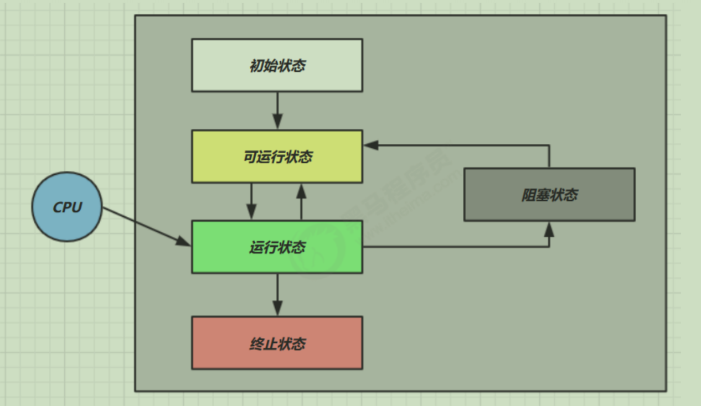
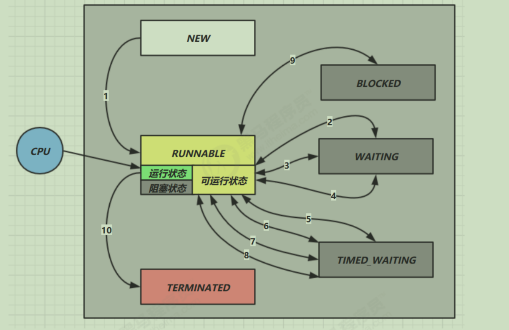
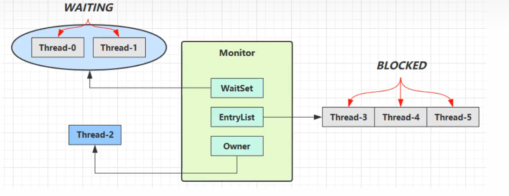

# 进程与线程

## 进程

- 程序由指令和数据组成，但这些指令要运行，数据要读写，就必须将指令加载至内存。在指令运行过程中还需要用到磁盘，网络等设备。进程就是用来加载指令，管理内存，管理IO的
- 当一个程序被运行，从磁盘加载这个程序的代码至内存，这是就开启了一个进程
- 进程就可以视为程序的一个实例。

## 线程

- 一个进程之内可以分为一到多个线程。
- 一个线程就是一个指令流，将指令流中的一条条指令以一定的顺序交给CPU执行
- Java中，线程作为最小调度单位，进程作为资源分配的最小单位。在Windows中进程是不活动的，只是作为线程的容器。

## 二者对比

- 进程基本上相互独立的，而线程存在于进程内，是进程的一个子集
- 进程拥有共享的资源，如内存空间等，供其内部的线程共享
- 进程通信较为复杂
  - 同一计算机的进程通信称为IPC
  - 不同计算机之间的进程通信，需要通过网络，并遵守共同的协议，例如HTTP
- 线程通信相对简单，因为它们共享进程内的内存，一个例子是多个线程可以访问同一个共享变量
- 线程更轻量，线程上下切换成本一般要比进程上下文切换低

# java线程

## 1. 创建线程

### 使用Thread

```java
Thread t = new Thread(){
            @Override
            public void run() {
                log.debug("running");
            }
        };
        t.start();
```

###  使用Runnable配合Thread

- Runnable：可运行的任务

```java
Runnable r = new Runnable() {
            @Override
            public void run() {
                log.debug("running");
            }
        };
        Thread t = new Thread(r,"t2");
        t.start();
```

Java8以后可以使用lambda精简代码

```java
Runnable r = () ->{
                log.debug("running");
        };
        Thread t = new Thread(r,"t2");
        t.start();
```

### FutureTask配合Thread

FutureTask能够接受Callable类型的参数，用来处理有返回结果的情况 

```java
FutureTask<Integer> task = new FutureTask<>(new Callable<Integer>() {
            @Override
            public Integer call() throws Exception {
                log.debug("running");
                Thread.sleep(1000);
                return 100;
            }
        });

        Thread t = new Thread(task,"t1");
        t.start();
        log.debug("{}",task.get());
```

## 2. 查看进程线程的方法

### windows

- 任务管理器可以查看进程和线程数，也可以用来杀死进程
- tasklist 查看进程
- taskkill 杀死进程

### linux

- ps -fe 查看所有进程
- ps -fT -p \<PID> 查看某个进程（PID）的所有线程
- kill 杀死进程
- top 按大写 H 切换是否显示线程
- top -H -p \<PID> 查看某个进程（PID）的所有线程

### Java

- jps 命令查看所有 Java 进程
- jstack \<PID> 查看某个 Java 进程（PID）的所有线程状态
- jconsole 来查看某个 Java 进程中线程的运行情况（图形界面）

> jconsole 远程监控配置

- 需要以如下方式运行你的 java 类

  ```cmd
  java -Djava.rmi.server.hostname=`ip地址` -Dcom.sun.management.jmxremote -
  Dcom.sun.management.jmxremote.port=`连接端口` -Dcom.sun.management.jmxremote.ssl=是否安全连接 -
  Dcom.sun.management.jmxremote.authenticate=是否认证 java类
  ```

  

- 修改 /etc/hosts 文件将 127.0.0.1 映射至主机名

如果要认证访问，还需要做如下步骤

- 复制 jmxremote.password 文件
- 修改 jmxremote.password 和 jmxremote.access 文件的权限为 600 即文件所有者可读写
- 连接时填入 controlRole（用户名），R&D（密码）

## 3. 线程上下文切换（Thread Context Switch）

导致cpu不在执行当前的线程，转而执行另一个线程的代码的原因

- 时间片用完
- 垃圾回收
- 有更高优先级的线程需要执行
- 线程自己调用了slep，yield，wait，park，synchronized，lock等方法

当Context Switch发生时，需要由操作系统保持当前线程的状态，并恢复另一个线程的状态，Java中对应的概念就是程序计数器（Program Counter Register），它的作用是记住下一条JVM指令的执行地址，是线程私有的

- 状态包括程序计数器，虚拟机栈中每个栈帧的信息，如局部变量，操作数栈，返回地址
- Context Switch频繁发生会影响性能

## 4. 常用方法

| 方法名           | static | 功能说明                                                     | 注意                                                         |
| ---------------- | ------ | ------------------------------------------------------------ | ------------------------------------------------------------ |
| start()          |        | 启动一个新线程，在新的线程运行 run 方法中的代码              | start 方法只是让线程进入就绪，里面代码不一定立刻运行（CPU 的时间片还没分给它）。每个线程对象的 start 方法只能调用一次，如果调用了多次会出现 IllegalThreadStateException |
| run()            |        | 新线程启动后会调用的方法                                     | 如果在构造 Thread 对象时传递了 Runnable 参数，则线程启动后会调用 Runnable 中的 run 方法，否则默认不执行任何操作。但可以创建 Thread 的子类对象，来覆盖默认行为 |
| join()           |        | 等待线程运行结束                                             |                                                              |
| join(long n)     |        | 等待线程运行结束,最多等待 n 毫秒                             |                                                              |
| getId()          |        | 获取线程长整型的 id id 唯一                                  |                                                              |
| getName()        |        | 获取线程名                                                   |                                                              |
| setName(String)  |        | 修改线程名                                                   |                                                              |
| getPriority()    |        | 获取线程优先级                                               |                                                              |
| setPriority(int) |        | 修改线程优先级                                               | java中规定线程优先级是1~10 的整数，较大的优先级能提高该线程被 CPU 调度的机率 |
| getState()       |        | 获取线程状态                                                 | Java 中线程状态是用 6 个 enum 表示，分别为：NEW, RUNNABLE, BLOCKED, WAITING, TIMED_WAITING, TERMINATED |
| isInterrupted()  |        | 判断是否被打断，不会清除打断标记                             |                                                              |
| isAlive()        |        | 线程是否存活（还没有运行完毕）                               |                                                              |
| interrupt()      |        | 打断线程                                                     | 如果被打断线程正在 sleep，wait，join 会导致被打断的线程抛出 InterruptedException，并清除打断标记；如果打断的正在运行的线程，则会设置打断标记；park 的线程被打断，也会设置打断标记 |
| interrupted()    | static | 判断当前线程是否被打断，会清除打断标记                       |                                                              |
| currentThread()  | static | 获取当前正在执行的线程                                       |                                                              |
| sleep(long n)    | static | 让当前执行的线程休眠n毫秒，休眠时让出 cpu 的时间片给其它线程 |                                                              |
| yield()          | static | 提示线程调度器让出当前线程对CPU的使用                        | 主要是为了测试和调试                                         |

## 2. 对比

### start和run

#### start

```java
Thread t1 = new Thread(){
            @Override
            public void run() {
                log.debug("running...");
                FileReader.read(Constants.MP4_FULL_PATH);
            }
        };
        t1.start();
        log.debug("do other things....");
```

>  输出结果：
> 11:13:20.833 c.FileReader <font color="red">[Thread-0]</font> - read [01.001-为什么学习并发.mp4] start ...
> 11:13:20.850 c.FileReader <font color="red">[Thread-0]</font>- read [01.001-为什么学习并发.mp4] end ... cost: 17 ms

#### run

```java
Thread t1 = new Thread(){
            @Override
            public void run() {
                log.debug("running...");
                FileReader.read(Constants.MP4_FULL_PATH);
            }
        };
       t1.run();
        log.debug("do other things....");
```

> 输出结果：
>
> 11:23:33.726 c.FileReader <font color="red">[main] </font>- read [01.001-为什么学习并发.mp4] start ...
> 11:23:33.739 c.FileReader <font color="red">[main] </font>- read [01.001-为什么学习并发.mp4] end ... cost: 13 ms

#### 小结

- 直接调用 run 是在主线程中执行了 run，没有启动新的线程
- 使用 start 是启动新的线程，通过新的线程间接执行 run 中的代码

### sleep和yield

#### slleep

1. 调用sleep会让当前线程从Running进入Timed Waiting状态
2. 其它线程可以使用interrupt方法打断正在睡眠的线程，这时sleep方法会抛出InterruptedException
3. 睡眠结束后的线程未必会立刻得到执行
4. 建议使用TimeUnit的sleep代替Thread的sleep来获得更好的可读性

#### yield

1. .调用yield会让当前线程从Running进入Runnable状态，然后调度执行其它同优先级的线程。如果这时没有同优先级的线程，那么不能保证让当前线程暂停的效果
2. 具体的实现依赖于操作系统的任务调度器

### 线程优先级

- 线程优先级会提示(hint)调度器优先调度该现线程，但它仅仅是一个提示，调度器可以忽略它
- 如果CPU比较忙，那么优先级高的线程会获得更多的时间片，但cpu闲时，优先级几乎没作用

## 6. 不推荐的方法

还有一些不推荐使用的方法，这些方法已过时，容易破坏同步代码块，造成线程死锁

| 方法名    | static | 功能说明           |
| --------- | ------ | ------------------ |
| stop()    |        | 停止线程运行       |
| suspend() |        | 挂起(暂停)线程运行 |
| resume()  |        | 恢复线程运行       |

## 7. 主线程与守护线程

默认情况下，Java进程需要等待所有线程都运行结束，才会结束。有一种特殊的线程叫守护线程，只要其它非守护线程运行结束了，即使守护线程的代码没有执行完，也会强制结束

```java
 Thread t1 = new Thread(()->{
            while (true){
                if(Thread.currentThread().isInterrupted()){
                    break;
                }
            }
            log.debug("结束");
        });
        t1.setDaemon(true);
        t1.start();

        Thread.sleep(1000);
        log.debug("结束");
```

> 注意：
>
> - 垃圾回收器线程就是一种守护线程
> - Tomcat 中的 Acceptor 和 Poller 线程都是守护线程，所以 Tomcat 接收到 shutdown 命令后，不会等待它们处理完当前请求

## 8. 五种状态

这是从**操作系统**层面来描述的



- 「初始状态」仅是在语言层面创建了线程对象，还未与操作系统线程关联
- 「可运行状态」（就绪状态）指该线程已经被创建（与操作系统线程关联），可以由CPU调度执行
- 「运行状态」指获取了CPU时间片运行中的状态
  - 当CPU时间片用完，会从「运行状态」转至「可运行状态」，会导致线程的上下文切换
- 「阻塞状态」
  - 如果调用了阻塞API，如BIO读写文件，这时该线程实际不会用到CPU，会导致线程上下文切换，进入「阻塞状态」
  - 等BIO操作完毕，会由操作系统唤醒阻塞的线程，转换至「可运行状态」
  - 与「可运行状态」的区别是，对「阻塞状态」的线程来说只要它们一直不唤醒，调度器就一直不会考虑调度它们
- 「终止状态」表示线程已经执行完毕，生命周期已经结束，不会再转换为其它状态

## 9. 六种状态

这是从**Java API**层面来描述的

根据Thread.State枚举，分为六种状态



- `NEW`线程刚被创建，但是还没有调用`start()`方法
- `RUNNABLE`当调用了`start()`方法之后，注意**Java API**层面的`RUNNABLE`状态涵盖了**操作系统**层面的「可运行状态」，「运行状态」和「可阻塞状态」（由BIO导致的线程阻塞，在Java里无法区分，仍然认为是可运行）
- `BLOCKED`，`WAITING`，`TIMED_WAITING`都是**Java API**层面对「阻塞状态」的细分，后面会在状态一节详述
- `TERMINATED`当线程代码运行结束

# 共享模型之管程

## 临界区与竞态条件

### 临界区Critical Section

- 一个程序运行多个线程本身是没有问题的
- 问题出在多个线程访问共享资源
  - 多个线程读共享资源其实也没有问题
  - 在多个线程对共享资源读写操作时发生指令交错，就会出现问题
- 一个代码块内如果存在对共享资源的多线程读写操作，称这段代码块为临界区

```java
static int counter = 0;

// 临界区
static void increment(){
    counter++;
}

// 临界区
static void decrement(){
    counter++;
}
```

### 竞态条件Race Condition

多个线程在临界区执行，由于代码的执行序列不同而导致结果无法预测，称之为发生了竞态条件

## 变量的线程安全分析

### 成员变量和静态变量是否安全？

- 如果它们没有共享，则线程安全
- 如果它们被共享，根据它们的状态是否能够被改变，又分两种情况
  - 如果只有读操作，则线程安全
  - 如果有读写操作，则这段代码是临界区，需要考虑线程安全

### 局部变量是线程安全？

- 局部变量是线程安全的
- 但局部变量引用的对象则未必
  - 如果该对象没有逃离方法的作用访问，它是线程安全的
  - 如果该对象逃离方法的作用范围，需要考虑线程安全

## Monitor概念

### Java对象头

以32为虚拟机为例

普通对象

<table style="text-align: center;;">
    <tr>
        <td colspan="2">Object Header (64 bits)</td>
    </tr>
    <tr>
        <td >Mark Word (32 bits)</td>
        <td >Klass Word (32 bits)</td>
    </tr>
</table>

数组对象

<table style="text-align: center;;">
    <tr>
        <td colspan="3">Object Header (96 bits)</td>
    </tr>
    <tr>
        <td >Mark Word (32 bits)</td>
        <td >Klass Word (32 bits)</td>
        <td>array length (32 bits)</td>
    </tr>
</table>

其中 Mark Word 结构为

<table style="text-align: center;;">
    <tr>
        <td colspan="6">Mark Word (32 bits)</td>
        <td>State</td>
    </tr>
    <tr>
        <td colspan="2">hashcode:25</td>
        <td>age:4</td>
        <td colspan="2">biased_lock:0</td>
        <td>01</td>
        <td>Normal</td>
    </tr>
    <tr>
        <td>thread:23</td>
        <td>epoch:2</td>
        <td>age:4</td>
        <td colspan="2">biased_lock:1</td>
        <td>01</td>
        <td>Biased</td>
    </tr>
    <tr>
        <td colspan="5">ptr_to_lock_record:30</td>
        <td>00</td>
        <td>Lightweight Locked</td>
    </tr>
    <tr>
        <td colspan="5">ptr_to_heavyweight_monitor:30</td>
        <td>10</td>
        <td>Heavyweight Locked</td>
    </tr>
    <tr>
        <td colspan="5"></td>
        <td>11</td>
        <td>Marked for GC</td>
    </tr>
</table>

64 位虚拟机 Mark Word

<table style="text-align: center;;">
    <tr>
        <td colspan="6">Mark Word (64 bits)</td>
        <td>State</td>
    </tr>
    <tr>
        <td>unused:25</td>
        <td>hashcode:31</td>
        <td>unused:1</td>
        <td>age:4</td>
        <td >biased_lock:0</td>
        <td>01</td>
        <td>Normal</td>
    </tr>
    <tr>
        <td>thread:54</td>
        <td>epoch:2</td>
        <td>unused:1</td>
        <td>age:4</td>
        <td>biased_lock:1</td>
        <td>01</td>
        <td>Biased</td>
    </tr>
    <tr>
        <td colspan="5">ptr_to_lock_record:62</td>
        <td>00</td>
        <td>Lightweight Locked</td>
    </tr>
    <tr>
        <td colspan="5">ptr_to_heavyweight_monitor:62</td>
        <td>10</td>
        <td>Heavyweight Locked</td>
    </tr>
    <tr>
        <td colspan="5"></td>
        <td>11</td>
        <td>Marked for GC</td>
    </tr>
</table>
## wiat/notify



- Owner线程发现条件不满足，调用wait方法，即可进入WaitSet变为WAITING状态
- BLOCKED和WAITING的线程都处于阻塞状态，不占用CPU时间片
- BLOCKED线程会在Owner线程释放锁时唤醒
- WAITING线程会在Owner线程调用notify或notifyAll时唤醒，但唤醒后并不意味者立刻获得锁，仍需进入EntryList 重新竞争

### API介绍

- `obj.wait()`让进入Object监视器的线程到waitSet等待
- `obj.notify()`在Object上正在waitSet等待的线程中挑一个唤醒
- `obj.notifyAll() `让 object 上正在 waitSet 等待的线程全部唤醒

> `wait()` 方法会释放对象的锁，进入 WaitSet 等待区，从而让其他线程就机会获取对象的锁。无限制等待，直到notify 为止
>
> `wait(long n) `有时限的等待, 到 n 毫秒后结束等待，或是被 notify

##  **wait notify** **的正确姿势**

### **sleep(long n)** **和** **wait(long n)** **的区别**

1) sleep 是 Thread 方法，而 wait 是 Object 的方法 
2) sleep 不需要强制和 synchronized 配合使用，但 wait 需要和 synchronized 一起用
3) sleep 在睡眠的同时，不会释放对象锁的，但 wait 在等待的时候会释放对象锁
4) 它们状态都是TIMED_WAITING

## ReentrantLock

相对于synchronized它具备如下特点

- 可中断

- 可以设置超时时间

- 可以设置为公平锁

- 支持多个条件变量

与synchronized一样，都支持可重入

```java
// 获取锁
reentrantLock.lock();
try {
 // 临界区
} finally {
 // 释放锁
 reentrantLock.unlock();
}
```

### 可重入

可重入是指同一个线程如果首次获得了这把锁，那么因为它是这把锁的拥有者，因此有权利再次获取这把锁如果是不可重入锁，那么第二次获得锁时，自己也会被锁挡住
