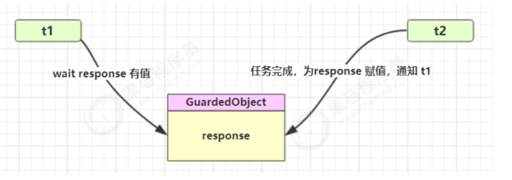
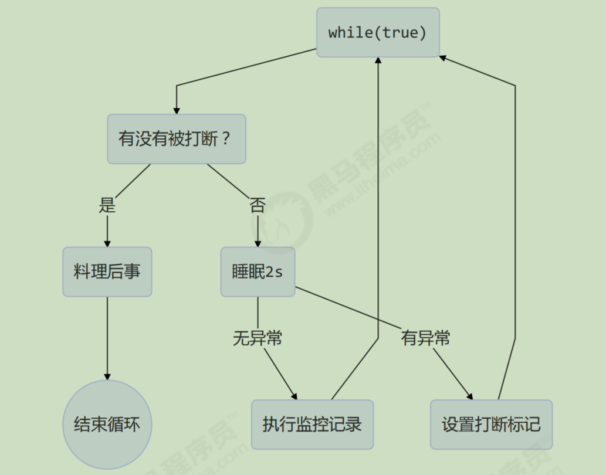

# 同步模式之保护性暂停

## 定义

即Guarded Suspension，用在一个线程等待另一个线程的执行结果

要点

- 有一个结果需要从一个线程传递到另一个线程，让他们关联同一个GuardedObject
- 如果有结果不断从一个线程到另一个线程那么可以使用消息队列(见生产者/消费者)
- JDK中，join 的实现、Future 的实现，采用的就是此模式
- 因为要等待另一方的结果，因此归类到同步模式



# 终止模式之两阶段终止模式

Two Phase Termination

在一个线程T1中如何“优雅”终止线程T2？，这里「优雅」指的是给T2一个料理后事的机会

## 错误思路

- 使用线程对象的stop方法停止线程
  - stop方法会真正杀死线程，如果这时线程锁住了共享资源，那么当它被杀死后就再也没有机会释放锁，其它线程将永远无法获取锁
- 使用System.exit(int)方法停止线程
  - 目的仅是停止一个线程，但这种做法会让整个程序都停止

## 两阶段终止模式



### 利用isInterrupted

interrupt可以打断标记，无论这个线程是在sleep，wait，还是正常运行

```java
package cn.itcast.test;

import lombok.extern.slf4j.Slf4j;

/**
 * @description:
 * @Author: wild
 * @Date: 2024/6/26 9:06
 */
@Slf4j(topic = "c.Test11")
public class Test11 {
    public static void main(String[] args) throws InterruptedException {
        TwoPhaseTermination twoPhaseTermination = new TwoPhaseTermination();
        twoPhaseTermination.start();

        Thread.sleep(3500);
        twoPhaseTermination.stop();
    }
}
@Slf4j(topic = "c.TwoPhaseTermination")
class TwoPhaseTermination{
    private Thread monitor;

    // 启动监控线程
    public void start(){
        monitor = new Thread(()->{
            while (true){
                Thread currentThread = Thread.currentThread();
                if(currentThread.isInterrupted()){
                    log.debug("料理后事");
                    break;
                }
                try {
                    Thread.sleep(1000); // 情况1
                    log.debug("执行监控记录"); // 情况2
                }catch (InterruptedException e){
                    e.printStackTrace();
                    // 重新设置打断标记
                    currentThread.interrupt();
                }
            }
        });
        monitor.start();
    }

    // 停止监控线程
    public void stop(){
        monitor.interrupt();
    }
}

```

> 结果：
>
> 09:11:52.755 c.TwoPhaseTermination [Thread-0] - 执行监控记录
> 09:11:53.767 c.TwoPhaseTermination [Thread-0] - 执行监控记录
> 09:11:54.781 c.TwoPhaseTermination [Thread-0] - 执行监控记录
> java.lang.InterruptedException: sleep interrupted
> 	at java.lang.Thread.sleep(Native Method)
> 	at cn.itcast.test.TwoPhaseTermination.lambda$start$0(Test11.java:34)
> 	at java.lang.Thread.run(Thread.java:750)
> 09:11:55.262 c.TwoPhaseTermination [Thread-0] - 料理后事
>
> Process finished with exit code 0