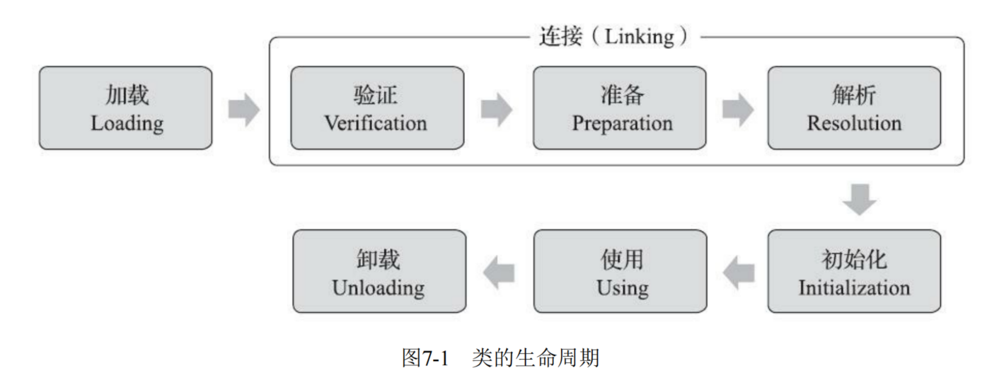

# JVM的整体架构

## JVM的架构模型

基本上是基于栈的指令集架构

1. 基于栈式架构的特点
   - 设计和实现更简单，适用于资源受限的系统
   - 避开了寄存器的分配难题：使用零地址指令方式分配
   - 指令流中的指令大部分是零地址指令，其执行过程依赖于操作栈。指令集更小，编译器容易实现
   - 不需要硬件支持，可移植性更好，更换实现跨平台
2. 基于寄存器架构的特点
   - 典型的应用是x86的二进制指令集，比如传统的PC以及Android的Davlik虚拟机
   - 指令集架构则完全依赖硬件，可移植性差
   - 性能优秀和执行更高效
   - 花费更少的指令去完成一项操作
   - 在大部分情况下，基于寄存器架构的指令集往往都以一地址指令，二地址指令和三地址指令为主，而基于栈式架构的指令集却是以零地址指令为主。

> 总结：
>
> 由于跨平台的设计，Java的 指令都是根据栈来设计的 。不同平台下CPU架构不同，所以不能设计为基于寄存器的。优点是跨平台，指令集小，编译器容易实现，缺点是性能下降，实现同样的功能需要更多的指令。

## JVM生命周期

1. 虚拟机的启动

   Java虚拟机的启动是通过引导类加载器(bootstrap class loader)创建一个初始类(initial class)来完成的，这个类是由虚拟机的具体实现指定的

2. 虚拟机的执行

   - 一个运行中的Java虚拟机有着一个清晰的任务，执行Java程序
   - 程序开始执行时他才运行，程序结束时他就停止
   - 执行一个所谓的Java程序的时候，真真正正在执行的是一个叫做Java虚拟机的进程

3. 虚拟机的退出

   - 程序正常的执行结束
   - 程序在执行过程中遇到了异常或错误而异常终止
   - 由于操作系统出现错误而导致Java虚拟机进程终止
   - 某线程调用Runtime类或System类的exit方法，或Runtime类的halt方法，并且Java安全管理器也允许这次exit或halt操作 
   - JNT(Java Native Interface)规范描述了用JNT Invocation API来加载或卸载Java虚拟机时，Java虚拟机的退出情况

# 类加载子系统

- 虚拟机的类加载

> 虚拟机把描述类的数据从Class文件加载到内存，并对数据进行校验，转换解析和初始化，最终形成可以被虚拟机直接使用的Java类型

## 类加载的时机

- 对类立即进行初始化的四种情况(主动引用)

  - 遇到new，getstatic，putstatic或invokestatic等四个指令时，如果未对齐进行初始化，则进行初始化
  - 使用java.lang.reflect进行反射调用时，还未初始化
  - 初始化时，父类未初始化，则对父类先进行初始化

  > 接口在初始化时，不会要求其父接口全部完成初始化，只有在使用到父接口时，才会进行初始化

  - 当虚拟机启动时，用户需要指定一个要执行的主类时

- 被动引用

  - 通过子类引用父类的静态字段，不会导致子类初始化
  - 通过数组定义来引用类，不会触发此类的初始化
  - 常量在编译阶段会存入调用类的常量池中，本质上没有直接引用到定义常量的类，因此不会触发定义常量的类的初始化

## 类加载的过程

类加载的全过程---加载，验证，准备，解析和初始化

1. 加载(Loading)

   - 通过一个类的全限定名获取定义此类的二进制文件流

   - 将这个字节流所代表的静态存储结构转化为方法区的运行时数据结构

   - 在内存中生成一个代表这个类的java.lang.Class对象，作为方法区这个类的各种数据的访问入口

   - > 加载.class文件的方式
     >
     > - 从本地系统中直接加载
     > - 通过网络获取，典型场景，Web Applet
     > - 从zip压缩包中读取，成为日后jar,war格式的基础
     > - 运行时计算生成，使用最多的是：动态代理技术
     > - 由其他文件生成，典型场景：JSP应用
     > - 从专有数据库中提取.class文件，比较少见
     > - 从加密文件中获取，典型的防Class文件被反编译的保护措施

2. 验证(Verify)

   - 目的在于确保Class文件的字节流中包含信息符合当前虚拟机 要求，保证被加载类的正确性，不会 危害虚拟机自身安全
   - 主要包括四种验证
     - 文件格式验证
     - 元数据验证
     - 字节码验证
     - 符号 引用验证

3. 准备(Prepare)

   - 为类变量分配内存并且设置该类变量的默认初始值
   - 不包含用final修饰的static，因为final在编译的时候就会分配，准备阶段会显式初始化
   - 不会为实例变量分配初始化，类变量会分配在方法区中，而实例变量是会随着对象一起分配到Java堆中

4. 解析(Resolve)

   - 将常量池内的符合引用转换为 直接引用的过程。
   - 解析操作往往会伴随着JVM在执行完初始化之后在执行。
   - 符号引用就是一组符号 来描述所引用的目标。直接引用就是直接指向目标的指针，相对偏移量或一个间接定位到目标的句柄。
   - 解析 动作主要针对类或接口，字段，类方法，接口方法，方法类型等。对应常量池中的CONSTANT_Class_info，CONSTANT_Fieldrer_info，CONSTANT_Methodref_info等

5. 初始化

   - 初始化阶段就是执行类构造器方法<clinit>()的过程。
   - 此方法不需要定义，是javac编译器自动收集类中的所有类变量的赋值动作和静态代码块中的语句合并而来。
   - 构造器方法中指令按语句在源文件中出现的顺序执行。
   - <clinit>()不同于类的构造器。
   - 若该类具有父类，JVM会保证子类的<clinit>()执行前，父类的<clinit>()已经执行完毕。
   - 虚拟机必须保证一个类的<clinit>()方法在多线程下被同步加锁。

## 类加载器的分类

JVM支持两种类型的类加载器，分别为引导类加载器(Bootstrap ClassLoader)和自定义类加载器(User-Defined ClassLoader)

> 从概念上讲，自定义类加载器一般指的是程序中由开发人员自定义的 一类类加载器，但是Java虚拟机规范却没有这么定义，而是将所有派生于抽象类ClassLoader的类加载器都划分为自定义类加载器

### 虚拟机自带的加载器

1. 启动类加载器(引导类加载器，BootstrapClassLoader)
   - 这个类加载使用C/C++语言实现的，嵌套在JVM内部。
   - 它用来加载Java的核心库(JAVA_HOME/jre/lib/rt.jar，resources.jar或sun.boot.class.path路径下的内容)，用于提供 JVM自身需要的类
   - 并不继承java.lang.ClassLoader，没有父加载器。
   - 加载扩展类和应用程序类加载器，并指定为他们的父类加载器。
   - 出于安全考虑，Bootstrap启动类加载器只加载包名为java，javax，sun等开头的类。
2. 扩展类加载器(Extension ClassLoader)
   - Java语言编写，由sun.misc.Launcher$ExtClassLoader实现。
   - 派生于ClassLoader类。
   - 父类加载器为启动类加载器。
   - 从java.ext.dirs系统属性所指定的目录中加载类库，或从JDK的安装目录的jre/lib/ext子目录(扩展目录)下加载类库。如果用户创建的JAR放在此目录下，也会自动由扩展类加载器加载。

3. 应用程序类加载器(系统类加载器，AppClassLoader)

   - java语言编写，由sun.misc.Launcher$AppClassLoader实现。
   - 派生于ClassLoader类。
   - 父类加载器为扩展类加载器。
   - 它负责加载环境变量classpath或系统属性java.class.path指定路径下单类库。
   - 该类加载是程序中默认的类加载器 ，一般来说，Java应用的类都是由它来完成加载。
   - 通过ClassLoader#getSystemClassLoader()方法可以获取到该类加载器。

4. 用户自定义类加载器

   > 为什么要自定义类加载器？
   >
   > - 隔离加载类
   > - 修改类加载的方式
   > - 扩展加载源
   > - 防止源码泄露

## 双亲委派机制

Java虚拟机对class文件采用的是按需加载的方式，既当需要使用该类时才会将它的class的文件加载到内存生成class对象，而且加载某个类的class文件时，Java虚拟机采用的是双亲委派模式，既把请求交由父类处理，它是一种任务委派模式。

### 工作原理

1. 如果一个加载器收到了类加载请求，它并不会自己先去加载，而是把这个请求委托给父类的加载器去执行；
2. 如果父类加载器还存在其父类加载器，则进一步向上委托，一次递归，请求最终将到达顶层的启动类加载器 ；
3. 如果父类加载器可以完成类加载任务，就成功返回，倘若父类加载器无法完成此加载任务，子加载器才会尝试自己去加载，这就是双亲委派模式

> 优势：
>
> - 避免类的重复加载
> - 保护程序安全，防止核心API被随意篡改

# 线程

- 线程是一个程序里的运行单元.JVM允许一个应用有多个线程并行的执行。
- 在HotSpot JVM里，每个线程都 与操作系统的本地线程直接映射。
  - 当一个Java线程准备好执行以后，此时一个操作系统的本地线程也同时创建 。Java线程执行终止后，本地线程也会回收。
- 操作系统负责所有线程的安排调度到任何一个可用的CPU上。一旦本地线程初始化成功，它就会调用Java线程中的run()方法。

HotSpot JVM的几个主要线程：

- 虚拟机线程
  - 这种线程的操作是需要JVM达到安全点才会出现。这些操作必须在不同的线程中发送的原因是他们都需要JVM达到安全点，这样才不会变化。这种线程的执行类型包括“stop-the-world”的垃圾收集，线程栈收集，线程挂起以及偏向锁撤销。
- 周期任务线程
  - 这种线程是时间周期事件的体现(比如中断)，他们一段用于周期性操作的调度执行。
- GC线程
  - 这种线程对在JVM里不同种类的垃圾收集行为提供了支持。
- 编译线程
  - 这种线程在运行时会将字节码编译成大片本地代码
- 信号调度线程
  - 这种线程接受信号并发送给JVM，在它内部通过调用适当的方法进行处理。

# 程序计数器

> JVM中的程序计数器(Program Counter Register)并非是广义上所指的物理寄存器，是对物理PC寄存器的一种抽象模拟

- PC寄存器(程序计数器)

  - PC寄存器用来存储指向下一条指令的地址，也即将要执行的指令代码。由执行引擎读取下一条指令。

  - 它是一块很小的内存空间，几乎可以忽略不计。也是运行速度最快的存储区域。

  - 在JVM规范中，每个线程都有它自己的程序计数器，是线程私有的，生命周期与线程的生命周期保持一致。

  - 任何时间一个线程都只有一个方法在执行，也就是所谓的当前方法。程序计数器会存储当前线程正在执行的Java方法的JVM指令地址；或者没如果是在执行native方法，则是未指定值(undefned)。

  - 它是程序控制流的指示器，分支，循环，跳转，异常处理，线程恢复等基础功能都需要依赖这个计数器来完成。

  - 字节码解释权工作时就是通过改变这个计数器的值来选取下一条需要执行的字节码指令。

  - 它是唯一个在Java虚拟机规范中没有规定任何OutOtMemoryError情况的区域。

  - 常见问题

    - 使用PC寄存器存储字节码指令地址有什么用呢？

      因为CPU需要不停的切换各个线程，这时候切换回来以后，就得知道接着从那开始继续执行。

    - 为什么使用PC寄存器记录当前线程的执行地址呢

      JVM的字节码解释器就需要通过改变PC寄存器的值来明确下一条应该执行什么样的字节码指令。

    - PC寄存器为什么会被设定为线程私有？

      - 所谓的多线程在一个特定的时间段内只会执行其中某一个线程的方法，CPU会不停地做任务切换，这样必然导致经常中断或恢复，如何保证毫无差距么？

        为了能够准确地记录各个线程正在执行的当前字节码指令地址，为某一个线程都分配一个PC寄存器，这样一来各个线程之间便可以独立进行计算，从而不会出现向好干扰的情况。

# 虚拟机栈

## 虚拟机栈概述

栈是运行时的单位，而堆是存储的单位。

> 栈解决程序的运行问题，即程序如何执行，或者说如何处理数据。堆解决的是数据存储的问题，即数据怎么放，放在那儿。

### 虚拟机栈的基本内容

- Java虚拟机栈

  Java虚拟机栈(Java Virtual Machine Stack)，早期也叫Java栈。每个线程在创建时都会创建一个虚拟机栈，其内部保存一个个的栈帧(Stack Frame)，对应着一次次的Java方法调用。

  - 是线程私有的。

- 生命周期

  生命周期和线程是一致。

- 作用

  主管Java程序的运行，它保存方法的局部变量，部分结果，并参与方法的调用和返回。

- 栈的特点(优点)

  - 栈是一种快速有效的分配存储方式，访问速度仅次于程序计数器。
  - JVM直接对Java栈的操作只有两个：
    - 每个方法执行，伴随着进栈(入栈，压栈)
    - 执行结束后的出栈工作
  - 对于栈来说不存在垃圾回收问题。

> 设置栈内存大小
>
> 使用参数-Xss选项来设置线程的最大栈空间，栈的大小直接决定了函数调用的最大可达深度。

### 面试题

- Java虚拟机规范允许Java栈的大小是动态的或者是固定不变的。
  - 如果采用固定大小的Java虚拟机栈，那每一个线程的Java虚拟机栈容量可以那种线程创建的时候独立选定。如果线程请求分配的栈容量超过Java虚拟机栈允许的最大容量，Java虚拟机将会抛出一个StackOverflowError异常。
  - 如果Java虚拟机栈乐可以动态，并且在尝试扩展的时候无法申请到足够的内存去创建对于的虚拟机栈，那Java虚拟机将会抛出一个OutofMemoryError异常。

## 栈的存储单位

- 栈中存储什么？
  - 每个线程都有自己的栈，栈中的数据都是以栈帧(Stack Frame)的格式存在。
  - 在这个线程上正在执行的每个方法都各自对于一个栈帧(Stack Frame)。
  - 栈帧是一个内存区块，是一个数据集，维系着方法执行过程中的各自数据信息。
- 栈运行原理
  - JVM直接对Java栈的操作只有两个，就是对栈帧的压栈和出栈，遵循着"先进后出"/"后进先出"原则。
  - 在一条活动线程中，一个时间点上，只会有一个活动的栈帧。即只有当前正在执行的方法的栈帧（栈顶栈帧）是有效的，这个栈帧被称为当前栈帧（Current Frame）,与当前栈帧相对应的方法就是当前方法（Current Method），定义这个方法的就是当前类（Current Class）.
  - 执行引擎运行的所有字节码指令只针对当前栈帧进行操作。
  - 如果在该方法中调用了其它方法，对应的新的栈帧会被创建出来，放在栈的顶端，成为新的当前栈。
  - 不同线程中所包含的栈帧是不允许存在相互引用的，即不可能在一个栈帧之中引用另外一个线程的栈帧。
  - 如果当前方法调用了其它方法，方法返回之际，当前帧 会传回此方法的执行结果当前一个栈帧，接着，虚拟机会丢弃当前栈帧，使得前一个栈帧重新成为当前栈帧。
  - Java方法中有两种返回函数的方式，无论哪种，都会导致栈帧被弹出
    - 正常的函数返回 ：return
    - 抛出异常

- 栈帧的内部结构

  - 局部变量表（Local Variables）

  - 操作数栈（Operand Stack）（或表达栈）

  - 动态链接（Dynamic Linking）(或指向运行时常量池的方法引用)

  - 方法返回地址（Return Address）(或方法正常退出或者异常退出的定义)

  - 一些附件信息

    

## 局部变量表

- 局部变量表也被称为局部变量数组或本地变量表。
- 定义为一个数字数组，主要用于存储方法参数和定义在方法体内的局部变量。
- 局部变量表是建立在线程的栈上，是线程的私有数据，不存在数据安全问题。
- 局部变量表所需的容量大小是在编译期确定下来的 ，并保存在方法的Code属性的maximum local variables数据项中。在方法运行期间是不会改变局部变量表的大小的。
- 方法嵌套调用的次数由栈的大小决定。一般来说，栈越大，方法嵌套调用次数越多。对一个函数而言，它的参数和局部变量越多，使得局部变量表膨胀，它的栈帧就越大，以满足方法调用所需传递的信息增大的需求。进而函数调用就会占用更多的栈空间，导致其嵌套调用次数就会减少。
- 局部变量表中的变量只在当前方法调用中有效。在方法执行时，虚拟机通过使用局部变量表完成参数值到参数变量列表的传递过程。当方法调用结束后，随着方法栈帧的销毁，局部变量表也会随之销毁。

### Slot

- 参数值的存放总是在局部变量数组的index0开始，到数组长度-1的索引结束。

- 局部变量表，最基本的存储单元是Slot（变量槽）

- 局部变量表中存放编译期可知的各种基本数据类型(八种)，引用类型在（reference），returnAddress类型的变量。

- 在局部变量表里，32位以内的类型只占用 一个slot（包括returnAddress类型），64位的类型（long和double）占用两个slot。

  - byte，short，char，boolean在存储前被转换为int。

- JVM会为局部变量表中的每一个Slot都分配一个访问索引，通过这个索引即可成功访问到局部变量表中指定的局部变量值。

- 当一个实例方法被调用的时候，它的方法参数和方法体内部定义的局部变量将会按照顺序被复制到局部变量表中的每一个Slot上 

- 如果需要访问局部变量表中一个64bit的局部变量值时，只需要使用前一个索引即可。（比如访问long或double类型变量）

  

- 如果当前帧是由构造方法或者实例方法 创建的，那么该对象引用this将会存放在index为0的slot处，其余的参数按照参数表顺序继续排列。

- 槽位是可以重复利用的。

## 操作数栈

- 每一个独立的栈帧中除了包含局部变量表以外，还包含一个先进后出的操作数栈，也可以称之为表达式栈（Expression Stack）

- 操作数栈，在方法执行过程中，根据字节码指令，往栈中写入数据或提取数据，即入栈（push）/出栈（pop）。

  - 某些字节码指令将值压入操作数栈，其余的字节码指令 将操作数取出栈。使用他们后再把结果压入栈。
  - 比如：执行复制，交换，求和等操作。

  

- 操作数栈，主要用于保存计算过程的中间结果，同时作为计算过程中变量临时的存储空间。

- 操作数栈就是JVM执行引擎的一个工作区，当一个方法刚开始执行的时候，一个新的栈帧也会随之被创建出来，这个方法的操作数栈是空的。

- 每一个操作数栈都会拥有一个明确的栈深度用于存储数值，其所需的最大深度在编译期就定义好了，保存在方法的Code属性中，为max_stack的值。

- 栈中的任何一个元素都是可以任意的Java数据类型。

  - 32bit的类型占用一个栈单位深度。
  - 64bit的类型占用两个栈单位深度。

- 操作数栈并非采用访问索引的方式来进行数据访问的，而是只能通过标准的入栈(push)和出栈(pop)操作来完成一次数据访问。

- 如果被调用的方法带有返回值的话，其返回值将会被压入当前栈帧的操作数栈中，并更新PC寄存器中下一条需要执行的字节码指令。

- 操作数栈中元素的数据类型必须为字节码指令的序列严格匹配，这由编译器在编译器期间进行验证，同时在类加载过程中的类检验阶段的数据流分析阶段再次验证。

  > 这里说的Java虚拟机的解释引擎是基于栈的执行引擎，其中的栈指的就是操作数栈。

## 代码追踪

> 反编译指令：javap -v 类名.class

## 栈顶缓存技术

> 将栈顶元素全部缓存在物理CPU的寄存器中，以此降低对内存的读/写次数，提示执行引擎的执行效率。

## 动态链接

> 指向运行时常量池的方法引用
>
>  
>
> 常量池：
>
> ​	为了提供一些符合和常量，便于指令的识别。

- 每一个栈帧内部都包含一个指向运行时常量池中该栈帧所属方法的引用。包含这个引用的目的就是为了支持当前方法的代码能够实现动态链接（Dynamic Linking）。比如：invokedynamic指令。
- 在Java源文件被编译到字节码文件中时，所有的变量和方法引用都作为符合引用（Symbolic Reference）保存在class文件的常量池里。比如：描述一个方法调用了另外的其它方法时，就是通过常量池中指向方法的符合引用来表示的，那么动态链接的作用就是为了将这些符合引用转换为调用方法的直接引用。

## 方法的调用：解析与分派

### 方法的调用

> 在JVM中，将符号引用转换为调用方法的直接引用与方法的绑定机制相关。

- 静态链接

    当一个字节码文件被装载进JVM内部时，如果被调用的目标方法在编译期可知，且运行期保持不变时。这种情况下将调用方法的符号引用转换为直接引用的过程称之为静态链接。

-  动态链接

    如果被调用的方法在编译期无法被确定下来，也就是说，只能够在程序运行期将调用方法的符号引用转换为直接引用，由于这种引用转换过程具备动态性，因此也就被称之为动态链接。

对应的方法的绑定机制为：早期绑定（Early Binding）和晚期绑定（Late Binding）。绑定是一个字段，方法或者类在符合引用被替换为直接引用的过程，仅仅发送一次。

- 早期绑定

  ​	早期绑定就是指被调用的目标方法如果在编译期可知，且运行期保持不变时，即可将这个方法与所属的类型进行绑定，这样一来，由于明确了被调用的目标方法究竟是那一个，因此 也就可以使用静态链接的方式将符号引用转换为直接引用。

- 晚期绑定

  ​         如果被调用的方法在编译期无法被确定下来，只能够 在 程序运行期根据 实际的类型绑定相关的方法，这种绑定方式也就称之为晚期绑定。

### 虚方法与非虚方法

**非虚方法：**

- 如果在编译期就确定了具体的调用版本，这个版本在运行时是不可变的。这样的方法称为非虚方法。

- 静态方法，私有方法，final方法，实例 构造器，父类方法都是虚方法

**虚方法：**

- 不是非虚方法的方法

虚拟机提供的方法调用指令

- 普通调用指令
  1. **invokestatic：**调用静态方法，解析阶段确定唯一方法版本
  2. **invokespecial：**调用<init>方法，私有方法及父类方法，解析阶段确定唯一方法版本
  3. **invokevirtual：**调用所有虚方法
  4. **invokeinterface：**调用接口方法
- 动态调用指令
  5. **invokedynamic：**动态解析出所需调用的方法，然后执行。

> 前四条指令固化在虚拟机内部，方法的调用执行不可人为干预，而invokedynamic指令则由用户确定版本。其中invokestatic指令和invokespecial指令调用的方法称为非虚方法，其余的（final修饰的除外）称为虚方法。

### 关于invokedynamic指令

动态类型语言和静态类型语言两者的区别就在与对类型的检查是在编译期还是在运行期，满足前者就是静态类型语言，反之是动态类型语言。

> 静态类型语言是判断变量自身的类型信息；动态类型语言是判断变量值的类型信息，变量没有类型信息，变量值才有类型信息，这是动态语言的一个重要特征。

### 方法重写的本质

1. 找到操作数栈顶的第一个元素所执行的对象的实际类型，记住C。
2. 如果在类型C中找到与常量 中的描述符合简单名称都相符的方法，则进行权限校验，如果通过则返回这个方法的直接引用，查找过程结束；如果不通过，则返回java.lang.IllegalAccessError异常。
3. 否则，按照继承关系从下往上依次对C的各个父类进行第二步的搜索和验证过程。
4. 如果始终没有找到合适的方法，则抛出java.lang.AbstractMethodError异常。

[^IllegalAccessError异常介绍]:程序视图修改一个属性或调用一个方法，这个或许或方法，没有权限访问。

### 虚方法表

- 在面向对象的编程中，会很频繁的使用到动态分派，如果在每次动态分派的过程中都要重新在类的方法元数据中搜索合适的目标的话就可能影响到执行效率。因此，为了提高性能，JVM采用在类的方法区建立一个虚方法表（virtual method table）（非虚方法不会出现在表中）来实现。使用索引表来代替。
- 每个类中都有一个虚方法表，表中存放着各个方法的实际入口。
- 虚方法表会在类加载的链接阶段被创建并开始初始化，类的变量初始值准备完成之后，JVM会把该类的方法表也初始化完毕。

## 方法返回地址

- 存放调用该方法的PC寄存器的值
- 一个方法的结束，有两种方式：
  - 正常执行完成
  - 出现未处理的异常，非正常退出
- 无论通过哪种方式退出，在方法退出后都返回到该方法被调用的位置。方法正茬退出时，调用者的pc计数器的值作为返回地址，即调用该方法的指令的下一条指令的地址。而通过异常退出的，返回地址是要通过异常表来确定的，栈帧中一般不会保存这部分信息。

## 栈的相关面试题

- 举例栈溢出的情况？（StackOverflowError）
  - 通过-Xss设置栈的大小：OOM
- 调整栈大小，就能保证不出现溢出吗？不能
- 分配的栈内存越大越好吗？不是！
- 垃圾回收是否会涉及到虚拟机栈？不会的！
- 方法中定义的局部变量是否线程安全？具体问题具体分析

# 本地方法接口

NAtive Method就是一个java调用非java代码的接口

# 本地方法栈（Native Method Statck）

- Java虚拟机栈用于管理Java方法的调用，而本地方法栈用于管理本地方法的调用。
- 本地方法栈，也是线程私有的。
- 允许被实现成固定或者是可动态扩展的内存大小。（在内存溢出方法是相同的）
  - 如果线程请求分配 的栈容量超过本地方法栈允许的最大容量，Java虚拟机将会抛出一个StackOverflowError异常。
  - 如果本地方法栈可以动态扩展，并且在尝试扩展的时候无法申请到足够的内存，或者在创建新的线程时没有足够的内存去创建对应的本地方法栈 ，那么Java 虚拟机将会抛出一个OutOfMemoryError异常。
- 本地方法是使用C语言实现的。
- 它的具体做法是做Native Method Stack中登记native方法，在Execution Engine执行时加载本地方法库。

- 当某个线程调用一个本地方法时，它就进入了一个全新的并且不再受虚拟机限制的世界。它和虚拟机拥有同样的权限。
  - 本地方法可以通过本地方法接口来访问虚拟机内部的运行时数据区。
  - 它甚至可以直接使用本地处理器中的寄存器。
  - 直接从本地内存的堆中分配任意数量的内存。
- 并不是所有的JVM都支持本地方法。因此 Java虚拟机规范并没有明确要求本地方法栈的使用语言，具体实现方式，数据结构等。如果JVM产品不打算支持native方法，也可以无需实现本地方法栈。
- 在Hotspot JVM中，直接将本地方法栈和虚拟机栈合二为一。

# 堆

## 堆的核心概述

- 一个JVM实例只存在一个堆内存，堆也是内存管理的核心区域。

- Java堆区在JVM启动的时候即被创建，其空间大小也就确定了。是JVM管理的最大一块内存空间。

  - 堆内存的大小是可以调节的。

- 《JVM虚拟机规范》规定，堆可以处于物理上不连续的内存空间中，但在逻辑上它应该被视为连续的。

- 所有的线程共享Java堆，在这里还可以划分线程私有的缓冲区（Thread Local Allocation Buffer，TLAB）。

- 在《Java虚拟机规范》中对Java堆的描述：所有的对象实例以及数组都应当在运行时分配在堆上。

- 数组和对象可能永远不会存储在栈上，因为栈帧中保存引用，这个引用指向对象或者数组在堆中的位置。

- 在方法结束后，堆中的对象不会马上被移除，仅仅在垃圾收集的时候才会被移除。

- 堆，是GC（Garbage Collection，垃圾收集器）执行垃圾回收的重点区域。

  

### 内存细分

现代垃圾收集器大部分都基于分代收集理论设计，堆空间细分为：

- Java7及之前堆内存逻辑上分为三个部分：新生区+养老区+永久区
  - Young Generation Space **新生区**   Young/New
    - 又被划分为Eden区和Survivor区
  - Tenure Generation Space   **养老区**    Old/Tenure
  - Permanent Space   **永久代**   Perm
- Java8及之后堆内存逻辑上分为三个部分：新生区+养老区+元空间
  - Young Generation Space **新生区**   Young/New
    - 又被划分为Eden区和Survivor区
  - Tenure Generation Space   **养老区**    Old/Tenure
  - Meta Space   **元空间**   Meta

> 约定：
>
> ​	新生区$\Longleftrightarrow$新生代$\Longleftrightarrow$年轻代
>
> ​	养老区$\Longleftrightarrow$老年区$\Longleftrightarrow$老年代
>
> ​	永久区$\Longleftrightarrow$​永久代

## 设置堆内存大小与OOM

- Java堆区用于存储Java对象实例，那么堆的大小在JVM启动时就已经定好了，大家可以通过选项“-Xmx”和“-Xms”来进行设置。

  - “-Xms”用于表示堆区的起始内存，等价于-XX:InitialHeapSize
  - “-Xmx”用于表示堆区的最大内存，等价于-XX:MaxHeapSize

- 一旦堆区中的内存大小超过“-Xmx”所指定的最大内存时，将会抛出OutOfMemoryError异常

- 通常会 将-Xms和-Xmx两个参数配置相同的值，其目的是为了能够在Java垃圾回收机制清理完堆区后不需要重新分隔计算堆区的大小，从而提高性能。

- 默认情况下，初始内存大小 ：物理电脑内存大小 / 64

  ​                        最大内存大小：物理电脑内存大小 / 4

## 年轻代与老年代

- 存储在JVM中的Java对象可以被划分为两类：
  - 一类是生命周期较短的瞬时对象，这类对象的创建和消亡都非常迅速
  - 另外一类对象的生命周期却非常长，在某些极端的情况下还能够与JVM的生命周期保持一致。
- Java堆区进一步细分的话，可以划分为年轻代（YoungGen）和老年代（OldGen）
- 其中年轻代又可以划分为Eden空间 ，Survivor0空间和Survivor1空间（有时也叫做from区，to区）

 下面这参数开发中一般不会调：

- 配置新生代与老年代在堆结构的占比。
  - 默认-XX:NewRatio=2，表示新生代占1，老年代占2，新生代占整个堆的1/3。
  - 可以修改-XX:NewRatio=4，表示新生代占1，老年代占4，新生代占整个堆的1/5。
- 在HotSpot中，Eden空间和另外两个Survivor空间缺省所占的比例是8:1:1
  - 可以 通过选项“-XX:SurvivorRation”调整这个空间比例
- 几乎所有的Java对象都是在Eden区被new出来的。
- 绝大部分的Java对象的销毁都在新生代进行了
- 可以使用“-Xmn”设置新生代最大内存大小

## 图解对象分配过程

### 概述

1. new的对象先放在Eden区，此区有大小限制。

2. 当Eden的空间填满时，程序又需要创建对象，JVM的垃圾回收器将对Eden进行垃圾回收（Minor GC），将Eden区中的不在被其它对象所引用 的对象进行销毁，再加载虚表的对象放到Eden区。

3. 然后将Eden中的剩余对象移动到Survivor0区。

4. 如果再次触发垃圾回收，此时上次幸存下来的放到Survivor0区的，如果没有回收，就会放到Survivor1区。

5. 如果再次经历垃圾回收，此时会重新放回Survivor0区，接着再去Survivor1区。

6. 啥时候能去养老区呢？可以设置次数，默认是15次。

   - 可以设置参数：-XX:MaxTenuringThreshold=<N>进行设置。

7. 在养老区，相对悠闲。当养老区内存不足时，再次触发GC：Major GC，进行养老区的内存清理。

8. 若养老区执行了Major GC之后发现依然无法进行对象的保存，就会 产生OOM异常。

   - java.lang.OutOfMemoryError；Java heap space

   

> 总结：
>
> - 针对Survivor s0,s1区的总结：复制之后有交换，谁空谁是to。
> - 关于垃圾回收：频繁在新生区收集，很少在养老区收集，几乎不在永久区/元空间收集。

### 常用调优工具

- JDK命令行
- Eclipse:Memory Analyzer Tool
- Jconsole
- VisualVM
- Jprofiler
- Java Flight Recorder
- GCViewer
- GC Easy

## Minor GC，Major GC，Full GC

JVM在进行GC时，并非每次都对上面三个内存（新生代，老年代，方法区）区域一起回收的，大部分时候回收的都是指新生代。

针对HotSpot VM的实现，它里面的GC按照回收区域又分为两大种类型：一种是不分收集（Partial GC）,一种是整堆收集（Full GC）

- 部分收集：不是完整收集整个Java堆的垃圾收集。其中又分为：
  - 新生代收集（Minor GC / Young GC）：只是新生代的垃圾收集。
  - 老年代收集（Major GC / Old GC）：只是老年代的垃圾收集。
    - 目前，只有GMS GC会有单独收集老年代的行为。
    - **注意**，很多时候Major GC会和Full GC混淆使用，需要具体分辨是老年代回收还是整堆回收。
  - 混合收集（Mixed  GC）：收集整个新生代以及部分老年代的垃圾收集。
    - 目前，只有G1 GC会有这种行为
- 整堆收集（Full GC）：收集整个Java堆和方法区的垃圾收集。

### 最简单的分代式GC策略的触发条件

- 年轻代GC（Minor GC）触发机制：

  - 当年轻代空间不足时，就会触发Minor GC，这里的年轻代满指的是Eden代满，Survivor满不会引发GC。（每次Minor GC会清理年轻代的内存。）
  - 因为Java对象大多都具备朝生夕死的特性，所以Minor GC非常频繁，一般回收速度也比较快。这一定义既清晰又易于理解。
  - Minor GC会引发STW，暂停其它用户的线程，等垃圾回收结束，用户线程才恢复运行。

  

- 老年代GC（Major GC/Full GC）触发机制：

  - 指发生在老年代的GC，对象从老年代消失时，我们 说 “Major GC”或”Full GC“发生了。
  - 出现了Major GC，经常会伴随至少一次的Minor GC（但非绝对的，在Parallel Scavenge收集器的收集策略里就有直接进行Major GC的策略选择过程）。
    - 也就是在老年代空间不足时，会先尝试触发Minor GC。如果之后空间还不足，则触发Major GC.
  - Major GC的速度一般会比Minor GC慢10倍以上，STW的时间更长。
  - 如果Major GC后，内存还不足，就报OOM了
  - Major GC的速度一般会比Minor GC慢10倍以上。

- Full GC触发机制

     触发Full GC执行的情况有如下五种：

  - 调用System.gc()时，系统建议执行Full GC，但是不必然执行。
  - 老年代空间不足
  - 方法区空间不足
  - 通过Minor GC后进入老年代的平均大小大于老年代的可用内存
  - 由Eden区，Survivor space0（From Space）区向Survivor space1（To Space）区复制时，对象大小大于To Space可用内存，则把该对象转存到老年代，且老年代的可用内存小于该对象大小

  > 说明：full gc是开发或调优中尽量要避免的。这样暂时时间会短一些。

## 堆空间分代思想

为什么需要把Java堆分代？不分代就不能正常工作了吗？

- 经研究，不同对象的生命周期不同。70%-99%的对象是临时对象。
  - 新生代：有Eden，两块大小相同的Survivor（又称为from/to，s0/s1）构成，to为空
  - 老年代：存放新生代中经历多次GC仍然存活的对象。
- 其实不分代完全可以，分代的唯一理由就是优化GC性能。如果没有分代，那所有的对象都在一块，就如同把一个学校的人都关在一个教室。GC的时候要找到哪些对象没用，这样就会对堆的所有区域进行扫描。而很多对象都是朝生夕死的，如果分代的话，把新创建的对象放到某一地方，当GC的时候先把这块存储“朝期生岁死”，对象的区域进行回收，这样就会腾出很大的空间出来

## 内存分配策略

​	如果对象在Eden出生并经过第一次MinorGC后仍然存活，并且能被Survivor容纳的话，将被移动到Survivor空间中，并将对象年龄设为1。对象在Survivor区中每熬过一次Minor GC，年龄就增加1岁，当它的年龄增加到一定程度（默认为15岁，其实每个JVM，每个GC都有所不同）时，就会被晋升到老年代中。

​	对象晋升老年代的年龄阀值，可以通过选项-XX：MaxTenuringThreshold来设置。

针对不同年龄段的对象分配原则如下所示 ：

- 优先分配到Eden
- 大对象直接分配到老年代
  - 尽量避免程序中出现过多的大对象
- 长期存活的对象分配到老年代
- 动态对象年龄判断
  - 如果Survivor区中相同年龄的所有对象大小的总和大于Survivor空间的一半，年龄大于或等于该年龄的对象可以直接进入老年代，无须等到MaxTenuringThreshold中要求的年龄。
- 空间分配担保
  - -XX:HandlePromotionFailure

## 为对象分配内存：TLAB

### 为什么有TLAB（THread Local Allocation Buffer）?

- 堆区是线程共享区域，任何线程都可以访问到堆区中的共享数据
- 由于对象实例的创建在JVM中非常频繁，因此在并发环境下从堆区中划分内存空间是线程不安全的
- 为避免多个线程操作同一地址，需要使用加锁等机制，进而影响分配速度。

### 什么是TLAB？

- 从内存模型而不是垃圾收集的角度，对Eden区域继续进行划分，JVM为每个线程分配了一个私有缓存区域，它包含在Eden空间内。
- 多线程同时分配内存时，使用 TLAB可以避免一系列的非线程安全问题，同时还能够提升内存分配的吞吐量，因此我们可以将这种内存分配方式称之为快速分配策略。

### TLAB的再说明：

- 尽管不是所有的对象实例都能够在TLAB中成功分配内存，但JVM确实是将TLAB作为内存分配的首选。
- 在程序中，开发人员可以通过选项“-XX:UseTLAB”设置是否开启TLAB空间。
- 默认情况下，TLAB空间的内存非常小，仅占有整个Eden空间的1%，当然我们可以通过选项“-XX:TLABWasteTargetPercent”设置TLAB空间所占用Eden空间的百分比大小。
- 一旦对象在TLAB空间分配内存失败时，JVM就会尝试着通过使用加锁机制确保数据操作的原子性，从而直接在Eden空间中分配内存。

## 小结堆空间的参数设置

- -XX:+PrintFlagsInitial：查看所有的参数的默认初始值
- -XX:+PrintFlagsFinal：查看所有的参数的最终值（可能会存在修改，
- 不再是初始值）
- -XmS：初始堆空间内存（默认为物理内存的1/64）
- -XmX：最大堆空间内存（默认为物理内存的1/4）
- Xmn：设置新生代的大小。（初始值及最大值）
- -XX：NewRatio：配置新生代与老年代在堆结构的占比
- -XX:SurvivorRatio：设置新生代中Eden和s0/s1空间的比例
- -XX:MaxTenuringThreshold：设置新生代垃圾的最大年龄
- -XX:+PrintGCDetails：输出详细的GC处理日志
  - 打印GC简要信息：
    1. -XX:+PrintGC
    2. -verbose:gc
- -XX:HandlePromotionFailure：是否设置空间分配担保

在发送Minor GC之前，虚拟机会检查老年代最大可用的连续空间是否大于新生代所有对象的总空间。

- 如果大于，则此次Minor GC是安全的。
- 如果小于，则虚拟机会查看-XX:HandlePromotionFailure设置值是否允许担保失败。
  - 如果HandlePromotionFailure=true，那么会继续检查老年代最大可用连续空间是否大于历次晋升到老年代的对象的平均大小。
    - 如果 大于，则尝试进行一次Minor GC，但这次Minor GC依然是有风险的；
    - 如果小于，则改为进行一次Full GC。
  - 如果HandlePromotion=false，则改为进行一次Full GC。

在JDK6Update24之后，HandlePromotionFailure参数不会再影响到虚拟机的空间分配担保策略，观察openJDK中的源码变化，虽然源码中还定义了
HandlePromotionFailure参数，但是在代码中已经不会再使用它。JDK6Update24之后的规则变为只要老年代的连续空间大于新生代对象总大小或者历次普升的平均大小就会进行MinorGc，否则将进行FullGc。

## 堆是分配对象的唯一

在Java虚拟机中，对象是在Java堆中中分配 的，这是普遍的常识。但是，有一种特殊情况，那就是**如果经过逃逸分析（Escape Analysis）后发现，一个对象并没有逃逸出方法的话，那么就可能被优化成栈上分配。**这样也就无须在堆上分配，也无须进行垃圾回收。这也就是常见的堆外存储技术。

### 逃逸分析概述

- 如何将堆上的对象分配到栈，需要使用逃逸分析手段。
- 这是一种可以有效减少Java程序中同步负载和内存堆分配压力的夸函数全局数据流分析算法。
- 通过逃逸算法分析，Java HotSpot编译器能够分析出一个新的对象的引用的使用范围从而决定是否将要这个对象分配到堆上。
- 逃逸分析的基本行为就是分析对象动态作用域：
  - 当一个对象在方法中被定义后，对象只在方法内部使用，则认为没有发生逃逸。
  - 当一个对象在方法中被定义后，它被 外部方法所引用，则认为发生逃逸。例如作为调佣参数传递到其他地方中。

参数设置：

- 在JDK 6u23版本之后，HotSpot中默认就已经开启了逃逸分析。
- 如果使用的是较早的版本，开发人员则可以通过：
  - 选项“-XX:+DoEscapeAnalysis"显式开启逃逸分析
  - 通过选项“-XX:+PrintEscapeAnalysis"查看逃逸分析的筛选结果。

> 结论：
>
> 开发中 能使用局部变量的，就不要使用在方法外定义。

### 逃逸分析：代码优化

使用逃逸分析，编译器可以对代码做如下优化：

1. 栈上分配

   ​	将堆分配转化为栈分配。如果一个对象在子程序中被分配，要使指向该对象的指针永远不会逃逸，对象可能是栈分配的候选，而不是堆分配。

2. 同步省略

   ​	如果一个对象被发现只能从一个线程被访问到，那么对于这个对象的操作可以不考虑同步。

3. 分离对象或标量替换

   ​	有的对象可能不需要作为一个连续的内存结构存在也可以被访问到，那么对象的部分（或全部）可以不存储在内存，而是存储在CPU寄存器中。

### 代码优化之栈上分配

- JIT编译器在编译期间  根据逃逸分析的结果，发现如果一个对象并没有逃逸出方法的话，就可能被优化成栈上分配 。分配完成后，继续在调佣栈内执行，最后线程结束，栈空间被回收，局部变量对象也被回收。这样就无须进行垃圾回收了。
- 常见的栈上分配的场景
  - 变量赋值
  - 方法返回值
  - 实例引用传递

### 代码优化之同步省略（消除）

- 线程同步的代价是相当高的，同步的后果是降低并发性和性能。
- 在动态编译同步快的时候，JIT编译器可以借助逃逸分析来判断同步块所使用的锁对象是否只能够被一个线程访问而没有被发布到其他线程。如果没有，那么JIT编译器在编译这个同步块的时候就会取消对这部分代码的同步。这样就能大大提高并发性和性能。这个取消同步的过程就叫同步省略，也叫锁消除

### 代码优化之标量替换

**标量（Scale）**是指一个无法再分解成更小的数据的数据。Java中的原始数据类型就是标量。相对的，那些还可以再分解的数据叫做**聚合量（Aggregate）**，Java中的对象就是聚合量，因为他可以分解成其他聚合量和标量。

在JIT阶段，如果经过逃逸分析，发现一个对象不会被外界访问的话，那么经过JIT优化，就会把这个对象拆解成若干个其中包含的若干个变量来代替。这个代替就是标量替换。

- 标量替换参数设置：
  - 参数-XX:+EliminateAllocations：开启了标量替换（默认打开），允许将对象分配在栈上。 

### 小结

- 逃逸分析并不成熟
  - 其根本原因就是无法保证逃逸分析的性能消耗一定能高于他的消耗。虽然经过逃逸分析可以做标量替换、栈上分配、和锁消除。但是逃逸分析自身也是需要进行一系列复杂的分析的，这其实也是一个相对耗时的过程
- 年轻代是对象的诞生、成长、消亡的区域，一个对象在这里产生、应用最后被垃圾回收器收集、结束生命。
- 老年代放置长生命周期的对象，通常都是从Survivor区域筛选拷贝过来的
  JaVa对象。当然，也有特殊情况，我们知道普通的对象会被分配在TLAB上；如果对象较大，JVM会试图直接分配在Eden其他位置上：如果对象太大，完全无法在新生代找到足够长的连续空闲空间，JVM就会直接分配到老年代
- 当GC只发生在年轻代中，回收年轻代对象的行为被称为Minor GC。当GC
  发生在老年代时则被称为Maior GC或者Full GC。一般的，MinorGC的发生频率要比MaiorGC高很多，即老年代中垃圾回收发生的频率将大大低于年轻代。

# 对象的实例化，内存布局与访问定位

## 对象的实例化