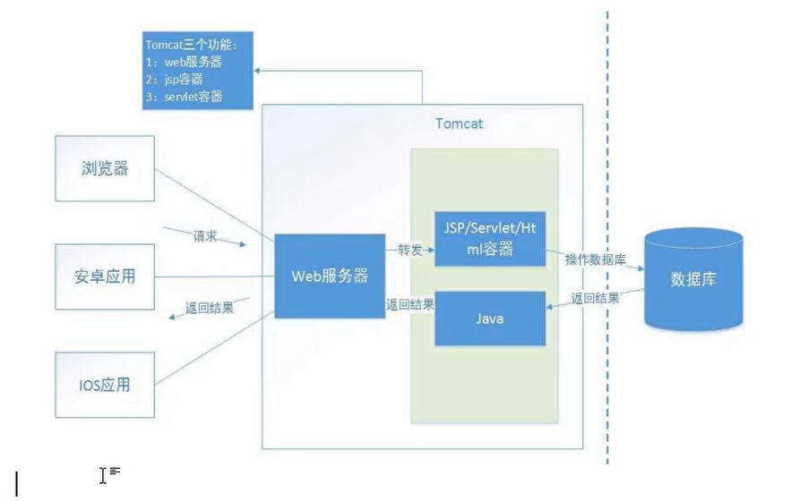
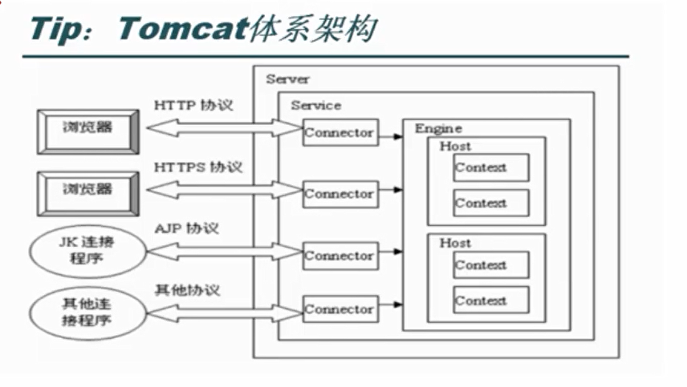
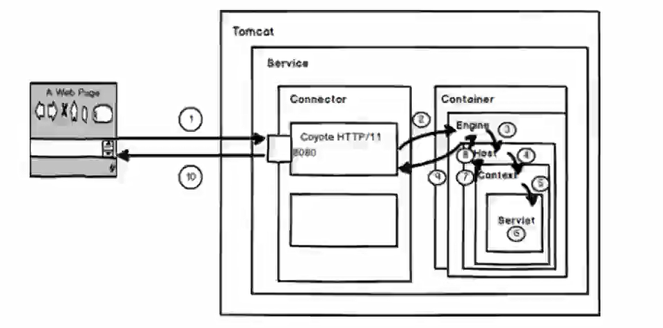
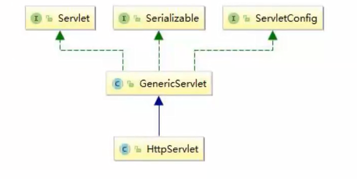

# JavaEE

## 1. 什么是JavaEE

​	JavaEE(Java Enterprise Edition)，Java 企业版，是一个用于企业级wek开发平台最早由Sun公司定制并发布，后由Oracle负责维护。在JavaEE平台规范了在开发企业级web应用中的技术标准。

​	在JavaEE平台共包含了13个技术规范（随着JavaEE版本的变化所包含的技术点的数量会有增多）。它们分别是：JDBC、JNDI、EJB、RMI、Servlet、JSP、XML、JMS、Java IDL、JPA、JTA、JavalMail 和JAF。

# Servlet

## 1. Servlet介绍

​	Servlet是Server Applet的简称，称为服务端小程序是JavaEE 平台下的技术标准，基于Java 语言编写的服务端程序。Web容器或应用服务器实现了 Servlet 标准所以 Servlet需要运行在Web容器或应用服务器中。Servlet主要功能在于能够在服务器中执行并生成数据。

## 2. Servlet技术特点

​	使用单进程多线程方式运行

## 3. Tomacat

### 3.1 Tomcat配置文件介绍

Tomcat的配置文件由4个xml组成，分别是 context.xml、web.xml、server.xml、

tomcat-users.xml。 每个文件都有自己的功能与配置方法。

1. context.xml 

	​	Context.xml是 Tomcat公用的环境配置。 Tomcat服务器会定时去扫描这个文件。 旦发现文件被修改（时间戳改变了），就会自动重新加载这个文件，而不需要重启服务器

2. web.xml

	​	Web应用程序描述文件，都是关于是Web应用程序的配置文件。所有Web应用web.xml文件的父文件。

3. server.xml

	​	是tomcat服务器的核心配置文件，server.xml的每一个元素都对应了tomcat中的一个

	组件，通过对xml中元素的配置，实现对tomcat中的各个组件和端口的配置。

4. tomcat-users.xml

	​	配置访问Tomcat的用户以及角色的配置文件。

### 3.2 解决乱码

​	控制台产生乱码的原因是在Tomcat在输出日志中使用的是UTF-8编码，而我们中文的
Windows操作系统使用的是GBK编码。由于编码格式不统一，所以出现了乱码。
解决方式：修改conf目录中的logging.properties文件重新指定的编码方式。 

```
java.util.logging.ConsoleHandler.encoding=GBK
```

### 3.3 Tomcat Manager中的角色分类

- manager-gui角色：

	允许访问HTMLGUI和状态页面（即URL路径为/manager/html/*）

- manager-script角色：

	允许访问文本界面和状态页面（即URL路径为/manager/text/*）

- manager-jmx角色：

	允许访问JMX代理和状态页面(即URL路径为/manager/jmxproxy/*）

- manager-status角色：

	仅允许访问状态页面(即URL路径为/manager/status/*）

### 3.4 Tomcat版本说明

| Tomcat版本 |   JDK版本   | Servlet版本 | JSP版本 | EL版本 |
| :--------: | :---------: | :---------: | :-----: | :----: |
|   9.0.x    | 8 and later |     4.0     |   2.3   |  3.0   |
|   8.5.x    | 7 and later |     3.1     |   2.3   |  3.0   |
|   8.0.x    | 7 and later |     3.1     |   2.3   |  3.0   |
|   7.0.x    | 6 and later |     3.0     |   2.2   |  2.2   |
|   6.0.x    | 5 and later |     2.5     |   2.1   |  2.1   |

### 3.5 Tomcat工作原理

1. Tomcat作用

	​	Tomcat是一个能够处理请求并产生响应的应用程序。Tomcat实现了JavaEE平台下的一些技术规范，所以我们可以在Tomcat中运行我们所编写的Servlet、JSP。

2. Tomcat运行原理

	

3. Tomcat架构图



### 3.6 Tomcat组件

#### 3.6.1 Server组件

​	启动一个server实例（即一个JVM），它监听在8005端口以接收shutdown命令。Servel的定义不能使用同一个端口，这意味着如果在同一个物理机上启动了多个Server实例，必须配置它们使用不同的端口。
```xml
<Serverport="8005"shutdown="SHUTDOWN">
```

port：接收shutdown指令的端口，默认为8005
shutdown：发往此Server用于实现关闭tomcat实例的命令字符串，默认为SHUTDOWN；

#### 3.6.2 Service组件

​	Service主要用于关联一个引擎和与此引擎相关的连接器，每个连接器通过一个特定的端口和协议接收请求并将其转发至关联的引擎进行处理。困此，Service要包含一个引擎、一个或多个连接器。

```xml
<Servicename="Catalina">
```

name：此服务的名称，默认为Catalina

#### 3.6.3 Connector组件

​	支持处理不同请求的组件，一个引擎可以有一个或多个连接器， 以适应多种请求方式
默认只开启了处理Htp协议的连接器。如果需要使用其他协议， 需要在Tomcat中配置该切
议的连接器。
在Tomcat中连接器类型通常有4种:

1. HTTP连接器
2. SSL连接器
3. AJP1.3连接器
4. proxy连接器 

```xml
<Connectorport="8888" protocol="HTTP/1.1
			connectionTimeout="20000" 
        	redirectPort="8443"/>
```

port：监听的端口
protocol：连接器使用的协议，默认为HTTP/1.1

connectionTimeout：等待客户端发送请求的超时时间，单位为毫秒
redirectPort：如果某接器支持的协议是HTTP，当接收客户端发来的HTTPS请求时
则转发至此属性定义的端口；
maxThreads：支持的最大并发连接数，默认为200个；

#### 3.6.4 Engine组件

​	Engine是Servlet处理器的一个实例，即servlet引擎，定义在server.xml中的Service标记中。Engine需要defaultHost属性来为其定义一个接收所有发往非明确定义虚拟主机的请求的 host 组件。

```xml
<Enginename="Catalina"defaultHost="localhost"> 
```

name：Engine组件的名称
defaultHost：Tomcat支持基于FQDN（FullyQualifiedDomainName全限定域名）的虚拟主机，这些虚拟主机可以通过在Engine容器中定义多个不同的Host组件来实现；但如果此引擎的连接器收到一个发往非非明确定义虚拟主机的请求时则需要将此请求发往一个默认的
虚拟主机进行处理，因此，在Engine中定义的多人虚拟主机的主机名称中至少要有一个跟
defaultHost定义的主机名称同名；

#### 3.6.5 Host组件

​	位于Engine容器中用于接收请求并进行相应处理的虚拟主机 通过该容器可以运行
Servlet或者JSP来处理请求。

```xml
<Hostname="localhost" appBase="webapps" unpackWARs="true" autoDeploy="true"> 
```

​	name：虚拟主机的名称，Tomcat通过在请求URL中的域名与name中的值匹配，用于
查找能够处理该请求的虚拟主机。如果未找到则交给在Engine中defaultHost指定的主机处
理。
​	appBase：此Host的webapps目录，即指定存放web应用程序的目录的路径；
​	autoDeploy：在Tomcat处于运行状态时放置于appBase目录中的应用程序文件是否自
动进行deploy；默认为true；
​	unpackWARs：在启用此webapps时是否对WAR格式的归档文件先进行展开；默认为
true;

#### 3.6.6 Context组件

​	Context是Host的子标签，代表指定一个Web应用，它运行在某个指定的虚拟主机(Host)上；每个Web应用都是 WAR文件 或文件的目录； 

```xml
<Contextpath="/test"docBase="D:bjsxt\itbaizhan.war"/> 
```

path：contextpath既浏览器访问项目的访问路径。 

docBase：相应的Web应用程序的存放位置；也可以使用相对路径，起始路径为此Context 所属Host中appBase定义的路径

### 3.7 Tomcat处理请求过程



1. 用户访问localhost:8080/test/index.jsp，请求被发送到Tomcat，被监听8080端口并处理HTTP/1.1协议的Connector获得。
2. Connector把该请求交给它所在的Service的Engine来处理，并等待Engine的回应
3. Engine获得请求localhost/test/index.jsp，匹配所有的虚拟主机Host。 
4. Engine匹配到名为localhost的Host虚拟主机来处理/test/index.jsp请求（即使匹配不到会请求交给默认Host处理），Host会根据/test匹配它所拥有的所有的Context。。 
5. 匹配到的context获得请求/index.jsp。
6. 构造HttpServletRequest对象和HttpServletResponse对象，作为参数调用JspServlet
	的doGet（）或doPost（）执行业务逻辑、数据存储等程序。
7. Context把执行完之后的结果通过HttpServletResponse对象返回给Host。
8. Host把HttpServletResponse返回给Engine。
9. Engine把HttpServletResponse对象返回Connector。
10. Connector把HttpServletResponse对象返回给客户Browser。

### 3.8 在Tomcat中配置虚拟主机

#### 3.8.1 需求

创建index.html页面
将index.html资源部署到d盘的demo目录中
通过www.itbz.com:8886/itbz/index.html访问虚拟主机，并访问index.html

#### 3.8.2 创建页面

创建index页面

#### 3.8.3 修server.xml添加Host配置

```xml
<Host name="www.itbz.com"
      appBase="webapps"
      unpackWARs="true"
      autoDeploy="true">
```

#### 3.8.4 添加Context配置

```xml
<Context path="/itbz" docBase="d:/demo"/>
```

#### 3.8.5 修改windows的Host文件

修改 Windows系统中的 Host 文件做域名与IP的绑定。

1. Host文件位置 
2. C:\Windows\System32\drivers\etc 
3. 修改内容 127.0.0.1 www.itbz.com 

#### 3.8.6 访问资源测试结果

## 4. Servlet继承结构



### 4.1 Servlet接口

1. init()，创建Servlet对象后立即调用该方法完成其他初始化工作。
2. service0，处理客户端请求，执行业务操作，利用响应对象响应客户端请求。
3. destroy)，在销毁Servlet对象之前调用该方法，释放资源。
4. getServletConfigO)，ServletConfig是容器向Servlet传递参数的载体。
5. getServletlnfo0，获取Servlet相关信息。

### 4.2 ServletConfig接口

​	Servlet运行期间，需要一些辅助信息，这些信息可以在web.xml文件中，使用一个或多个元素，进行配置。当Tomcat初始化一个Servlet时，会将该Servlet的配置信息，封装到一个ServletConfig对象中，通过调用init(ServletConfigconfig)方法，将ServletConfig对称传递给Servlet

### 4.3 GenericServlet是个抽象类

​	GenericServlet是实现了Servlet接口的抽象类。在GenericServlet中进一步的定义了Servlet接口的具体实现，其设计的目的是为了和应用层协议解耦，在GenericServlet中包含一个Servieei抽象方法，我们地可以通过继承Genericserviet并实现service方法卖现请求的处理，但是需要将ServletReutqest 和SeryletResponise转为HttpservlerRenuest和HttasetvletResponse。

### 4.4HttpServlet

​	继承自GenericServlet.针对于处理HTTP协议的请求所定制。在HttpServlet的service()
方法中已经把 ServletReuqest和 ServletResponse转为HttpServletRequest和HttpServletResponse。 直接使用HttpServletRequest和HttpServletResponse，不再需要强转。实际开发中，直接继承HttpServlet，并根据请求方式复写doXxx0方法即可。

## 5. Servlet的生命周期

Servlet的生命周期是由容器管理的，分别经历三各阶段：

1. init()：初始化 
2. service：服务 
3. destroyo：销毁

​	当客户端浏览器第一次请求Servlet时，容器会实例化这个Servlet，然后调用一次init方法，并在新的线程中执行service方法处理请求。service方法执行完毕后容器不会销毁这个Servlet而是做缓存处理，当客户端浏览器再次请求这个Servlet时，容器会从缓存中直接找到这个Servlet对象，并再一次在新的线程中执行Service方法。当容器在销毁Servlet之前对调用一次destory方法。

## 6. HttpServletRequest对象

​	HttpServletRequest对象代表客户端浏览器的请求，当客户端浏览器通过HTTP协议访问服务器时，HTTP请求中的所有信息都会Tomcat所解析并封装在这个对象中，通过这个对象提供的方法，可以获得客户端请求的所有信息。

### 7.1获取请求信息 

- req.getRequestURL() 返回客户端浏览器发出请求时的完整URL。
- req.getRequestURL() 返回请求行中指定资源部分。
- req.getRemoteAddr() 返回发出请求的客户机的IP地址。
- req.getLocalAddr() 返回WEB服务器的IP地址。
- req.getLocalPort() 返回WEB服务器处理Http协议的连接器所监听的端口。