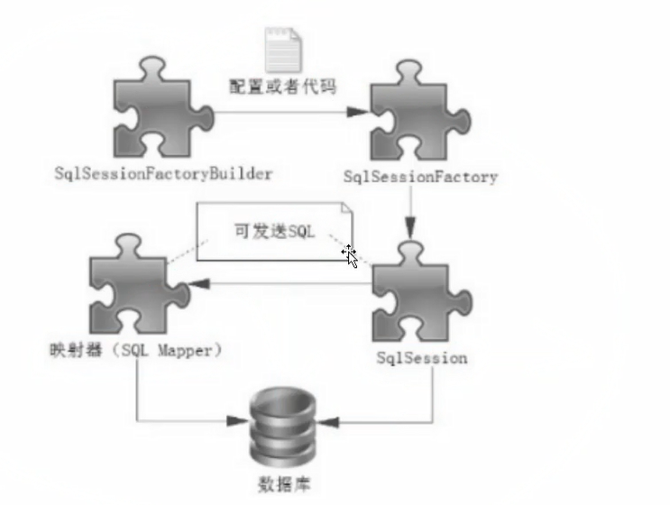

# 1. 核心API

## 1.1 核心API

- SqlSessionFactoryBuilder

	SqlSessionFactoryBuilder的作用是使用构建者模式 创建 SqlSessionFactory接对象

- SqlSessionFactory

	SqlSessionFactory可以被认为是一个数据库连接池，它的作用是创建SqlSession接口对象。

-  SqlSession 

	如果说SqlSessionFactory相当于数据库连接池，那么SqlSession就相当于一个数据库连接（Connection对象），你可以在一个事务里面执行多条SQL，然后通过它的commit、rollback方法提交或者回滚事务。

- Mapper

	映射器。由一个Java接口和XML文件 （或者注解构成），需要给出对应的SQL和映射规则， 负责发送SQL去执行并返回结果

## 1.2 核心API工作流程

## 1.3 生命周期

- SqlSessionFactoryBuilder:

	该类用来创建SqlSessionFactory对象，当SqlSessionFactory对象被创建后SqlSessionFactoryBuilder就失去了作用，所以它只能存在于创建 SqlSessionFactory的方法中，而不要让其长期存在。因此SqlSessionFactoryBuilder实例的最佳作用域是方法作用域。

- SqlSessionFactory:

	SqlSessionFactory的生命周期存在于整个MyBatis的应用之中，所以一旦创建了SqlSessionFactory，就要长期保存它，直至不再使用MyBatis应用，所以可以认为SqlSessionFactory的生命周期就等同于MyBatis 的应用周期。由于SqlSessionFactory是一个对数据库的连接池，所以它占据着数据库的连接资源。如果创建多个SqlSessionFactory，那么就存在多个数据库连接池，这样不利于对数据库资源的控制，也会导致数据库连接资源被消耗光，出现系统岩机等情况，所以尽量避免发生这样的情况。因此SqlSessionFactory是一个单例，让它在应用中被共享

- SqlSession

	SqlSession应该存活在一个业务请求中，处理完整个请求后，应该关闭这条连接，让它归还给SqlSessionFactory，否则数据库资源就很快被耗费精光，系统就会瘫痪，所以用try...catch...finally..语句来保证其正确关闭所以SqlSession的最佳的作用域是请求或方法作用域。

- Mapper:

	由于SqlSession的关闭，它的数据库连接资源也会消失，所以它的生命周期应该小于等于SqlSession的生命周期。Mapper代表的是一个请求中的业务处理，所以它应该在一个请求中，一旦处理完了相关的业务，就应该废弃它。