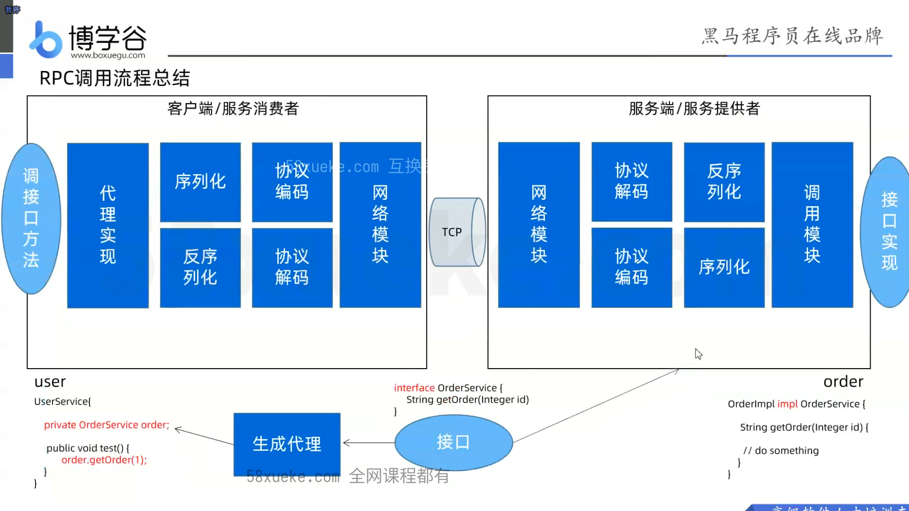

# RPC通信原理实战

## 概念

- **RPC：Remote Procedure Call，过程远程调用，**它定义了一台计算机上的程序去调用另一台计算机上子程序的这一行为
- **特点：**
  - 把远程实现搬到了本地，效果上远程调用和本地调用没有差别
  - 使用CS模式，客户端发起请求并传递参数，服务端接受请求参数后执行，并将执行结果返回
  - 底层网络通信细节对上层开发者屏蔽，上层开发者无需为这一交互过程做额外的编码，做到应用无侵入。
- 应用场景：
  - 需要远程通信的各类场景
- 优势
  1. 让构建分布式应用更容易，解耦服务，容易扩展
  2. RPC框架一般使用长连接，不必每次通信都要建立连接，减少网络开销
  3. RPC框架需要有注册中心，可以动态感知服务变化并可视化
  4. 丰富的后台管理功能，可统一管理接口服务，对调用方来说是无感知，统一化的操作。
  5. RPC能做到协议精简，效率更高，私密安全性高。
  6. RPC的服务治理功能可以让我们很方便的调控流量，参数等。
  7. RPC是面向服务的更高级的抽象，支持服务注册发现，负载均衡，容错，流量管理等高级特性

## 调用流程

