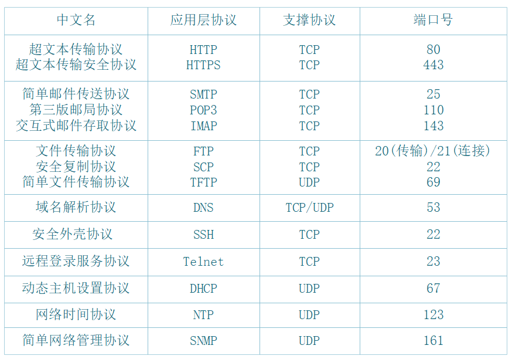
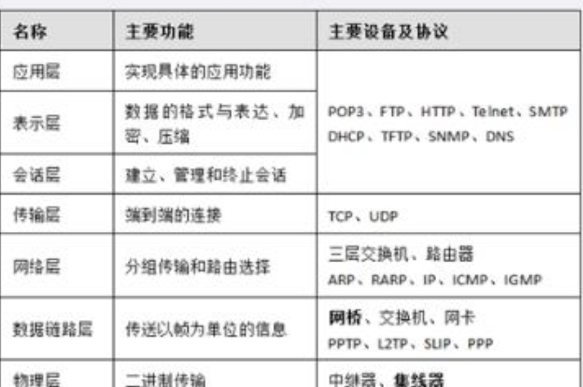

# 计算机网络

# Netstat命令的连接状态包括： 

* LISTEN：侦听来自远方的 TCP端口的连接请求。
* SYN-SENT：在发送连接请求后等待匹配的连接请求。
* SYN-RECEIVED：在收到和发送一个连接请求后等待对方对连接请求的确认。
* ESTABLISHED：代表一个打开的连接。
* FIN-WAIT-1：等待远程 TCP连接中断请求，或先前的连接中断请求的确认。
*  FIN-WAIT-2：从远程 TCP等待连接中断请求。
* CLOSE-WAIT：等待从本地用户发来的连接中断请求。
*  CLOSING：等待远程 TCP对连接中断的确认。
* LAST-ACK：等待原来的发向远程 TCP的连接中断请求的确认。
*  TIME-WAIT：等待足够的时间以确保远程 TCP接收到连接中断请求的确认。
* CLOSED：没有任何连接状态。

# PPP

* ppp的NCP可以承载协议的三层数据包ppp的LCP控制多链路参数
* ppp的pap认证，二次握手建立认证（明文不加密）
* ppp的CHAP认证，三次握手建立（MD5）加密
* ppp的双向认证采用CHAP的主验证ppp的加固验证，采用两种（pap，chap）验证同时使用

# 主要设备及协议

‍

​​

​​
