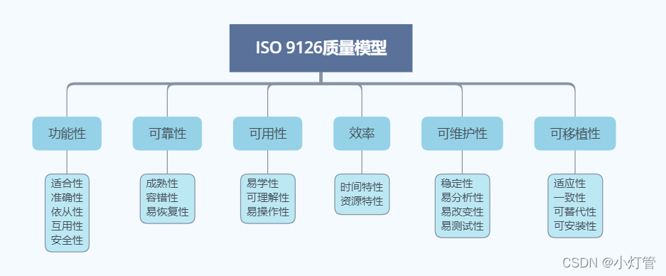
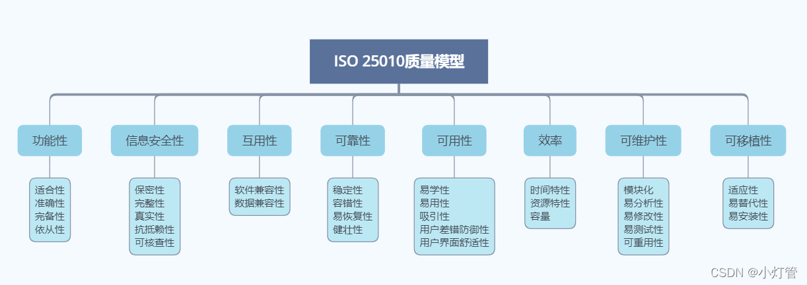

# 软件工程

# 聚按强度从低到高有以下几种类型

1. 偶然内聚 (巧合内聚)

    1. 如果一个模块的各成分之间毫无关系，则称为偶然内聚，也就是说模块完成一组任务，这些任务之间的关系松散，实际上没有什么联系。
2. 逻辑内聚

    1. 几个逻辑上相关的功能被放在同一模块中，则称为逻辑内聚。如一个模块读取各种不同类型外设的输入。尽管逻辑内聚比偶然内聚合理一些，但逻辑内聚的模块各成分在功能上并无关系，即使局部功能的修改有时也会影响全局，因此这类模块的修改也比较困难。
3. 时间内聚

    1. 如果一个模块完成的功能必须在同一时间内执行（如系统初始化），但这些功能只是因为时间因素关联在一起，则称为时间内聚。
4. 通信内聚

    1. 如果一个模块的所有成分都操作同一数据集或生成同一数据集，则称为通信内聚。
5. 顺序内聚

    1. 如果一个模块的各个成分和同一个功能密切相关，而且一个成分的输出作为另一个成分的输入，则称为顺序内聚。
6. 过程内聚

    1. 构件或者操作的组合方式是，允许在调用前面的构件或操作之后，马上调用后面的构件或操作，即使两者之间没有数据进行传递。 模块完成多个需要按一定的步骤一次完成的功能。（过程相关控制耦合）。例如：在用程序流程图设计模块时，若将程序流程图中的一部分划出各自组成模块，便形成过程内聚。
7. 信息内聚

    1. 模块完成多个功能，各个功能都在同一数据结构上操作，每一项功能有一个唯一的入口点。这个模块将根据不同的要求，确定该模块执行哪一个功能。由于这个模块的所有功能都是基于同一个数据结构（符号表），因此，它是一个信息内聚的模块。
8. 功能内聚

    1. 模块的所有成分对于完成单一的功能都是必须的，则称为功能内聚。

# ISO/IEC软件质量模型

​​​​

​​

# 测试

* 集成测试（ integrationtesting ）

  * 也称为组装测试，在单元测试的基础之上，把所有的模块组装成一个系统进行测试。
  * 主要测试设计阶段产生的错误，集成测试计划应该在概要设计阶段制定。
* 非渐增式集成测试。

  * 首先将每个模块分别进行单元测试，再把所有的模块组装成一个完整的系统进行测试。
  * 目前在进行集成测试时已普遍采用渐增式集成。
* 渐增式集成测试。
* 自顶向下集成

  * 先测试上层模块，再测试下层模块，由于测试下层模块时上层模块已经测试过，所以不必要另外编写驱动模块。
  * 自底向上集成

    * 先测试下层模块，再测试上层模块。顶层模块测试时不需要驱动模块，底层模块测试时不需要桩模块。软件的集成测试最好由不属于该软件开发组的软件设计人员承担，以提高集成测试的效果。
* 三明治测试。

  * 从系统的三个角往中间包围测试的方法。

自底向上的集成测试不需要编写桩模块，但需要编写驱动模块，而自顶向下的集成测试需要编写桩模块，不需要编写驱动模块。

# 能力成熟度集成模型CMMI

0：未完成  
1：已执行，特定目标的完成  
2：已管理，制度化  
3：已定义：标准化和部署  
4：量化管理：定量管理的过程制度化  
5：已经优化

‍
