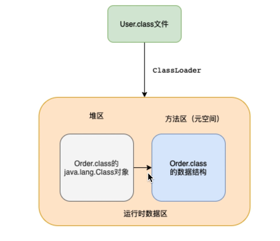

# 类的加载过程

## 加载

当我们要使用一个类的时候，要通过ClassLoader将类加载到内存中

**类加载阶段主要完成以下三件事：**

1. 通过全类名，获取类的二进制流
2. 解析类的二进制流为方法区的数据结构
3. 创建一个java.lang.Class类的实例，表示该类型，作为方法区这个类的访问入口

**通过全类名，获取类的二进制流的方式有很多种**

1. 从zip压缩包中获取
2. 从网络中获取
3. 运算时计算生成，入动态代理技术
4. ...

**对于非数组类型的加载阶段，既可以使用java虚拟机内置的类加载器区完成，也可以使用用户自定义的类加载器去完成**

## 链接

链接这个阶段主要分为3个部分，验证，准备，解析

### 验证

**验证阶段主要是确保Class文件的格式正确，运行时不会危害虚拟机的安全**

验证阶段的规则很多，大致分为以下4个阶段

### 准备

**准备阶段主要是为类的静态变量分配内存，并将其初始化为默认值**

**如果类静态变量的字段属性表中存在ConstantValue属性，则直接执行赋值语句**

1. 类静态变量为基本数据类型，并且被final修饰
2. 类静态变量为String类型，被final修饰，并且以字面量的形式赋值

### 解析

**将类，接口，字段和方法的符合引用(在常量池中)转为直接引用**

- 符号引用：用一组符合来描述所引用的目标
- 直接引用：直接指向指向目标的指针

## 初始化

**执行类静态成员变量赋值语句和静态代码块中的语句**

**初始化阶段的重要工作是执行类的初始化方法\<clinit>()**

- **该方法仅能由Java编译器生成并由JVM调用**，程序开发者无法自定义一个同名的方法，更无法直接在Java程序中调用该方法，虽然该方法也是由字节码指令所组成。
- 它是由类静态成员的赋值语句以及static语句块合并产生的。

.png)

## 使用

使用阶段，开发人员可以在程序中访问和调用它的静态成员信息(比如：静态字段，静态方法)，或者使用new关键字为其创建对象实例

# 双亲委派机制

**JVM存在的三个默认加载器**

- 启动类加载器（BootstrapClassLoader）
  - 内嵌在JVM内核中的加载器，由C++语言编写
  - 最顶层的类加载器
  - 用于加载Java的核心类库，即加载jre/lib/rt.jar里所有的class
- 扩展类加载器（ExtClassLoader）
  - 父类加载器为启动类加载器
  - 负责加载JRE的扩展目录，ire/lib/ext或者由iava.ext.dirs系统属性指定的自录中iar包的类
- 应用程序类加载器（AppClassLoader）
  - 父类加载器为扩展类加载器
  - 主要加载classpath下的class

> 注意：
>
> - 除了启动类加载器，其余的两个类加载器都继承于classLoader，我们自定义的类加载器，也需要继承classLoader。
> - 启动类、扩展类与应用类加载器之间的父子关系，并不是通过继承来实现的，而是通过组合，即使用parent变量来保存“父加载器”的引用。

JVM在加载一个类时，会调用AppclassLoader的loadclass方法来加载这个类，不过在这个方法中，会先使用ExtClassLoader的loadclass方法来加载类，同样ExtClassLoader的loadclass方法中会先使用BootstrapClassLoader来加载类，如果BootstrapClassLoader加载到了就直接成功，如果BootstrapclassLoader没有加载到，那么ExtClassLoader就会自己尝试加载该类，如果没有加载到，那么则会由AppclassLoader来加载这个类。
所以，双亲委派指的是，JVM在加载类时，会委派给Ext和Bootstrap进行加载，如果没加载到才由自己进行加载。

## 为什么需要双亲委派机制

1. 避免类的重复加载
2. 保护了程序的安全性，防止核心的API被修改