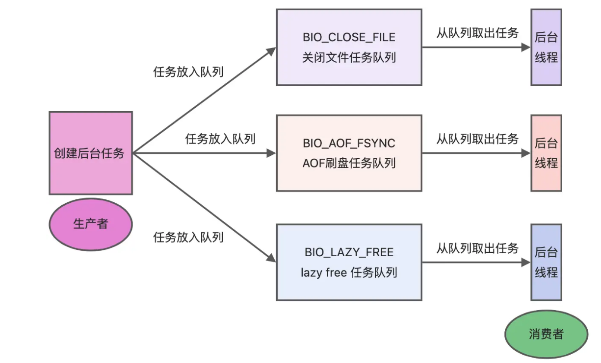

# 认识Redis

## 什么是Redis？

Redis是一种基于内存的数据库，对数据的读写操作都是在内存中完成，因此**读写速度**非常快，常用于**缓存，消息队列，分布式锁等场景**。

Redis提供了多种数据类型来支持不同的业务场景，比如String(字符串)，Hash(哈希)，List(列表)，Set(集合)，Zest(有序集合)，Bitmaps(位图)，HypeerLogLog(基数统计)，GEO(地理信息)，Stream(流)，并且对数据类型的操作都是**原子性**的，因为执行命令由单线程负责，不存在并发竞争的问题。

另外，Redis还支持**事务，持久化，Lua脚本，多种集群方案（主从复制模式，哨兵模式，切片机群模式)，发布/订阅模式，内存淘汰机制，过期删除机制。**

## Redis和Memcached有什么区别？

**共同点：**

- 都是基于内存的数据库，一般都用来做缓存使用。
- 都有过期策略
- 两者的性能都非常高

**区别：**

- Redis支持的类型更加丰富，而Memcached支持最简单的key-value数据类型。
- Redis支持数据的持久化，可以将内存中的数据保持在磁盘中，重启的时候可以再次加载进行使用，而Memcached没有持久化功能，数据全部存在内存之中，Memcached重启或者挂掉之后，数据就没了。
- Redis原生支持集群模式，Memcached没有元素的集群模式，需要依靠客户端来实现集群中分片写入数据；
- Redis支持发布订阅模型，Lua脚本，事务等功能，而Memcached不支持。

## 为什么用Redis作为MySQL的缓存

Redis具备「高性能」和「高并发」两种特性。

# Redis数据结构

## Redis数据类型以及使用场景分别是什么？

常见的五种数据类型：**String (字符串)，Hash(哈希)，List(列表)，Set(集合)，Zset(有序集合)**。随着Redis版本的更新，后面又新增了BitMap(2.2)，HyperLogLog(2.8)，GEO(3.2)，Stream(5.0)

**应用场景：**

- String：缓存对象，常规计数，分布式锁，共享session信息。
- List：消息队列（但又两个问题：1.生产者需要自行实现全局唯一ID，2.不能以消费组形式消费数据）等
- Hash：缓存对象，购物车等
- Set：聚合计算（交集，并集，差集）场景，比如点赞，共同关注，抽奖活动
- Zset类型：排序场景，比如排行榜，电话和姓名排序
- BitMap：二值状态统计的场景，比如签到，判断用户登录状态，连续签到用户总数等；
- HyperLogLog：海量数据基数统计的场景，比如百万级网页UV计数等
- Stream：消息队列，相比于基于 List 类型实现的消息队列，有这两个特有的特性：自动生成全局唯一消息ID，支持以消费组形式消费数据。

## 五种常见的Redis数据类型是怎么实现的？

# Redis线程模型

## Redis是单线程吗

Redis单线程指的是「接受客户端请求->解析请求->进行数据读写等操作->发送数据给客户端」这个过程是由一个线程（主线程）来完成的，这也是常说Redis是单线程的原因。

但是，**Redis程序并不是单线程的**，Redis在启动的时候，是会**启动后台线程(BIO)的**.

- 2.6版本，启动2个后台线程，分别为处理关闭文件，AOF刷盘
- 4.0之后，新增一个后台线程，用来异步释放Redis内存（lazyfree线程）

关闭文件，AOF刷盘，释放内存这三个任务都有各自的任务队列

- BIO_CLOSE_FILE，关闭文件任务队列：当队列有任务后，后台线程会调佣close(fd)，将文件关闭
- BIO_AOF_FSYNC，AOF刷盘任务队列：当AOF日志配置成everysec选项后，主线程会把AOF写日志操作封装成一个任务，也放到队列中。当发现有任务后，后台线程会调用fsync(fd)，将AOF文件刷盘，
- BIO_LAZY_FREE，lazy free任务队列：当队列有任务后，后台线程会free(obj)释放对象/free(dict)删除数据库所有对象/free(skiplist)释放跳表对象

## Redis单线程模式是怎样的？

6.0版本之前：

## Redis采用单线程为什么还这么快？

官方使用基准测试的结果是，**单线程的 Redis 吞吐量可以达到 10W/每秒**，如下图所示

**原因：**

- Redis的大部分操作都在**内存中完成**，并且采用了高效的数据结构，因此Redis瓶颈可能是机器的内存或者网络带宽，而非CPU，既然CPU不是瓶颈，那么自然就采用单线程的解决方案了；
- Redis采用单线程模型**避免了多线程之间的竞争**，省去了多线程切换带来的时间和性能上的开销，而且也不会导致死锁问题
- Redis 采用了 **I/O 多路复用机制**处理大量的客户端 Socket 请求，IO 多路复用机制是指一个线程处理多个 IO 流，就是我们经常听到的 select/epoll 机制。简单来说，在 Redis 只运行单线程的情况下，该机制允许内核中，同时存在多个监听 Socket 和已连接 Socket。内核会一直监听这些 Socket 上的连接请求或数据请求。一旦有请求到达，就会交给 Redis 线程处理，这就实现了一个 Redis 线程处理多个 IO 流的效果

## Redis 6.0之前会为什么使用单线程？

**CPU并不是制约Redis性能表现的瓶颈所在，**更多情况下是受到内存大小和网络I/O的限制，所以Redis核心网络模型使用单线程并没有什么问题，如果你想要使用服务的多核CPU，可以在一台服务器上启动多个节点或者采用分片集群的方式。

除了上面的官方回答，选择单线程的原因也有下面的考虑。

使用了单线程后，可维护性高，多线程模型虽然在某些方面表现优异，但是它却引入了程序执行顺序的不确定性，带来了并发读写的一系列问题，**增加了系统复杂度、同时可能存在线程切换、甚至加锁解锁、死锁造成的性能损耗**。

## Redis 6.0之后为什么引入了多线程？

虽然Redis的主要工作（网络I/O和执行命令）一直都是单线程模型，但是在**6.0之后采用多个I/O线程处理网络请求，这是因为随着网络硬件的性能提升，Redis 的性能瓶颈有时会出现在网络 I/O 的处理上。但是对于命令的执行，Redis 仍然使用单线程来处理**

关于线程数的设置，官方的建议是如果为 4 核的 CPU，建议线程数设置为 2 或 3，如果为 8 核 CPU 建议线程数设置为 6，线程数一定要小于机器核数，线程数并不是越大越好。

因此， Redis 6.0 版本之后，Redis 在启动的时候，默认情况下会**额外创建 6 个线程**（*这里的线程数不包括主线程*）：

- Redis-server ： Redis的主线程，主要负责执行命令；
- bio_close_file、bio_aof_fsync、bio_lazy_free：三个后台线程，分别异步处理关闭文件任务、AOF刷盘任务、释放内存任务；
- io_thd_1、io_thd_2、io_thd_3：三个 I/O 线程，io-threads 默认是 4 ，所以会启动 3（4-1）个 I/O 多线程，用来分担 Redis 网络 I/O 的压力。

# Redis持久化

## Redis 如何实现数据不丢失？

Redis 的读写操作都是在内存中，所以 Redis 性能才会高，但是当 Redis 重启后，内存中的数据就会丢失，那为了保证内存中的数据不会丢失，Redis 实现了数据持久化的机制，这个机制会把数据存储到磁盘，这样在 Redis 重启就能够从磁盘中恢复原有的数据。

Redis 共有三种数据持久化的方式：

- **AOF日志：**每执行一条写操作命令，就把该命令以追加的方式写入到一个文件里；
- **RDB快照：**将某一时刻的内存数据，以二进制的方式写入磁盘；
- **混合持久化：**Redis 4.0新增的方式，集成了AOF和RDB的优点；

# Redis过期删除与内存淘汰

## Redis使用的过期删除策略是什么？

Redis使用的过期删除策略是：**「惰性删除+定期删除」**这两种策略搭配使用

> 什么是惰性删除策略？

惰性删除策略的做法是，**不主动删除过期键，每次从数据库访问key时，都检测key是否过期，如果过期则删除该key、**

流程图如下：

**优点：**

- 因为每次访问时，才会检查key是否过期，所以策略只会使用很少的系统资源，因此，惰性删除策略对CPU时间最友好

**缺点：**

- 如果一个key已经过期，而这个key又仍然保留在数据库中，那么只要这个过期key一直没有被访问，它所占用的内存就不会释放，造成了一定的内存空间浪费。所以，惰性删除策略对内存不友好。

> 什么是定期删除策略？

定期删除策略的做法是，**每隔一段时间「随机」从数据库中取出一定数量的key进行检查，并删除其中的过期key。**

Redis的定期删除流程：

1. 从过期字典中随机抽取 20 个 key；
2. 检查这 20 个 key 是否过期，并删除已过期的 key；
3. 如果本轮检查的已过期 key 的数量，超过 5 个（20/4），也就是「已过期 key 的数量」占比「随机抽取 key 的数量」大于 25%，则继续重复步骤 1；如果已过期的 key 比例小于 25%，则停止继续删除过期 key，然后等待下一轮再检查。

可以看到，定期删除是一个循环的流程。那 Redis 为了保证定期删除不会出现循环过度，导致线程卡死现象，为此增加了定期删除循环流程的时间上限，默认不会超过 25ms。

流程图如下：

**优点：**

- 通过限制删除操作执行的时长和频率，来减少删除操作对CPU的影响，同时也能删除一部分过期的数据减少了过期键对空间的无效占用。

**缺点：**

- 难以确定删除操作执行的时长和频率，如果执行的太频繁，就会对CPU不友好；如果执行的太少，那又和惰性删除一样了，过期key占用的内存不会及时得到释放。

可以看到，惰性删除策略和定期删除策略都有各自的优点，所以 **Redis 选择「惰性删除+定期删除」这两种策略配和使用**，以求在合理使用 CPU 时间和避免内存浪费之间取得平衡。

## Redis内存淘汰策略

