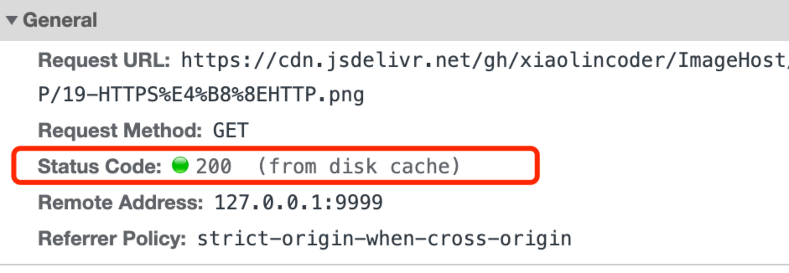

强制缓存指的是只要浏览器判断缓存没有过期，则直接使用浏览器的本地缓存，决定是否使用缓存的主动性在于浏览器这边。

如下图中，返回的是 200 状态码，但在 size 项中标识的是 from disk cache，就是使用了强制缓存。

强制缓存是利用下面这两个HTTP响应头部字段实现的，它们都是用来表示资源在客户端缓存的有效期：

- Cache-Control：是一个相对时间
- Expires：是一个绝对时间

如果 HTTP 响应头部同时有 Cache-Control 和 Expires 字段的话，**Cache-Control 的优先级高于 Expires** 。

Cache-control 选项更多一些，设置更加精细，所以建议使用 Cache-Control 来实现强缓存。具体的实现流程如下：

- 当浏览器第一次请求访问服务器资源时，服务器会在返回这个资源的同时，在 Response 头部加上 Cache-Control，Cache-Control 中设置了过期时间大小；
- 浏览器再次请求访问服务器中的该资源时，会先**通过请求资源的时间与 Cache-Control 中设置的过期时间大小，来计算出该资源是否过期**，如果没有，则使用该缓存，否则重新请求服务器；
- 服务器再次收到请求后，会再次更新 Response 头部的 Cache-Control。